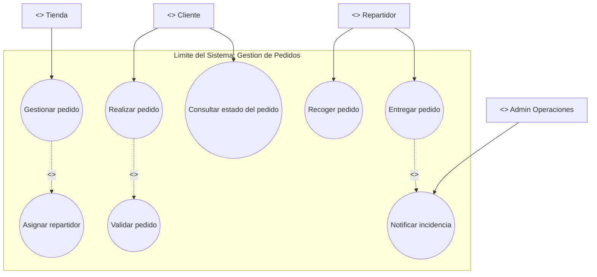
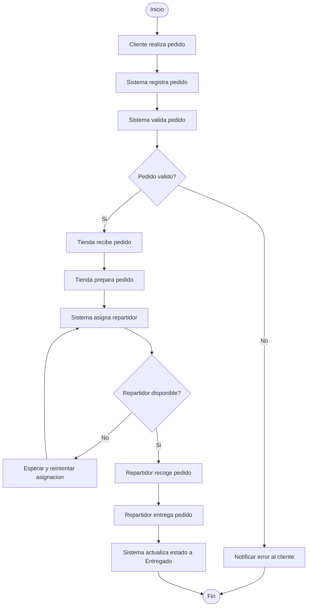
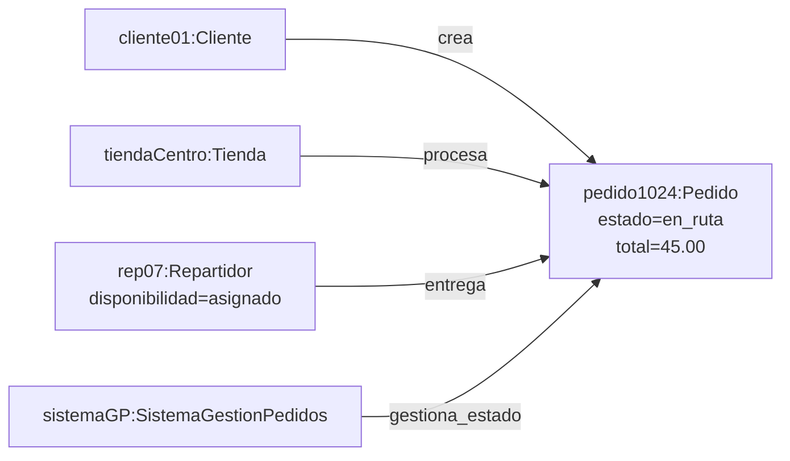

# Avance 01 - Modelado UML del Proceso de Gestion de Pedidos (Enfoque RUP)

## 1. Contexto del avance
Este documento presenta un primer avance para la tarea grupal de modelado del proceso elegido del proyecto: **Gestion de pedidos**.

Siguiendo el curso de **Analisis de Sistemas de Informacion**, se trabaja bajo enfoque **RUP (Rational Unified Process)** y modelado UML con **Rational Rose**.

En este avance se desarrolla la base de tres artefactos del modelado:
- Diagrama de casos de uso
- Diagrama de actividades
- Diagrama de objetos

El enfoque se mantiene a nivel de analisis de negocio y requisitos funcionales, sin incluir decisiones tecnicas de implementacion.

## 2. Definicion del proceso elegido
El proceso de gestion de pedidos abarca desde la creacion de un pedido por parte del cliente hasta su entrega final, incluyendo validacion, preparacion, asignacion de repartidor y seguimiento del estado.

## 3. Objetivo del modelado (RUP)
En terminos de RUP, este avance aporta principalmente a la disciplina de **Requisitos** y parcialmente a **Analisis y Diseno**.

Se modela el flujo operativo principal para:
- Identificar actores e interacciones clave.
- Visualizar decisiones y puntos criticos del proceso.
- Definir objetos de dominio involucrados y sus relaciones.

## 4. Ubicacion del avance en RUP
- Fase principal: **Elaboracion**.
- Artefacto base: **Modelo de Casos de Uso**.
- Artefactos de apoyo: **Especificacion suplementaria del flujo de actividades** y **vista inicial de objetos de dominio**.

## 5. Diagrama de Casos de Uso (Mermaid como borrador UML)
Nota: este diagrama se presenta en Mermaid para avance rapido, pero se debe llevar a **Rational Rose** manteniendo la notacion UML formal (actores, limites del sistema y relaciones `<<include>>`/`<<extend>>`).

### 5.1 Actores
- Cliente
- Tienda
- Repartidor
- Administrador de operaciones (opcional para control de incidencias)

### 5.2 Casos de uso considerados
- Realizar pedido
- Validar pedido
- Gestionar pedido
- Asignar repartidor
- Recoger pedido
- Entregar pedido
- Consultar estado del pedido
- Notificar incidencia (opcional)

### 5.3 Lectura del diagrama
- El **Cliente** inicia el proceso al realizar el pedido y luego consulta su estado.
- La **Tienda** gestiona la preparacion del pedido.
- El **Repartidor** participa desde el recojo hasta la entrega.
- `<<include>>` representa subfuncionalidades obligatorias dentro del flujo principal.
- `<<extend>>` representa comportamiento opcional o por excepcion.

## 6. Diagrama de Actividades (Mermaid)
Este diagrama representa el flujo principal y decisiones criticas del caso de uso "Gestionar pedido".

En version Rational Rose, se recomienda modelarlo con **swimlanes** por actor: Cliente, Sistema, Tienda, Repartidor.

### 6.1 Puntos clave del flujo
- Hay dos decisiones principales: validacion del pedido y disponibilidad de repartidor.
- El flujo contempla una salida por error y una ruta de reintento para asignacion.
- El estado final de negocio es **Pedido entregado**.

## 7. Diagrama de Objetos (Mermaid)
En UML/RUP, un diagrama de objetos debe mostrar **instancias concretas** en un momento del tiempo. Por eso, aqui se modelan objetos con el formato `objeto:Clase`.

### 7.1 Lectura del diagrama
- Se representa una fotografia puntual del sistema para un pedido especifico.
- **pedido1024:Pedido** es la instancia central.
- Las demas instancias evidencian quien crea, procesa, entrega y actualiza el estado.

## 8. Criterios de calidad para revision (RUP/Rose)
- Cada caso de uso debe tener nombre en infinitivo y actor primario identificado.
- Debe existir limite explicito del sistema en el diagrama de casos de uso.
- El diagrama de actividades debe tener nodos inicial/final y decisiones con guardas.
- El diagrama de objetos debe mostrar instancias, no solo clases.

## 9. Supuestos de este primer avance
- El proceso modelado corresponde al flujo estandar (happy path) con dos excepciones basicas.
- No se incluyen metodos de pago ni devoluciones en esta iteracion.
- No se detallan reglas tecnicas ni infraestructura.

## 10. Plan de traspaso a Rational Rose
1. Crear paquete `Modelo de Casos de Uso`.
2. Dibujar actores, limite del sistema y casos de uso con relaciones `<<include>>` y `<<extend>>`.
3. Crear actividad del caso de uso principal con swimlanes por actor.
4. Crear diagrama de objetos con instancias concretas del escenario principal.
5. Revisar consistencia de nombres entre los tres diagramas.

## 11. Siguiente avance sugerido
- Versionar este documento como "Avance 02" agregando:
  - Swimlanes por actor en actividades.
  - Escenarios alternos adicionales (pedido cancelado, tienda sin stock).
  - Mayor detalle de estados del pedido (registrado, validado, en preparacion, en ruta, entregado).
