# 📚 Guía de Examen Final — "Desde Final de Sistema hasta Modelo de Análisis completo"

> **Curso**: Análisis de Sistemas de Información
> **Alcance del examen (según el profesor)**: *Desde Final de Sistema hasta Modelo de Análisis completo*
> **Caso de negocio usado en toda la guía**: Sistema de Control de Estacionamiento Vehicular (SCEV) — el mismo caso de laboratorio (Lab 6, 7, 11, 14) usado por el profesor a lo largo del curso.

---

## 0. ¿Por qué este alcance exacto? (lee esto primero)

El profesor no dio un rango de semanas, dio un rango de **artefactos**. Para no estudiar de más ni de menos, esta guía traduce esa frase a los temas concretos del curso, con evidencia tomada directamente del material:

| Frase del profesor | Traducción a temas del curso | Evidencia |
|---|---|---|
| **"Final de Sistema"** | El cierre del **Modelo de Requisitos del Sistema**: Actores del Sistema + **Casos de Uso del Sistema (CUS)** completos (especificación, relaciones, diagrama de actividades, prototipo de interfaz). Es lo último que se produce ANTES de empezar el Análisis. | `sem06/6 Requerimientos y casos de uso.pdf`; plantilla de CUS en `sem05`, `sem06/Lab_6 C.pdf` |
| **"Modelo de Análisis completo"** | El conjunto completo de artefactos que el curso llama **Modelo de Análisis**: **Modelo Conceptual/Dominio** + **Diagrama de Secuencia del Sistema (DSS)** + **Contratos de Operaciones** + su integración en la **Realización del Caso de Uso en Análisis**. | `sem08/9 Modelos UML C_largman Analisis.pdf` (pág. con el listado: *"Modelo Conceptual • Modelo de Análisis (realizaciones)"*); `sem12/Lab_14 sol.pdf` paso 8: *"Realizar el modelo de análisis (realizaciones — diagrama de secuencia/colaboración por cada RCUS)"* |

> ⚠️ **Qué NO entra en este rango**: el **Modelo de Diseño** (Diagramas de Colaboración de diseño, Diagrama de Clases de Diseño con métodos, arquitectura MVC, esquema de base de datos). Ese es el tema que viene DESPUÉS del Modelo de Análisis. Tampoco entra el **Modelo de Negocio** (CUN, Workers, Actores de Negocio) ni la **Ingeniería de Requerimientos** general (FURPS+, tipos de requisitos) — esos son temas ANTERIORES a "Final de Sistema". Si tu examen sí los incluye, revisa `repaso_final/04_modelo_negocio.md` y `repaso_final/06_requerimientos.md`.

### El rango exacto, en una sola imagen

```mermaid
flowchart LR
    subgraph FUERA1["❌ Fuera del examen (anterior)"]
        NEG["Modelo de Negocio<br/>(CUN, Workers, Actores de Negocio)"]
        REQ["Ingeniería de Requerimientos<br/>(FURPS+, tipos de requisitos)"]
    end

    subgraph DENTRO["✅ DENTRO DEL EXAMEN"]
        direction TB
        T1["<b>Tema 1</b><br/>Casos de Uso del Sistema<br/>(cierre de 'Sistema')"]
        T2["<b>Tema 2</b><br/>Modelo Conceptual / Dominio"]
        T3["<b>Tema 3</b><br/>Diagrama de Secuencia<br/>del Sistema (DSS)"]
        T4["<b>Tema 4</b><br/>Contratos de Operaciones"]
        T5["<b>Tema 5</b><br/>Realización del CU en Análisis<br/>= Modelo de Análisis COMPLETO"]
        T1 --> T2 --> T3 --> T4 --> T5
    end

    subgraph FUERA2["❌ Fuera del examen (posterior)"]
        DIS["Modelo de Diseño<br/>(Colaboración, Clases de Diseño, MVC)"]
    end

    NEG --> REQ --> T1
    T5 --> DIS

    style FUERA1 fill:#7f8c8d33
    style FUERA2 fill:#7f8c8d33
    style DENTRO fill:#2ecc7122
    style T1 fill:#3498db,color:#fff
    style T2 fill:#2ecc71,color:#fff
    style T3 fill:#9b59b6,color:#fff
    style T4 fill:#f39c12,color:#fff
    style T5 fill:#e74c3c,color:#fff
```

---

## 1. Índice de archivos

| # | Archivo | Contenido |
|---|---------|-----------|
| 00 | [Índice](00_indice.md) | Este archivo. Alcance, justificación, cómo estudiar. |
| 01 | [Casos de Uso del Sistema](01_casos_uso_sistema.md) | Actores, especificación de CUS, include/extend/generalización, diagrama de actividades, prototipos |
| 02 | [Modelo Conceptual / Dominio](02_modelo_conceptual.md) | Clases conceptuales, atributos, asociaciones, agregación/composición, generalización |
| 03 | [Diagrama de Secuencia del Sistema](03_diagrama_secuencia_sistema.md) | DSS, eventos de sistema, operaciones del sistema |
| 04 | [Contratos de Operaciones](04_contratos_operaciones.md) | Postcondiciones, tipos de cambio de estado |
| 05 | [Realización del CU en Análisis](05_realizacion_modelo_analisis.md) | Integración: Modelo de Análisis completo, Diagrama de Comunicación de Análisis |
| 06 | [Cheatsheet General](06_cheatsheet_general.md) | Todas las plantillas, tablas y reglas en 1 solo documento de referencia rápida |
| 07 | [Conceptos que más se confunden](07_conceptos_confusos.md) | Comparaciones lado a lado de los pares que todo el curso confunde |
| 08 | [Mapa Conceptual Completo](08_mapa_conceptual_completo.md) | El flujo entero, de "Final de Sistema" a "Modelo de Análisis", en diagramas |
| 09 | [Simulacro de Examen Final](09_simulacro_examen.md) | Examen completo tipo, con el mismo estilo que usaría el profesor |
| 10 | [Respuestas del Simulacro](10_respuestas_simulacro.md) | Solución razonada del simulacro (archivo separado, a propósito) |

---

## 2. El caso de negocio único que hilvana toda la guía

Para que puedas ver la evolución de los artefactos sin tener que aprenderte un caso nuevo en cada tema, **todos los temas (01 a 05) usan el mismo caso de negocio**, tomado literalmente del material del curso:

> ### 🅿️ Sistema de Control de Estacionamiento Vehicular (SCEV)
> Una empresa dispone de estacionamientos (parqueos) para vehículos y desea brindar servicio de alquiler por períodos de tiempo, de forma rápida y segura. La empresa automatiza sus funciones principales y cuenta con **sensores ultrasónicos** que detectan la ubicación y el espacio ocupado por un vehículo dentro del estacionamiento.
>
> **Actores identificados**: `Administrador`, `Trabajador`, `Sensor` (actor no-humano / sistema externo).
>
> **CUS identificados** (nombre canónico que usamos en toda la guía):
> 1. Gestionar Trabajadores (Administrador)
> 2. Gestionar Catálogo de Tarifas (Administrador)
> 3. Gestionar Estacionamientos (Administrador) — verificar estado/disponibilidad, generar reportes
> 4. Registrar Clientes (Trabajador)
> 5. **Gestionar Parqueo** (Trabajador) — ⭐ CU principal que seguimos paso a paso en los 5 temas
> 6. Registrar Pagos (Trabajador)
> 7. Operaciones del Sensor (Sensor)

Fuente: `sem06/Lab_6 C.pdf` (Laboratorio 6), reutilizado y ampliado en `sem08` y `sem11/Lab_11 Modelo Conceptual.pdf`, y llevado hasta el Modelo de Análisis en `sem12/Lab_14 sol.pdf`. Es decir: **es el mismo caso que probablemente el profesor reutilice o adapte en el examen**, porque es el que usó de forma continua en las prácticas que cubren justo este rango.

---

## 3. Cómo usar esta guía (plan de estudio recomendado)

### Si tienes 3+ días
1. Lee `08_mapa_conceptual_completo.md` para tener el panorama.
2. Estudia los temas `01` → `05` en orden, en profundidad, resolviendo los ejercicios de cada uno.
3. Repasa `07_conceptos_confusos.md`.
4. Haz `09_simulacro_examen.md` a libro cerrado y cronometrado.
5. Corrige con `10_respuestas_simulacro.md` y vuelve a los temas donde fallaste.

### Si tienes 1 día
1. Lee el "Resumen ejecutivo" (última sección) de cada tema `01` a `05`.
2. Lee completo `06_cheatsheet_general.md`.
3. Lee `07_conceptos_confusos.md`.
4. Haz `09_simulacro_examen.md`.

### La noche anterior al examen
1. Solo `06_cheatsheet_general.md` + los 5 "Resumen ejecutivo" + `07_conceptos_confusos.md`.

---

## 4. Convenciones usadas en esta guía

| Símbolo | Significado |
|---------|------------|
| 🔑 | Concepto clave, altamente probable en el examen |
| ⚠️ | Error común / confusión frecuente |
| 🔗 | Referencia cruzada a otro archivo de esta guía o de `repaso_final/` |
| 📋 | Fragmento del ejemplo continuo (SCEV) |
| 🧩 | Conexión explícita con otro concepto/tema |
| 🧪 | Pista de qué tipo de pregunta suele hacer el profesor sobre este punto |

Esta guía es un complemento de `repaso_final/` (biblioteca del curso completo). Si necesitas repasar temas ANTERIORES a "Final de Sistema" (Modelo de Negocio, Requerimientos) usa `repaso_final/04_modelo_negocio.md` y `repaso_final/06_requerimientos.md`. Si el examen también incluyera Diseño, usa `repaso_final/09_clases_objetos.md` y `repaso_final/12_colaboracion.md`.
