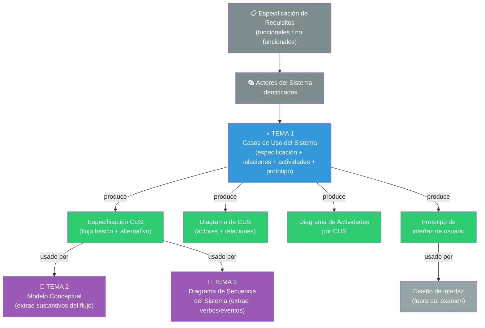
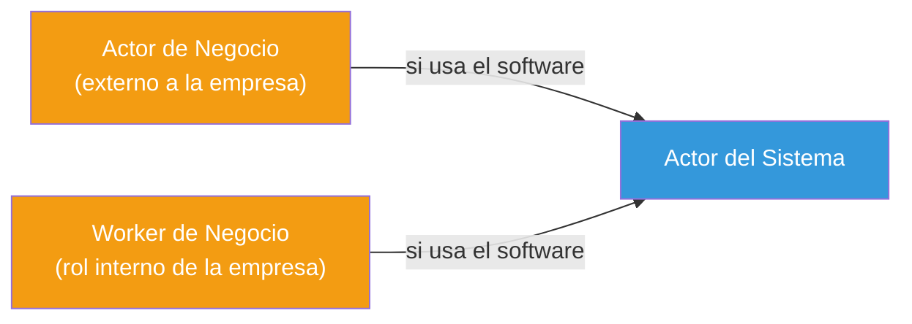
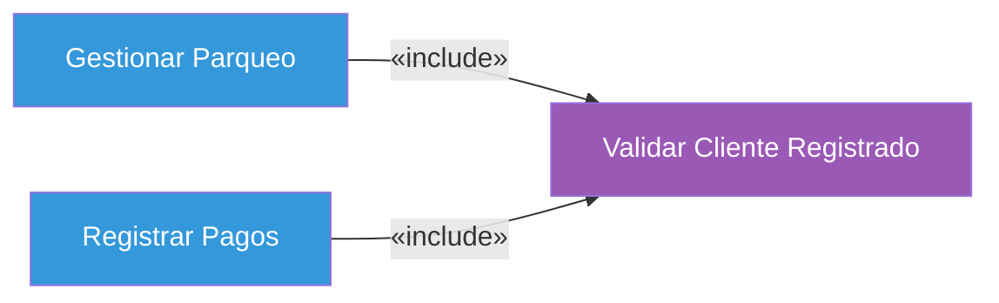
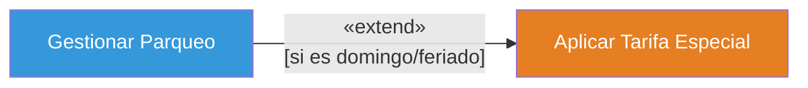
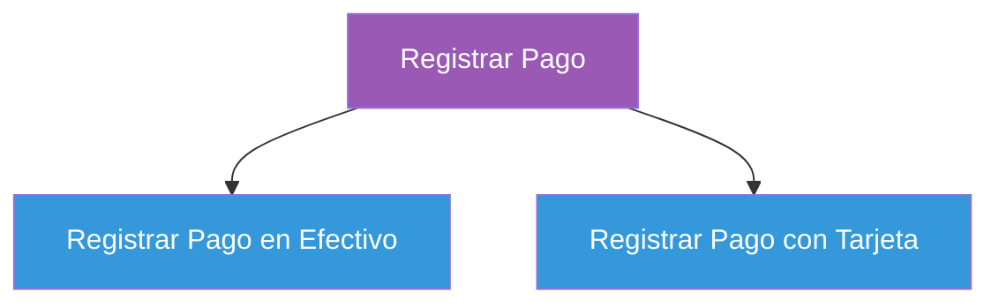
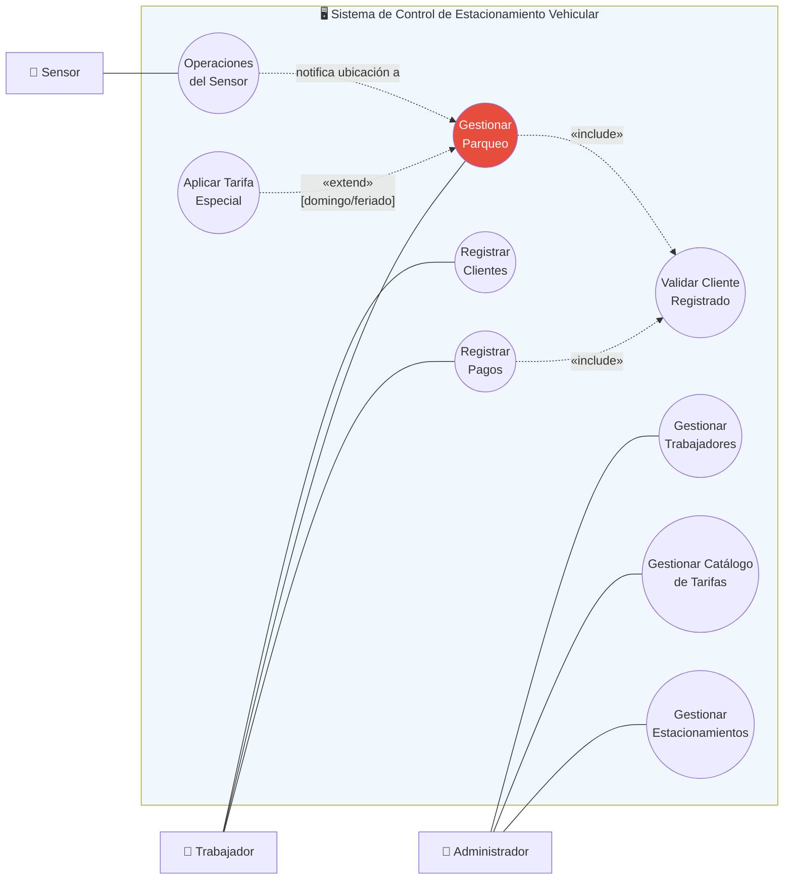
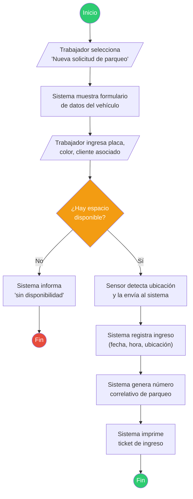
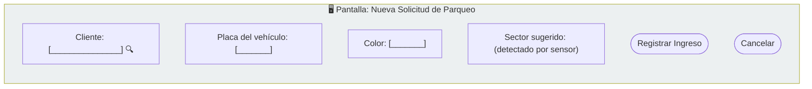

# Tema 1 — Casos de Uso del Sistema (cierre de "Sistema")

> 🔗 Este tema es el **punto de partida** del rango de examen. Es donde termina el bloque llamado "Sistema" (Requisitos) y donde arranca todo lo que sigue.

---

# Objetivo del tema

Un Caso de Uso del Sistema (CUS) resuelve un problema muy concreto dentro del Proceso Unificado: **traducir lo que el negocio necesita en una lista precisa, verificable y acotada de lo que el software debe hacer, vista desde afuera**.

Hasta este punto del curso ya se hizo el Modelo de Negocio (se entendió *cómo funciona el negocio sin software*) y se recolectaron requisitos (funcionales, no funcionales, de implementación — ver `repaso_final/06_requerimientos.md`). El problema es que una lista plana de requisitos ("El sistema deberá calcular el importe...", "El sistema deberá registrar el ingreso...") es difícil de:

- **Agrupar** en unidades de funcionalidad con sentido para el usuario.
- **Negociar** con el cliente ("¿esto va en la primera entrega o en la segunda?").
- **Usar como base** para diseñar la interacción y la estructura del software.

Los Casos de Uso del Sistema resuelven exactamente eso: agrupan requisitos relacionados en **procesos completos con valor para un actor**, contados como una historia con inicio y fin.

### ¿Dónde encaja en RUP?

En RUP esto corresponde al final del **Flujo de Trabajo de Requisitos** (*Requirements Workflow*), dentro de las fases de **Inicio** y **Elaboración**. Es el artefacto que **cierra la pregunta "¿QUÉ debe hacer el sistema?"** antes de que el equipo empiece a preguntarse "¿CÓMO lo va a hacer internamente?" (que es la pregunta del Análisis, Tema 2 en adelante).

> 🔑 **Idea central**: un CUS **no dice cómo se implementa nada**. Es una caja negra. Todavía no existen clases, ni bases de datos, ni arquitecturas. Solo existe: un actor, una intención, y una secuencia de interacciones con el sistema.

---

# Panorama general



**Preguntas que responde este diagrama:**

- **¿Qué viene antes?** La ingeniería de requerimientos: ya sabes qué requisitos debe cumplir el sistema y quiénes son sus actores.
- **¿Qué produce este tema?** Cuatro artefactos: la especificación textual del CUS, el diagrama de CUS, el diagrama de actividades de cada CUS, y el prototipo de interfaz.
- **¿Quién utiliza ese resultado?** El Modelo Conceptual (Tema 2) toma los **sustantivos** del flujo del CUS para proponer clases candidatas. El Diagrama de Secuencia del Sistema (Tema 3) toma los **verbos/acciones del actor hacia el sistema** para proponer operaciones del sistema.
- **¿Qué sigue después?** El Análisis completo (Temas 2 a 5): se deja de preguntar "¿qué hace el sistema?" y se empieza a preguntar "¿con qué conceptos del dominio se explica lo que hace?".

---

# Conceptos fundamentales

## 1. Actor del Sistema

> 🔑 **Definición**: un actor del sistema es cualquier entidad **externa** al software que **interactúa directamente** con él intercambiando información (persona, dispositivo u otro sistema).

No confundir con el Actor de Negocio (Tema del Modelo de Negocio): el Actor de Negocio interactúa con la **empresa completa** (puede que ni siquiera toque una computadora); el Actor del Sistema interactúa con el **software**.

| Tipo de actor | Ejemplo en SCEV | ¿Por qué es actor? |
|---|---|---|
| Persona (rol humano) | `Administrador`, `Trabajador` | Usan una interfaz para dar órdenes al sistema y reciben respuestas |
| Dispositivo / sistema externo | `Sensor` | No es una persona, pero envía eventos al sistema (detección de ubicación de vehículo) y el sistema reacciona |

**¿De dónde salen los actores del sistema?** No se inventan: se derivan de quién necesita interactuar con el software para cumplir los requisitos ya identificados. En el Modelo de Negocio, un Actor de Negocio o un Worker de Negocio que termine usando el software **se convierte** en Actor del Sistema.



> ⚠️ **Error común**: incluir como actor a alguien que NO interactúa directamente con el sistema. En SCEV, el `Cliente` que estaciona su carro **no usa el software** — es el `Trabajador` quien lo opera por él. El Cliente es relevante para el negocio, pero no es Actor del Sistema en este caso (salvo que el enunciado agregue, por ejemplo, un totem de autoservicio).

## 2. Caso de Uso del Sistema (CUS)

> 🔑 **Definición**: descripción narrativa y estructurada de una secuencia de acciones, incluyendo variantes, que un sistema ejecuta para producir un resultado observable de valor para un actor.

### 2.1 Niveles de detalle

| Nivel | Cuándo se usa | Contenido |
|---|---|---|
| **Alto nivel / breve** | Fase de Inicio, para negociar alcance con el cliente rápidamente | 2-4 líneas: qué hace, quién lo usa |
| **Expandido / esencial** | Fase de Elaboración, antes de pasar a Análisis | Precondición, flujo básico numerado, flujos alternativos, postcondición |

⚠️ **Por qué existen ambos**: el nivel alto sirve para **planear iteraciones** (decidir qué CUS entran en cada entrega) sin gastar tiempo detallando algo que quizá cambie. El nivel expandido es el que realmente **alimenta el Análisis** — de él se extraen clases (Tema 2) y operaciones del sistema (Tema 3). Si saltas directo al expandido sin el de alto nivel, pierdes velocidad de negociación con el cliente; si te quedas solo con el de alto nivel, no tienes suficiente detalle para diseñar nada.

### 2.2 Plantilla de especificación (memorízala, aparece tal cual en examen)

| Campo | Qué contiene |
|---|---|
| **Nombre CUS** | Verbo + sustantivo, ej. "Gestionar Parqueo" |
| **Actores** | Quién(es) participan |
| **Descripción** | Resumen de 1-2 líneas |
| **Precondición** | Qué debe ser cierto ANTES de iniciar el CUS |
| **Flujo básico** | Pasos numerados del escenario de éxito |
| **Flujo alternativo** | Variantes, errores, cancelaciones — referenciadas al paso del flujo básico donde ocurren (ej. "En el punto 4, si...") |
| **Postcondición** | Qué es cierto DESPUÉS de completar el CUS con éxito |

> ⚠️ **Error común**: escribir el flujo básico mezclando **decisiones internas del sistema** ("el sistema decide el mejor sensor a usar") con **interacción observable** ("el sistema muestra el total"). El CUS es una caja negra: solo describe lo que el actor ve y hace, nunca el algoritmo interno.

## 3. Relaciones entre Casos de Uso

Estas relaciones existen para **reducir duplicación** y **modelar variabilidad**, no por capricho notacional.

### 3.1 Include (inclusión) — obligatorio, factoriza lo común



- El CU base **siempre** ejecuta al incluido (no es opcional).
- El incluido **no tiene sentido ejecutado solo** ("Validar Cliente Registrado" no es un servicio que alguien pida por sí mismo).
- Sirve para no repetir el mismo bloque de pasos en varios CUS.

### 3.2 Extend (extensión) — opcional, condicional



- El CU base puede ejecutar o NO al extendido, según una condición.
- La flecha va **del extendido hacia el base** (contraintuitivo: el que "agrega" comportamiento apunta hacia el que lo recibe).
- Sirve para modelar comportamiento opcional sin ensuciar el flujo básico del CU principal.

### 3.3 Generalización de casos de uso — variantes que heredan



- El hijo hereda el comportamiento del padre y puede añadir o sobrescribir pasos.
- Se usa cuando existen **variantes** de un mismo proceso, no una simple opción dentro del proceso (a diferencia de `extend`).

### Tabla comparativa (muy preguntada en examen)

| Criterio | Include | Extend | Generalización |
|---|---|---|---|
| ¿Es obligatorio? | Sí, siempre | No, depende de una condición | El hijo hereda todo, siempre |
| ¿Quién dispara a quién? | El CU base invoca al incluido | El CU extendido se activa dentro del base | No hay invocación, hay herencia |
| Dirección de la flecha | Base → Incluido | Extendido → Base | Hijo → Padre (triángulo) |
| Propósito | Eliminar duplicación | Modelar opcionalidad | Modelar variantes/especialización |

> ⚠️ **El error de examen #1 de este tema**: invertir la flecha de `extend`. Trucos para recordarla: *"el que extiende, apunta hacia lo que extiende"* — la flecha sale del comportamiento adicional y llega al CU que lo recibe.

## 4. Diagrama de Actividades del CUS

> 🔑 Un Diagrama de Actividades traduce el flujo básico + alternativo de la especificación textual a un **flujo de control gráfico**, útil cuando el CUS tiene muchas ramas, bucles o decisiones que son difíciles de leer en texto.

**¿Cuándo usarlo?** No es obligatorio para todos los CUS. Se usa cuando el flujo tiene:
- Varias decisiones encadenadas.
- Actividades que pueden ocurrir en paralelo.
- Un ciclo (repetición) que conviene visualizar.

**Elementos principales:**

| Elemento | Símbolo Mermaid aproximado | Significado |
|---|---|---|
| Inicio | `((•))` | Punto de arranque del flujo |
| Actividad | `[Actividad]` | Una acción o paso |
| Decisión | `{Condición}` | Punto de ramificación |
| Fin | `((◉))` | Punto de término |
| Carril (swimlane) | `subgraph` | Separa actividades por responsable (Actor vs. Sistema) |

> ⚠️ **Error común**: mezclar el nivel de detalle — poner "el sistema valida" como una sola actividad en un diagrama y en otro CUS desagregarlo en 5 pasos. Sé consistente con el nivel de abstracción dentro de todo el diagrama.

## 5. Prototipo de interfaz de usuario

Un prototipo es una representación **de baja fidelidad** (boceto) de las pantallas que el actor usará para ejecutar el CUS. No es diseño visual definitivo: es una herramienta de **comunicación con el cliente** para validar que el flujo del CUS tiene sentido antes de construir nada.

**¿Cuándo se usa?** Justo después de tener el flujo básico del CUS, y antes o en paralelo con el Diagrama de Secuencia del Sistema. Ayuda a decidir qué datos pide el sistema en cada paso (información que después alimenta los parámetros de las operaciones del sistema, Tema 3).

> 🧩 **Conexión clave**: cada campo del prototipo suele corresponder a un **parámetro** de una operación del sistema, y cada botón de acción suele disparar **un mensaje** del actor hacia el sistema en el DSS. Si tu prototipo pide "Placa del vehículo" y tu DSS no tiene ningún mensaje con ese parámetro, hay una inconsistencia.

---

# Diagramas

## Diagrama de Casos de Uso del Sistema — SCEV completo

**¿Para qué sirve?** Da una vista de conjunto: todos los actores, todos los CUS, y cómo se relacionan entre sí. No muestra flujo ni orden temporal, solo *quién puede hacer qué* y qué CUS dependen de otros.

**¿Cuándo utilizarlo?** Al cerrar el análisis de requisitos, como "tabla de contenidos" visual de la funcionalidad del sistema, y como insumo para planear iteraciones.

**Elementos**: actor (monigote o rectángulo `«actor»`), caso de uso (óvalo), límite del sistema (rectángulo contenedor), relaciones (asociación, `include`, `extend`, generalización).



> **Errores frecuentes en este diagrama**: (1) conectar actores directamente entre sí (los actores no se conocen entre sí dentro del diagrama de CUS); (2) usar `include`/`extend` para relacionar CUS que en realidad no comparten pasos (sobre-modelar); (3) olvidar que el actor `Sensor` también necesita su propio CUS aunque no sea humano.

## Diagrama de Actividades — CUS "Gestionar Parqueo" (flujo de ingreso de vehículo)

**¿Para qué sirve?** Visualizar la secuencia y las decisiones del flujo básico + alternativo de "Gestionar Parqueo" de forma más legible que el texto plano.

**¿Cuándo utilizarlo?** Este CUS tiene una decisión relevante (¿hay espacio disponible?) y una posible interrupción (cancelación), por lo que se beneficia de un diagrama de actividades.



> **Errores frecuentes**: dibujar el diagrama de actividades como si fuera un diagrama de secuencia (con mensajes entre objetos) — el diagrama de actividades es sobre **flujo de control**, no sobre **quién le manda un mensaje a quién**; eso es tarea del Tema 3.

## Prototipo de interfaz — pantalla "Nueva Solicitud de Parqueo" (aproximación textual)

**¿Para qué sirve?** Validar con el cliente que el orden y los campos del formulario capturan exactamente lo que el flujo básico necesita.



> **Errores frecuentes**: incluir en el prototipo campos que el CUS nunca menciona (sobre-diseñar), o al revés, que el CUS pida un dato que el prototipo no contempla (inconsistencia que después se traduce en un DSS incompleto).

---

# Ejemplo completo

Seguimos el caso **Sistema de Control de Estacionamiento Vehicular (SCEV)** desde cero.

### Paso 1 — Requisitos de partida (ya resueltos en el tema anterior al examen)

Ejemplos de requisitos ya capturados (de `sem06`, `sem11`):

- R10 (Funcional): *"El sistema deberá permitir que un trabajador realice el registro de la solicitud de parqueo a los clientes que estén registrados en el sistema."*
- R12 (Funcional): *"El sistema deberá permitir que el sensor de acercamiento ultrasónico detecte la ubicación, sector, piso del estacionamiento que está ocupando un vehículo al momento de estacionarse."*
- R13 (Funcional): *"El sistema deberá registrar el ingreso y la salida de los vehículos (cliente, fecha, hora, placa del vehículo, color, ...)."*
- R16 (Funcional): *"El sistema deberá generar un número correlativo de 6 dígitos que identificará el Nº de parqueo..."*

### Paso 2 — Actores del Sistema

| Actor | Descripción |
|---|---|
| `Administrador` | Gestiona trabajadores, catálogo de tarifas y verifica el estado de los estacionamientos |
| `Trabajador` | Registra clientes, solicitudes de parqueo, ingresos/salidas de vehículos y pagos |
| `Sensor` | Detecta la ubicación y el espacio ocupado por un vehículo, y envía esa información al sistema |

### Paso 3 — Matriz Requisitos → CUS (agrupación)

| CUS | Requisitos que cubre | Actor |
|---|---|---|
| Gestionar Trabajadores | R04 | Administrador |
| Gestionar Catálogo de Tarifas | R07, R08 | Administrador |
| Gestionar Estacionamientos | R03, R20 | Administrador |
| Registrar Clientes | R11 | Trabajador |
| **Gestionar Parqueo** | R10, R12, R13, R16 | Trabajador (+ Sensor) |
| Registrar Pagos | R14, R15 | Trabajador |
| Operaciones del Sensor | R12 | Sensor |

### Paso 4 — Especificación expandida del CUS principal: "Gestionar Parqueo"

```
Nombre CUS:      Gestionar Parqueo
Actores:         Trabajador (principal), Sensor (secundario)
Descripción:     Permite al trabajador registrar la solicitud de parqueo de un
                 cliente registrado, detectar la ubicación del vehículo y
                 generar el ticket de ingreso.
Precondición:    El trabajador inició sesión correctamente. El cliente está
                 registrado en el sistema (CUS "Registrar Clientes").

FLUJO BÁSICO:
1.  El Trabajador selecciona "Nueva solicitud de parqueo".
2.  El Sistema muestra el formulario de datos del vehículo.
3.  El Trabajador ingresa el cliente, la placa y el color del vehículo.
4.  El Sistema valida que el cliente esté registrado. «include: Validar Cliente
    Registrado»
5.  El Sistema verifica disponibilidad de espacio.
6.  El Sensor detecta el sector y piso donde se ubicó el vehículo y lo
    reporta al Sistema.
7.  El Sistema registra el ingreso (fecha, hora, placa, color, ubicación).
8.  El Sistema genera un número correlativo de 6 dígitos para el parqueo.
9.  El Sistema imprime el ticket de ingreso.
10. El CUS finaliza.

FLUJOS ALTERNATIVOS:
5a. Sin disponibilidad de espacio:
    1. El Sistema informa que no hay espacio disponible.
    2. El CUS finaliza.
9a. Día domingo o feriado: «extend: Aplicar Tarifa Especial»
    1. El Sistema marca el parqueo con tarifa especial para el cálculo
       posterior del pago.
    2. Continúa en el paso 9 del flujo básico.

Postcondición:   Se registró el ingreso del vehículo, se le asignó una
                 ubicación y un número de parqueo, y se emitió el ticket.
```

### Paso 5 — Diagrama de actividades y prototipo

Ya mostrados arriba en la sección **Diagramas**, construidos directamente a partir de este flujo.

### Lo que este tema deja listo para el Tema 2

- **Sustantivos candidatos** ya visibles en el flujo: `Trabajador`, `Cliente`, `Vehículo`, `Solicitud de Parqueo`, `Sector`, `Piso`, `Ticket`, `Sensor`, `Tarifa Especial`. Estos se convertirán en clases candidatas del Modelo Conceptual.
- **Acciones del actor hacia el sistema** ya visibles: "selecciona nueva solicitud", "ingresa datos del vehículo", "el sensor reporta ubicación". Estas se convertirán en operaciones del sistema en el DSS (Tema 3).

---

# Casos típicos de examen

- **Pedir que identifiques actores** a partir de un enunciado nuevo (no visto en clase) y justificar por qué SÍ o por qué NO algo es un actor (el error clásico es marcar como actor a alguien que no interactúa directamente con el software).
- **Dar un flujo básico en prosa y pedir la especificación estructurada** (con precondición, flujo alternativo y postcondición correctamente separados).
- **Pedir que distingas `include` de `extend`** dado un par de CUS con comportamiento compartido u opcional — y que dibujes la flecha en la dirección correcta.
- **Preguntar por la dirección de la flecha de `extend`** de forma aislada — es EL error más común, así que suele aparecer como pregunta trampa.
- **Pedir el diagrama de CUS completo** de un caso nuevo, incluyendo relaciones.
- **Comparar CUS de alto nivel vs. expandido** y preguntar en qué fase/momento se usa cada uno.
- **Pedir el diagrama de actividades** de un CUS con al menos una decisión y un flujo alternativo.
- Comparación importante que casi siempre aparece: **Actor de Negocio vs. Actor del Sistema** (de dónde viene cada uno).

---

# Preguntas de recuperación

1. ¿Por qué un Caso de Uso del Sistema no debe describir CÓMO el sistema hace algo internamente, solo QUÉ ocurre desde afuera?
2. Explica con tus propias palabras la diferencia entre `include` y `extend`, y por qué la dirección de la flecha de `extend` suele memorizarse mal.
3. ¿Qué información concreta del flujo de un CUS termina alimentando al Modelo Conceptual, y qué información termina alimentando al Diagrama de Secuencia del Sistema?
4. ¿Por qué el actor `Sensor` es un actor del sistema válido aunque no sea una persona?
5. ¿Qué diferencia hay entre un CUS de alto nivel y uno expandido, y en qué momento del proyecto usarías cada uno?
6. ¿Qué relación existe entre un Actor de Negocio (o un Worker de Negocio) y un Actor del Sistema?
7. ¿Cuándo tiene sentido dibujar un diagrama de actividades para un CUS y cuándo no vale la pena?
8. ¿Qué inconsistencia se produce si un prototipo de interfaz pide un dato que jamás aparece en la especificación del CUS?

---

# Ejercicios

### 1 (conceptual) 
Explica por qué "Validar Cliente Registrado" no podría convertirse nunca en un caso de uso independiente que un actor invoque directamente, y qué tipo de relación debe tener con los CUS que lo usan.

### 2 (conceptual)
Dado el par de CUS "Registrar Pagos" y "Aplicar Tarifa Especial" (que solo ocurre si el día es domingo o feriado), justifica por qué la relación correcta es `extend` y no `include`, dibujando la relación con la flecha en la dirección correcta.

### 3 (interpretación)
Lee este fragmento de un enunciado nuevo: *"Los clientes de un gimnasio pueden reservar una clase grupal desde una aplicación móvil. Un sensor de aforo en la sala evita que se reserven más cupos que sillas disponibles. La recepcionista puede reservar una clase manualmente para un cliente que llama por teléfono."* Identifica todos los actores del sistema y justifica cada uno.

### 4 (interpretación)
Con el mismo enunciado del ejercicio 3, escribe la especificación expandida (precondición, flujo básico de al menos 6 pasos, un flujo alternativo, postcondición) del CUS "Reservar Clase Grupal".

### 5 (diseño/análisis)
Para el CUS que escribiste en el ejercicio 4, dibuja el diagrama de actividades correspondiente, incluyendo al menos una decisión (el chequeo de aforo disponible).

### 6 (diseño/análisis)
Construye el diagrama de Casos de Uso del Sistema completo del gimnasio, agregando al menos un CUS adicional relacionado por `include` con "Reservar Clase Grupal" (por ejemplo, validar membresía activa) y uno relacionado por `extend` (por ejemplo, aplicar recargo por reserva tardía).

### 7 (diseño/análisis)
A partir del flujo básico que escribiste en el ejercicio 4, subraya los sustantivos que consideres clases candidatas para un futuro Modelo Conceptual, y subraya por separado las acciones del actor hacia el sistema que consideres futuras operaciones del sistema. (No construyas todavía el Modelo Conceptual ni el DSS — eso es el Tema 2 y el Tema 3.)

---

# Autoevaluación

- [ ] Puedo explicar la diferencia entre Actor de Negocio y Actor del Sistema sin ver mis notas.
- [ ] Puedo escribir de memoria los 7 campos de la plantilla de especificación de un CUS.
- [ ] Puedo dibujar `include` y `extend` con la dirección de flecha correcta sin dudar.
- [ ] Puedo explicar por qué un CUS de alto nivel no reemplaza a uno expandido.
- [ ] Dado un enunciado nuevo (no visto en clase), puedo identificar sus actores y al menos 3 CUS candidatos en menos de 10 minutos.
- [ ] Puedo construir un diagrama de actividades a partir de un flujo básico con al menos una decisión.
- [ ] Entiendo qué parte de un CUS "sobrevive" hacia el Modelo Conceptual y cuál hacia el Diagrama de Secuencia del Sistema.

---

# Resumen ejecutivo

Un **CUS** documenta, en prosa estructurada, un proceso completo que el sistema ejecuta para dar valor a un **actor del sistema** (persona, dispositivo o sistema externo que interactúa directamente con el software — no confundir con Actor de Negocio). Tiene dos niveles: **alto nivel** (2-4 líneas, para negociar alcance) y **expandido** (precondición, flujo básico numerado, flujos alternativos referenciados a un paso del básico, postcondición — plantilla de examen obligatoria). Los CUS se relacionan entre sí de tres formas: **`include`** (el base siempre ejecuta al incluido; factoriza comportamiento común; el incluido no tiene sentido solo), **`extend`** (el base *puede* ejecutar al extendido según una condición; la flecha va del extendido hacia el base — error de examen #1 si se invierte), y **generalización** (un CU hijo hereda y especializa el comportamiento de un padre; usar cuando hay variantes de un mismo proceso). El **Diagrama de Actividades** traduce el flujo a un flujo de control gráfico (útil con decisiones/bucles); no muestra mensajes entre objetos, solo secuencia y ramas. El **prototipo de interfaz** es un boceto de baja fidelidad para validar con el cliente que el flujo tiene sentido, y sus campos deben ser consistentes con los datos que el CUS realmente pide. Este tema es la bisagra del curso: es lo último de "Sistema" y lo primero que alimenta el **Análisis** — los sustantivos del flujo básico se vuelven clases candidatas del Modelo Conceptual (Tema 2) y las acciones actor→sistema se vuelven operaciones del sistema en el Diagrama de Secuencia del Sistema (Tema 3).
