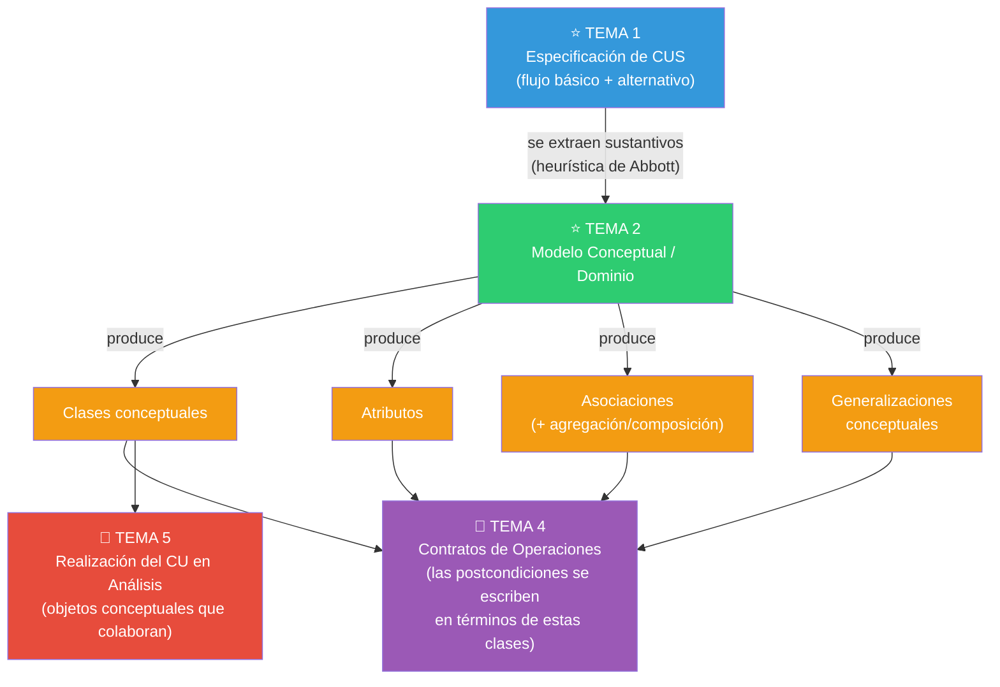
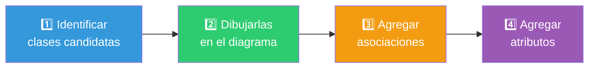
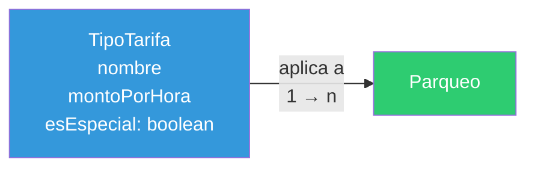
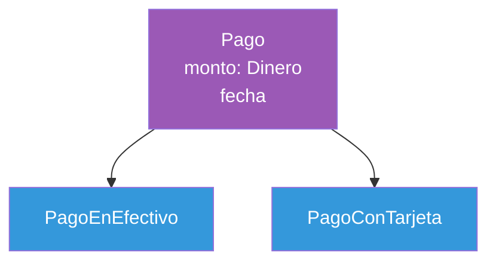
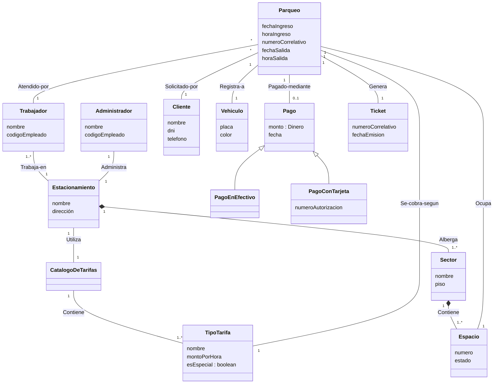
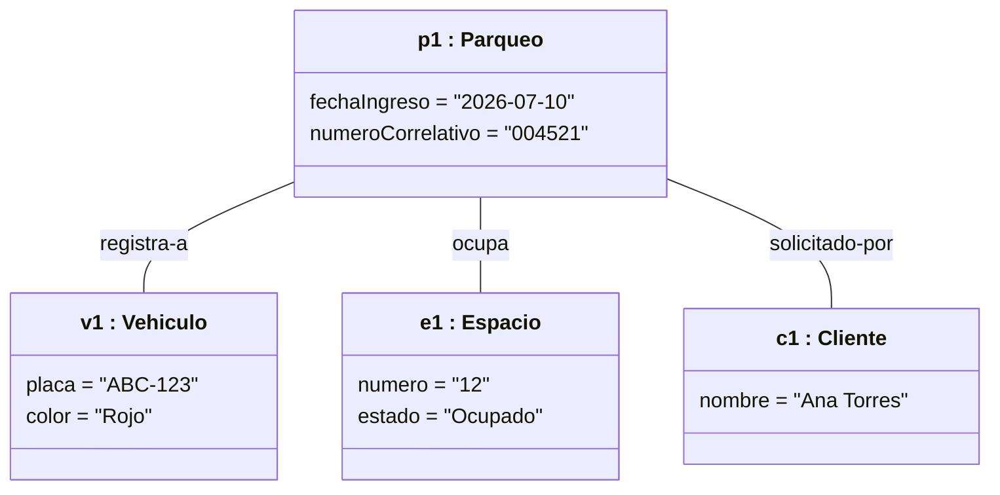
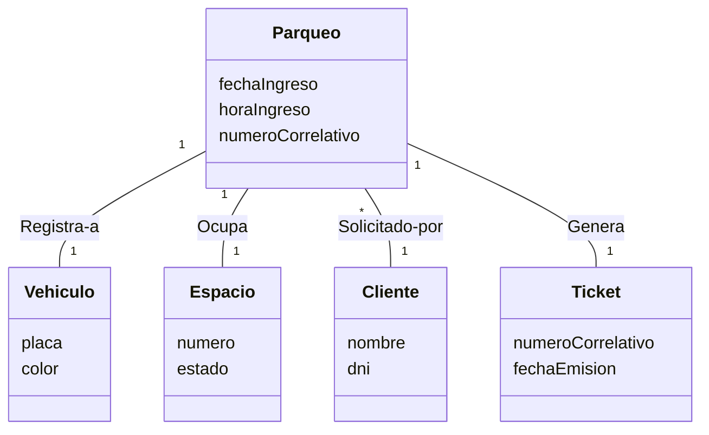

# Tema 2 — Modelo Conceptual / Modelo de Dominio

> 🔗 Continúa el caso SCEV desde `01_casos_uso_sistema.md`. Este es el **primer artefacto de Análisis** propiamente dicho.

---

# Objetivo del tema

El Modelo Conceptual resuelve un problema muy concreto: **antes de escribir una sola línea de código o diseñar una sola clase de software, el equipo necesita un vocabulario común y preciso sobre el dominio del problema**. Sin ese vocabulario, cada desarrollador le pone nombre distinto a las mismas cosas, el cliente no entiende lo que se está construyendo, y el software termina modelando mal la realidad que dice representar.

En RUP, este artefacto pertenece al **Flujo de Trabajo de Análisis**, dentro de la fase de **Elaboración**. Es el primer paso de "traducir" el CUS (que describe comportamiento observable) en una estructura de conceptos.

> 🔑 **Idea central (Larman)**: *"Un modelo de dominio muestra clases conceptuales significativas en el dominio del problema. NO muestra software."* No hay clases de software, no hay ventanas, no hay bases de datos, no hay métodos. Solo hay conceptos del mundo real y las relaciones entre ellos.

**¿Por qué existe como artefacto separado, en vez de ir directo al diseño de clases?** Porque mezclar el vocabulario del negocio con decisiones de software produce diseños contaminados por decisiones prematuras (por ejemplo, modelar "Cliente" como una tabla de base de datos en vez de como un concepto del negocio). El Modelo Conceptual reduce el **salto de representación** (*representational gap*) entre el mundo real y el software, dándole al diseño de software un punto de partida con nombres y relaciones ya validados contra la realidad.

---

# Panorama general



- **¿Qué viene antes?** La especificación expandida de los CUS (Tema 1). Sin flujo básico escrito, no hay de dónde extraer conceptos.
- **¿Qué produce?** Un diagrama de clases (sin métodos) con clases conceptuales, atributos simples y asociaciones/generalizaciones entre esas clases.
- **¿Quién usa este resultado?** Los Contratos de Operaciones (Tema 4) describen sus postcondiciones **usando exactamente los nombres de clases, atributos y asociaciones definidos aquí**. La Realización del CU en Análisis (Tema 5) usa estas clases como los "objetos" que colaboran para resolver cada operación.
- **¿Qué sigue después (fuera del examen)?** El Modelo de Diseño toma estas mismas clases y les agrega métodos, tipos de datos concretos y visibilidad, transformándolas en clases de software.

---

# Conceptos fundamentales

## 1. ¿Qué es y qué no es una clase conceptual?

| Sí es Modelo Conceptual | No es Modelo Conceptual |
|---|---|
| Conceptos del mundo real (`Vehículo`, `Parqueo`, `Tarifa`) | Componentes de software (`FormularioParqueo`, `TablaVehiculos`) |
| Atributos simples de esos conceptos (`fecha`, `placa`) | Métodos o responsabilidades (`calcularImporte()`) |
| Relaciones que existen en el negocio, con o sin software | Relaciones de acceso a datos (foreign keys, JOINs) |

> ⚠️ **Error común y muy preguntado**: meter clases como `BaseDeDatosParqueos` o métodos como `imprimirTicket()` dentro del modelo conceptual. Esos son artefactos de software, pertenecen al Modelo de Diseño (fuera de este examen).

## 2. El proceso de construcción — 4 pasos



> 🔑 **Regla de oro (Larman)**: es mejor especificar de más, con clases de "grano fino" (una clase separada para cada concepto relevante), que especificar por defecto o quedarse corto. Es más fácil eliminar una clase sobrante después que descubrir tarde que falta una.

## 3. Paso 1 — Identificar clases candidatas

### Estrategia A: lista de categorías de clases conceptuales

Repasa cada categoría contra el dominio y pregunta "¿existe algo así en mi caso?":

| Categoría | Ejemplo en SCEV |
|---|---|
| Objetos físicos/tangibles | `Vehículo`, `Sensor` |
| Especificaciones/descripciones | `TipoTarifa` (descripción de una tarifa, independiente de cada cobro concreto) |
| Lugares | `Estacionamiento`, `Sector` |
| Transacciones | `Parqueo`, `Pago` |
| Líneas de transacción | (no aplica de forma directa en SCEV; sí en un sistema de venta con líneas de detalle) |
| Roles de personas | `Trabajador`, `Administrador`, `Cliente` |
| Contenedores | `Estacionamiento` (contiene sectores y espacios) |
| Cosas en el contenedor | `Vehículo`, `Espacio` |
| Sistemas externos | `Sensor` (si se modela como fuente de eventos, no solo actor) |
| Catálogos | `CatálogoDeTarifas` |
| Registros / documentos | `Ticket` |
| Eventos | `Parqueo` (el acto de estacionar es también un evento en el tiempo) |

### Estrategia B: análisis de frases nominales (heurística de Abbott)

1. Toma el flujo básico + alternativo ya escrito en el Tema 1.
2. Subraya cada sustantivo o frase nominal.
3. Cada uno es candidato a **clase** o a **atributo** (se decide más adelante con la prueba de la sección 4).

> ⚠️ **Punto débil de esta técnica**: el lenguaje natural es ambiguo (sinónimos, palabras que se refieren a lo mismo con distinto nombre). Por eso siempre se complementa con la Estrategia A — nunca se usa la heurística de Abbott sola.

## 4. La prueba más importante: ¿atributo o clase conceptual?

> 🔑 **Regla práctica**: si dudas, conviértelo en clase. Los atributos deben ser la excepción, no la regla, en un modelo de dominio.

**Prueba**: ¿la "cosa" en cuestión es un tipo de dato simple (número, texto, fecha, booleano) o es algo con identidad propia en el mundo real (una entidad legal, un objeto físico, algo que ocupa espacio o tiempo)?

```
❌ INCORRECTO                       ✅ CORRECTO

Parqueo                             Parqueo          Sector
  sector: String                                     nombre
                                                      piso

Vehículo                            Vehículo         Cliente
  cliente: String                                    nombre
                                                      dni
```

**Aplicado a SCEV**: `sector` no es un simple texto libre — es un lugar identificable dentro del estacionamiento, con su propia información (nombre, piso, capacidad). Por lo tanto **`Sector` debe ser clase, no atributo** de `Parqueo`.

## 5. Clases de especificación / descripción

> 🔑 Una clase de especificación (o "catálogo") describe información que debe **sobrevivir** aunque no existan instancias concretas asociadas.

**¿Cuándo usarla?**
- Necesitas la descripción **independientemente** de que existan instancias físicas.
- Eliminar instancias provocaría **pérdida de información** valiosa.
- Reduce datos redundantes repetidos en cada instancia.



Aplicado a SCEV: si se elimina un `Parqueo` finalizado (por archivado histórico), el `TipoTarifa` ("Tarifa normal", "Tarifa especial domingo/feriado") debe seguir existiendo en el `CatálogoDeTarifas`, porque describe una política del negocio, no un evento puntual.

## 6. Paso 3 — Asociaciones

### ¿Qué asociaciones registrar?

Solo las que sea necesario **recordar** para cumplir los requisitos — no todo lo que "se te ocurra" que podría relacionarse.

| Categoría de asociación común | Ejemplo en SCEV |
|---|---|
| A es una parte física de B | `Sector` — `Estacionamiento` |
| A es una parte lógica de B | (no aplica de forma directa aquí) |
| A está contenido físicamente en B | `Espacio` — `Sector` |
| A es una descripción de B | `TipoTarifa` — `Parqueo` |
| A se registra/captura en B | `Parqueo` — `Estacionamiento` |
| A es miembro de B | `Trabajador` — `Estacionamiento` |
| A utiliza/gestiona B | `Trabajador` — `Parqueo` |
| A se comunica con B | `Sensor` — `Sistema` (evento externo) |
| A es transacción relacionada con B | `Pago` — `Parqueo` |

### Multiplicidad

| Notación | Significado |
|---|---|
| `1` | Exactamente uno |
| `0..1` | Cero o uno |
| `*` o `0..*` | Cero o más |
| `1..*` | Uno o más |

### Nombrar asociaciones

Formato: `ClaseA — FraseVerbal — ClaseB`. Ejemplos en SCEV: `Parqueo — Ocupa — Espacio`, `Parqueo — Pagado-mediante — Pago`, `Estacionamiento — Alberga — Sector`.

## 7. Agregación, composición y generalización conceptuales

| Relación | Símbolo | Fuerza | ¿La parte sobrevive sin el todo? |
|---|---|---|---|
| Asociación simple | línea | — | N/A |
| Agregación | ◇ rombo hueco | Débil | Sí |
| Composición | ◆ rombo relleno | Fuerte | No |
| Generalización | △ triángulo | Es-un-tipo-de | N/A |

**Composición en SCEV**: `Estacionamiento ◆— Sector` (si el estacionamiento se elimina del sistema, sus sectores no tienen sentido de forma independiente). **Agregación en SCEV**: `CatálogoDeTarifas ◇— TipoTarifa` (un `TipoTarifa` podría, en teoría, existir referenciado desde otro catálogo histórico, aunque en la práctica suele modelarse igual con composición — la frontera entre agregación y composición siempre es la pregunta de examen más debatida, ver Tema 7 de esta guía).

### Generalización conceptual: `Pago`



- **Regla del 100%**: todo lo que aplica a `Pago` debe aplicar también a `PagoEnEfectivo` y a `PagoConTarjeta`.
- **Regla "es-un-tipo-de"**: `PagoConTarjeta` **es un tipo de** `Pago` (no simplemente "usa" o "tiene" un pago).
- **¿Cuándo crear la subclase?** Cuando tiene atributos adicionales (`PagoConTarjeta` necesita `numeroAutorización`) o se maneja de forma distinta en el negocio (requiere validación con un servicio externo, mientras que en efectivo no).

## 8. Paso 4 — Atributos

### Reglas

1. Solo tipos de datos **simples**: texto, número, fecha, hora, booleano.
2. Nunca un concepto complejo como atributo — si tiene identidad propia, es una asociación a otra clase.
3. Si el atributo tiene **partes internas** (ej. un número de placa con formato específico) puede modelarse como clase si esas partes importan al negocio.
4. Si el atributo tiene **unidad de medida**, modelarlo como Cantidad + Unidad (ej. `Dinero` = monto + moneda), no como número plano.

```
❌ INCORRECTO                  ✅ CORRECTO
Pago                           Pago
  monto: Número                 monto: Dinero   (Dinero = número + moneda)
```

---

# Diagramas

## Diagrama de Clases Conceptual — SCEV completo

**¿Para qué sirve?** Fijar el vocabulario compartido del dominio: qué existe, cómo se llama y cómo se relaciona, sin ninguna decisión de software todavía.

**¿Cuándo utilizarlo?** Inmediatamente después de tener las especificaciones expandidas de los CUS principales — es la base de todo lo que sigue en Análisis.

**Elementos y relaciones**: clase (rectángulo con nombre y atributos, SIN métodos), asociación (línea con nombre y multiplicidad), agregación (◇), composición (◆), generalización (△).



> **Errores frecuentes en este diagrama**: (1) agregar métodos "porque se ven bien" — un modelo conceptual NUNCA tiene métodos; (2) confundir `Ticket` con `Pago` — el ticket es un comprobante de ingreso, el pago es la transacción monetaria de salida, son conceptos distintos con su propio ciclo de vida; (3) modelar `sector` y `piso` como atributos de texto libre de `Parqueo` en vez de asociarlos a `Sector`/`Espacio` como clases propias.

## Diagrama de Objetos — una instancia concreta

**¿Para qué sirve?** Verificar que el diagrama de clases es coherente, mostrando un escenario real con valores concretos (una "fotografía" del sistema en un instante).

**¿Cuándo utilizarlo?** Para validar multiplicidades dudosas, o para explicarle a alguien el modelo con un ejemplo tangible.



> **Diferencia clave con el diagrama de clases**: aquí `p1:Parqueo` es UNA instancia concreta, con valores reales, subrayado el nombre del objeto. El diagrama de clases muestra la estructura general (`Parqueo` con sus atributos tipados y multiplicidades), este muestra un caso puntual.

---

# Ejemplo completo

Continuamos con SCEV, aplicando el proceso de 4 pasos al flujo básico de "Gestionar Parqueo" (Tema 1).

### Paso 1 — Sustantivos subrayados en el flujo básico

> *"El **Trabajador** selecciona 'Nueva solicitud de parqueo'. El **Sistema** muestra el formulario. El Trabajador ingresa el **cliente**, la **placa** y el **color** del **vehículo**. El Sistema valida... El Sistema verifica **disponibilidad de espacio**. El **Sensor** detecta el **sector** y **piso**... El Sistema registra el **ingreso**... El Sistema genera un **número correlativo**... El Sistema imprime el **ticket de ingreso**."*

### Paso 2 — Clasificación: ¿clase o atributo?

| Candidato | ¿Clase o atributo? | Justificación |
|---|---|---|
| Cliente | Clase | Tiene identidad propia (nombre, DNI, teléfono), ya definida en el CUS "Registrar Clientes" |
| Placa, Color | Atributos de `Vehículo` | Son datos simples (texto) del vehículo |
| Vehículo | Clase | Tiene atributos propios y participa en varias asociaciones |
| Sector, Piso | Clase `Sector` (con atributo `piso`) | `Sector` tiene identidad (nombre/código), no es solo un texto |
| Espacio | Clase | Cada espacio físico tiene su propio estado (ocupado/libre) — necesario para "verificar disponibilidad" |
| Número correlativo | Atributo de `Parqueo` | Dato simple generado por el sistema |
| Ticket de ingreso | Clase | Es un documento con su propio ciclo de vida (se emite, se puede reimprimir) |

### Paso 3 — Asociaciones agregadas

`Parqueo — Ocupa — Espacio`, `Parqueo — Registra-a — Vehículo`, `Parqueo — Solicitado-por — Cliente`, `Parqueo — Genera — Ticket`, `Sector *-- Espacio (composición)`.

### Paso 4 — Atributos agregados

`Parqueo`: `fechaIngreso`, `horaIngreso`, `numeroCorrelativo`. `Vehículo`: `placa`, `color`.

### Resultado

El fragmento del Modelo Conceptual centrado en "Gestionar Parqueo" (subconjunto del diagrama completo de la sección **Diagramas**):



### Lo que este tema deja listo para el Tema 3 y el Tema 4

- El vocabulario (`Parqueo`, `Vehículo`, `Espacio`, `Cliente`, `Ticket`) que usarán los **Contratos de Operaciones** para describir postcondiciones ("se creó una instancia de Parqueo...", "se asoció con el Espacio...").
- Las clases que se convertirán en los "objetos" que colaboran en la **Realización del CU en Análisis** (Tema 5).

---

# Casos típicos de examen

- **Dar un párrafo nuevo de un dominio no visto** y pedir el modelo conceptual completo (clases, atributos, asociaciones, multiplicidad).
- **Preguntar si "X" debe ser atributo o clase**, obligando a aplicar la prueba de identidad propia / tipo de dato simple.
- **Pedir que distingas agregación de composición** con un ejemplo concreto y que expliques qué pasa si se destruye el "todo".
- **Aplicar la Regla del 100% y la regla "es-un-tipo-de"** para justificar (o refutar) una generalización propuesta.
- **Detectar errores en un modelo conceptual ya dibujado** (por ejemplo, un método colado, una clase de software, un atributo que en realidad es una clase).
- **Pedir la multiplicidad correcta** de una asociación dada una regla de negocio en texto.
- Comparación importante que casi siempre aparece: **Modelo Conceptual vs. Diagrama de Clases de Diseño** (el segundo está fuera de este examen, pero se pregunta la diferencia para verificar que entendiste los límites del Análisis).

---

# Preguntas de recuperación

1. ¿Por qué el Modelo Conceptual no puede contener métodos ni clases de software? ¿Qué problema evita esta restricción?
2. Explica la prueba que usarías para decidir si algo es un atributo o una clase conceptual, con un ejemplo propio (no de SCEV).
3. ¿Cuál es la diferencia entre agregación y composición, y qué pregunta harías sobre el "todo" para decidir cuál aplica?
4. ¿Cuándo conviene crear una clase de especificación/catálogo en lugar de dejar el dato suelto como atributo?
5. Aplica la Regla del 100% a un ejemplo de generalización que tú mismo inventes y explica por qué se cumple o no.
6. ¿Por qué se dice que el Modelo Conceptual reduce el "salto de representación" entre el mundo real y el software?
7. ¿Qué información del CUS (Tema 1) se usa exactamente para identificar clases candidatas, y qué limitación tiene esa técnica?
8. ¿Qué pasaría en los Temas 3 y 4 si el Modelo Conceptual estuviera incompleto o mal nombrado?

---

# Ejercicios

### 1 (conceptual)
Explica con tus propias palabras por qué `Dinero` suele modelarse como una clase (monto + moneda) y no como un atributo numérico simple.

### 2 (conceptual)
Dado `Empleado` y `Gerente` (un `Gerente` es un tipo de `Empleado` que además supervisa a otros empleados), aplica la Regla del 100% y la regla "es-un-tipo-de" para justificar que la generalización es correcta.

### 3 (interpretación)
Retoma el enunciado del gimnasio del Tema 1 (clases grupales, sensor de aforo, reservas). Subraya los sustantivos del flujo que escribiste en el CUS "Reservar Clase Grupal" y clasifica cada uno como clase candidata o atributo candidato, justificando cada decisión.

### 4 (interpretación)
Con el mismo caso del gimnasio, decide si la relación entre `SalaDeClases` y `ClaseGrupal` (una clase grupal se imparte en una sala) es agregación, composición o asociación simple, y multiplica tu respuesta con la multiplicidad correcta en ambos extremos.

### 5 (diseño/análisis)
Construye el Modelo Conceptual completo del gimnasio (mínimo 6 clases), incluyendo al menos una generalización y una composición, con sus multiplicidades.

### 6 (diseño/análisis)
Un compañero modeló `Reserva` con un atributo `cliente: String` (el nombre del cliente escrito como texto). Explica qué error de modelado cometió, qué problema real causaría en el sistema, y corrige el diagrama.

### 7 (diseño/análisis)
Agrupa las clases de tu Modelo Conceptual del gimnasio (ejercicio 5) en al menos 2 paquetes lógicos, y justifica el criterio de agrupación que usaste.

---

# Autoevaluación

- [ ] Puedo explicar por qué el Modelo Conceptual no incluye métodos ni clases de software.
- [ ] Puedo aplicar la prueba "¿tipo de dato simple o entidad con identidad propia?" sin dudar.
- [ ] Puedo diferenciar agregación de composición usando la pregunta "¿sobrevive la parte sin el todo?".
- [ ] Puedo aplicar la Regla del 100% y la regla "es-un-tipo-de" para validar una generalización.
- [ ] Puedo construir un Modelo Conceptual completo (clases + atributos + asociaciones + multiplicidad) a partir de un párrafo nuevo en menos de 20 minutos.
- [ ] Sé explicar cuándo conviene una clase de especificación/catálogo.
- [ ] Entiendo qué partes de este modelo reutilizarán los Contratos de Operaciones (Tema 4).

---

# Resumen ejecutivo

El **Modelo Conceptual (o de Dominio)** representa las clases conceptuales significativas del dominio del problema — SIN software, SIN métodos, SIN bases de datos. Se construye en 4 pasos: (1) identificar clases candidatas usando la **lista de categorías** (objetos físicos, transacciones, roles, catálogos, eventos...) y la **heurística de Abbott** (subrayar sustantivos del flujo del CUS); (2) dibujarlas; (3) agregar **asociaciones** (con nombre, dirección de lectura y multiplicidad); (4) agregar **atributos** (solo tipos simples). La decisión más preguntada en examen es **¿atributo o clase?** — la regla es: si tiene identidad propia en el mundo real (ocupa espacio, es una entidad legal, tiene su propio ciclo de vida), es clase; si es solo un dato simple, es atributo; **ante la duda, hazlo clase**. Existen relaciones especiales: **agregación** (◇, todo-parte débil, la parte sobrevive sin el todo), **composición** (◆, todo-parte fuerte, la parte NO sobrevive sin el todo, multiplicidad del todo siempre 1) y **generalización** (△, aplica la Regla del 100% y la regla "es-un-tipo-de"). Las **clases de especificación/catálogo** (como `TipoTarifa`) se usan cuando la descripción debe sobrevivir aunque no existan instancias asociadas. Este modelo es la base de vocabulario que reutilizan literalmente los Contratos de Operaciones (Tema 4) y la Realización del CU en Análisis (Tema 5): si el vocabulario aquí está mal, todo lo que sigue hereda el error.
