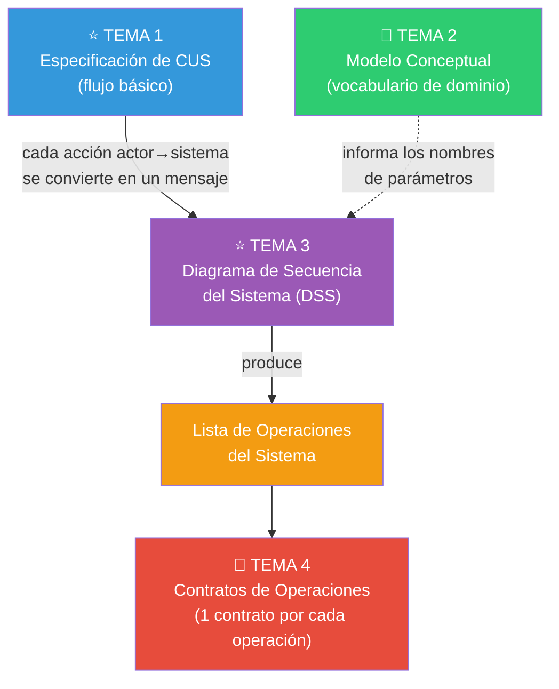
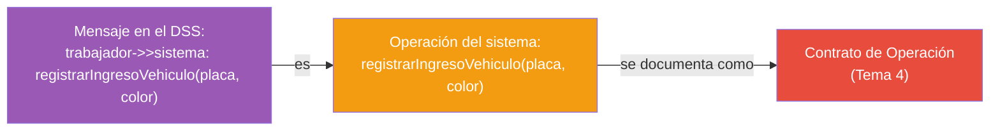
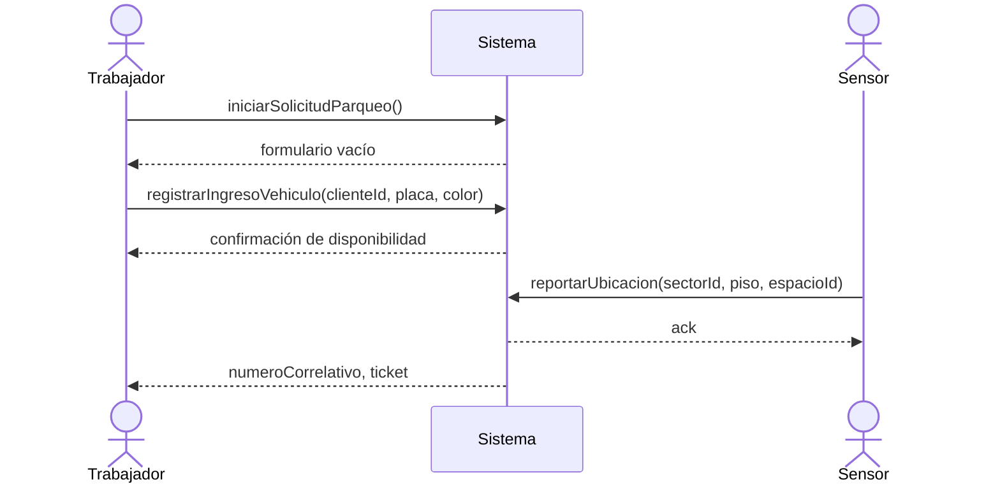
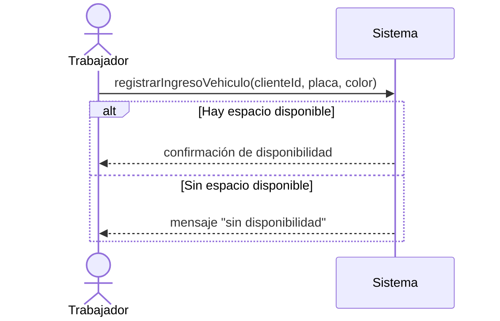

# Tema 3 — Diagrama de Secuencia del Sistema (DSS)

> 🔗 Continúa el caso SCEV. Trabaja en paralelo conceptual con el Tema 2, pero mira al mismo CUS del Tema 1 desde otro ángulo: no "qué conceptos existen", sino "qué eventos ocurren".

---

# Objetivo del tema

El flujo básico de un CUS (Tema 1) está escrito en **prosa**. La prosa es excelente para comunicarse con el cliente, pero es ambigua para definir con precisión **qué mensajes concretos llegan al sistema y en qué orden**. El Diagrama de Secuencia del Sistema (DSS) resuelve ese problema: convierte el flujo en una representación gráfica y formal de los **eventos externos** que llegan al sistema.

En RUP, el DSS pertenece al **Flujo de Trabajo de Análisis**, en la fase de **Elaboración**, y es el puente directo entre "lo que el actor hace" (CUS) y "qué debe programarse como una operación" (Contratos, Tema 4).

> 🔑 **Idea central**: el DSS trata al sistema como una **caja negra**. No muestra objetos internos, ni clases, ni cómo el sistema resuelve internamente cada petición — solo muestra **qué entra** (eventos del actor) y **qué sale** (respuestas del sistema). Es la razón por la que este diagrama pertenece a Análisis y NO a Diseño: en Diseño ya se abre la caja negra (eso lo hace el Diagrama de Colaboración de Diseño, fuera de este examen).

**¿Por qué no basta con el CUS en prosa?** Porque de la prosa no se puede derivar directamente una **firma de operación** con parámetros bien definidos. El DSS obliga a decidir, mensaje por mensaje, qué datos concretos viajan del actor al sistema — y esa decisión es exactamente lo que después se documenta formalmente en un Contrato de Operación.

---

# Panorama general



- **¿Qué viene antes?** La especificación expandida del CUS (Tema 1) y, en paralelo, el Modelo Conceptual (Tema 2) que da nombre a los conceptos que viajarán como parámetros.
- **¿Qué produce?** Una **lista de operaciones del sistema**: nombres de mensajes con sus parámetros, extraídos directamente del diagrama.
- **¿Quién usa este resultado?** Cada operación identificada aquí se documenta como un **Contrato de Operación** completo en el Tema 4.
- **¿Qué sigue después?** Los contratos (Tema 4), y luego la integración de todo en la Realización del CU en Análisis (Tema 5).

---

# Conceptos fundamentales

## 1. ¿Qué es exactamente un DSS?

> 🔑 **Definición**: diagrama que muestra, para un escenario particular de un CUS, los eventos generados por actores externos, su orden y los mensajes/parámetros interactuando con el sistema — representado como un objeto único, sin descomponer su estructura interna.

| Aspecto | Valor |
|---|---|
| Perspectiva | Caja negra (QUÉ hace el sistema, no CÓMO) |
| Se deriva de | La especificación del CUS (Tema 1) |
| Participantes | El/los actor(es) + una única línea de vida llamada "Sistema" |
| Fase RUP | Análisis (Elaboración) |
| Produce | Lista de operaciones del sistema |

## 2. Reglas de construcción

1. **El actor siempre inicia el mensaje.** El sistema nunca envía el primer mensaje de una interacción — solo responde.
2. **Un mensaje por cada paso del flujo básico que representa una interacción real con el sistema.** Pasos puramente descriptivos ("el trabajador observa la pantalla") no generan mensaje.
3. **Los parámetros del mensaje son los datos que el actor debe proporcionar** en ese paso — ni más, ni menos que lo que el flujo menciona.
4. **Las respuestas se muestran como flechas punteadas de retorno**, opcionalmente con los datos que se devuelven.
5. **Los bucles del flujo básico** (ej. "repetir hasta indicar fin") se representan con un marco `loop`.
6. **Eventos de actores no humanos** (como el `Sensor`) también generan mensajes hacia el sistema, igual que un actor humano.

> ⚠️ **Error común**: dibujar mensajes que salen DEL sistema hacia el actor como si fueran la iniciativa de la interacción (por ejemplo, "el sistema pregunta al trabajador..."). En el DSS, el sistema **responde**, no inicia — si el sistema necesita datos, es porque el actor ejecutó una acción que los requiere, y el mensaje sigue naciendo del actor.

> ⚠️ **Error común #2**: nombrar el mensaje como si fuera una descripción libre ("el trabajador ingresa los datos") en lugar de un nombre de operación con sintaxis de función: `registrarIngresoVehiculo(placa, color, clienteId)`.

## 3. De mensajes a operaciones del sistema

Cada mensaje único que llega al "Sistema" en el DSS **es**, por definición, una operación del sistema. Por eso el DSS es el artefacto que **produce la lista de operaciones** que luego se documentan como contratos.



## 4. DSS vs. Diagrama de Secuencia "de diseño" (fuera de este examen)

| Aspecto | DSS (Análisis — este tema) | Diagrama de Secuencia/Colaboración de Diseño (fuera del examen) |
|---|---|---|
| Participantes | Actor + "Sistema" (una sola caja) | Actor + múltiples objetos de software internos |
| Muestra | QUÉ entra y sale del sistema | CÓMO colabora internamente el software |
| Mensajes | Operaciones del sistema | Invocaciones de métodos entre objetos concretos |

---

# Diagramas

## DSS — CUS "Gestionar Parqueo" (escenario principal de éxito)

**¿Para qué sirve?** Formalizar, mensaje por mensaje, la interacción entre el `Trabajador`/`Sensor` y el sistema durante el registro de un ingreso de vehículo.

**¿Cuándo utilizarlo?** Inmediatamente después de tener el flujo básico expandido y el vocabulario del Modelo Conceptual, antes de escribir los contratos.

**Elementos**: actor (figura o `actor`), objeto "Sistema" (una única línea de vida), mensaje (flecha continua con nombre y parámetros), retorno (flecha punteada), marco `loop`/`alt` para repeticiones o alternativas.



### Operaciones del sistema identificadas

| Operación | Parámetros | Origen del mensaje |
|---|---|---|
| `iniciarSolicitudParqueo()` | — | Trabajador |
| `registrarIngresoVehiculo(clienteId, placa, color)` | ID cliente, placa, color | Trabajador |
| `reportarUbicacion(sectorId, piso, espacioId)` | ID sector, piso, ID espacio | Sensor |

> **Errores frecuentes en este diagrama**: (1) omitir el mensaje del `Sensor` porque "no es una persona" — cualquier actor externo, humano o no, genera mensajes válidos; (2) dibujar flechas de retorno como si fueran nuevos mensajes del sistema hacia el actor iniciando una nueva interacción (confundiendo respuesta con iniciativa); (3) incluir en el diagrama detalles de implementación como "el sistema consulta la base de datos" — eso es una decisión interna, no un evento observable.

## DSS con flujo alternativo — "sin disponibilidad de espacio"

**¿Para qué sirve?** Mostrar cómo se representa una rama alternativa del CUS (Tema 1, flujo alternativo 5a) dentro del mismo tipo de diagrama.



> **Error frecuente**: crear un DSS completamente nuevo por cada flujo alternativo. Cuando la alternativa es corta, se representa con un marco `alt` dentro del mismo diagrama; solo se justifica un DSS separado cuando el flujo alternativo es tan distinto que mezclarlo haría el diagrama ilegible.

---

# Ejemplo completo

Retomamos el flujo básico completo de "Gestionar Parqueo" (Tema 1) y lo convertimos mensaje por mensaje.

### Paso 1 — Flujo básico (recordatorio del Tema 1)

```
1. El Trabajador selecciona "Nueva solicitud de parqueo".
2. El Sistema muestra el formulario.
3. El Trabajador ingresa el cliente, la placa y el color del vehículo.
4. El Sistema valida que el cliente esté registrado.
5. El Sistema verifica disponibilidad de espacio.
6. El Sensor detecta el sector y piso, y lo reporta al Sistema.
7. El Sistema registra el ingreso.
8. El Sistema genera un número correlativo de 6 dígitos.
9. El Sistema imprime el ticket de ingreso.
```

### Paso 2 — Identificar qué pasos generan un mensaje real

| Paso | ¿Genera mensaje? | Mensaje |
|---|---|---|
| 1 | Sí | `iniciarSolicitudParqueo()` |
| 2 | No (es una respuesta, no un nuevo mensaje) | — (parte del retorno de 1) |
| 3 | Sí | `registrarIngresoVehiculo(clienteId, placa, color)` |
| 4 | No (es lógica interna disparada por el mensaje 3) | — |
| 5 | No (idem) | — |
| 6 | Sí (mensaje del actor `Sensor`) | `reportarUbicacion(sectorId, piso, espacioId)` |
| 7, 8, 9 | No (son consecuencia interna del mensaje 3/6, se devuelven como retorno) | — |

> 🔑 Nota clave: los pasos 4, 5, 7, 8 y 9 son **lo que el sistema hace por dentro** como reacción a un mensaje ya recibido — no son mensajes nuevos. Es un error muy común convertir cada línea del flujo básico en un mensaje distinto; solo las líneas donde el **actor** hace algo generan un mensaje.

### Paso 3 — DSS resultante

(Mostrado arriba en la sección **Diagramas**.)

### Paso 4 — Lista final de operaciones del sistema para este CUS

1. `iniciarSolicitudParqueo()`
2. `registrarIngresoVehiculo(clienteId, placa, color)`
3. `reportarUbicacion(sectorId, piso, espacioId)`

### Lo que este tema deja listo para el Tema 4

Exactamente estas tres operaciones son las que se documentarán, una por una, como **Contratos de Operaciones** completos (responsabilidades, precondiciones, postcondiciones).

---

# Casos típicos de examen

- **Dar un flujo básico en prosa (nuevo, no visto) y pedir el DSS completo**, incluyendo el filtrado correcto de qué pasos generan mensaje y cuáles no.
- **Pedir la lista de operaciones del sistema** que se derivan de un DSS ya dado.
- **Preguntar por qué el sistema nunca "inicia" un mensaje** en un DSS.
- **Dar un DSS con errores** (mensaje iniciado por el sistema, actor faltante, mensaje con nombre no válido) y pedir identificarlos.
- **Pedir representar un bucle o una alternativa** del flujo dentro del mismo DSS usando `loop`/`alt`.
- Comparación importante que casi siempre aparece: **DSS vs. Diagrama de Colaboración de Diseño** (caja negra vs. caja blanca — aunque el segundo esté fuera del examen, se usa para confirmar que entiendes el límite del Análisis).

---

# Preguntas de recuperación

1. ¿Por qué el DSS trata al sistema como una única "caja negra" en vez de mostrar sus componentes internos?
2. ¿Cómo decides, dado un flujo básico en prosa, qué pasos generan un mensaje y cuáles no?
3. ¿Por qué el actor siempre debe iniciar el mensaje en un DSS, y qué error se comete si el sistema "inicia" una interacción?
4. ¿Qué relación exacta existe entre un mensaje del DSS y una operación del sistema?
5. ¿Cómo se representa un flujo alternativo corto dentro de un DSS sin crear un diagrama separado?
6. ¿Por qué un actor no humano (como un sensor) puede generar mensajes válidos en un DSS?
7. ¿Qué información necesitas del Modelo Conceptual (Tema 2) para poder nombrar correctamente los parámetros de un mensaje del DSS?

---

# Ejercicios

### 1 (conceptual)
Explica, en tus propias palabras, la diferencia entre un mensaje del DSS y una respuesta/retorno del sistema. ¿Por qué un retorno nunca es "la iniciativa" de la interacción?

### 2 (conceptual)
¿Por qué la mayoría de los pasos internos de validación ("el sistema valida...", "el sistema verifica...") de un flujo básico NO se convierten en mensajes separados del DSS?

### 3 (interpretación)
Retomando el CUS "Reservar Clase Grupal" del gimnasio (Temas 1 y 2), identifica qué pasos de tu flujo básico generan un mensaje real hacia el sistema y cuáles son solo reacción interna.

### 4 (interpretación)
Con la clasificación del ejercicio 3, escribe la lista final de operaciones del sistema (nombre + parámetros) para "Reservar Clase Grupal".

### 5 (diseño/análisis)
Dibuja el DSS completo de "Reservar Clase Grupal", incluyendo el mensaje generado por el sensor de aforo, usando un marco `alt` para representar el caso "sin cupos disponibles".

### 6 (diseño/análisis)
Un compañero dibujó este DSS: `Sistema->>Cliente: solicitarDatosDeReserva()` como primer mensaje del diagrama. Explica qué error conceptual cometió y corrígelo.

### 7 (diseño/análisis)
Para el CUS "Registrar Pagos" de SCEV (no desarrollado en el ejemplo completo de este tema), escribe su flujo básico breve (puedes inventarlo de forma consistente con el resto de SCEV) y deriva su DSS completo con al menos 3 operaciones del sistema.

---

# Autoevaluación

- [ ] Puedo explicar por qué el DSS es una representación de "caja negra".
- [ ] Puedo filtrar, dado un flujo básico, qué pasos generan mensaje y cuáles son reacción interna.
- [ ] Puedo justificar por qué el actor siempre inicia el mensaje y el sistema solo responde.
- [ ] Puedo derivar la lista de operaciones del sistema a partir de un DSS dado.
- [ ] Puedo representar bucles (`loop`) y alternativas (`alt`) dentro de un DSS.
- [ ] Entiendo la diferencia entre DSS (Análisis) y Diagrama de Colaboración de Diseño (fuera de este examen).
- [ ] Puedo construir el DSS completo de un CUS nuevo en menos de 15 minutos.

---

# Resumen ejecutivo

El **Diagrama de Secuencia del Sistema (DSS)** convierte el flujo básico de un CUS en una representación gráfica formal donde el sistema se trata como **caja negra**: solo se muestran los eventos que un actor (humano o no) envía al sistema y las respuestas que recibe, nunca la estructura interna. Reglas de construcción clave: **el actor siempre inicia el mensaje** (el sistema nunca "pregunta" por iniciativa propia), **un mensaje por cada paso donde el actor interactúa realmente** (los pasos de validación/cálculo interno del sistema NO generan mensaje nuevo, son reacción al mensaje ya recibido), los **parámetros** del mensaje son los datos que el actor aporta en ese paso, y los **bucles/alternativas** del flujo se representan con marcos `loop`/`alt`. El resultado más importante del DSS es la **lista de operaciones del sistema**: cada mensaje distinto que llega al sistema es, por definición, una operación que debe documentarse formalmente. Ese es exactamente el puente hacia el Tema 4 (**Contratos de Operaciones**): cada operación identificada aquí recibe su propio contrato con precondiciones y postcondiciones expresadas en el vocabulario del Modelo Conceptual (Tema 2).
