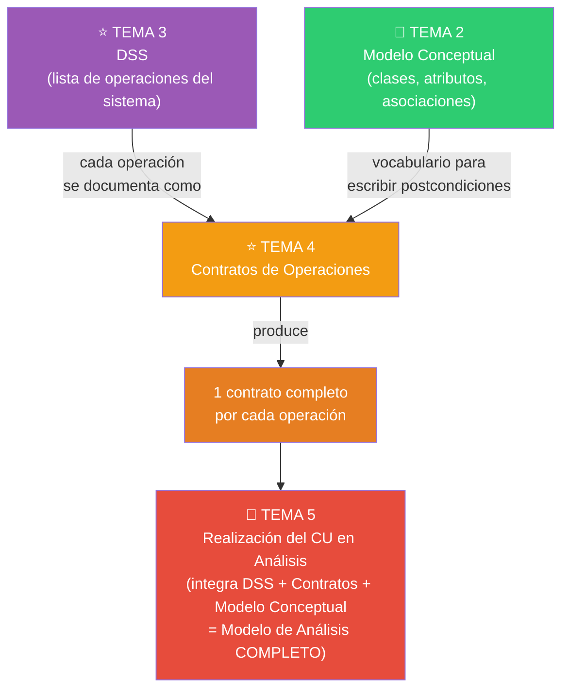
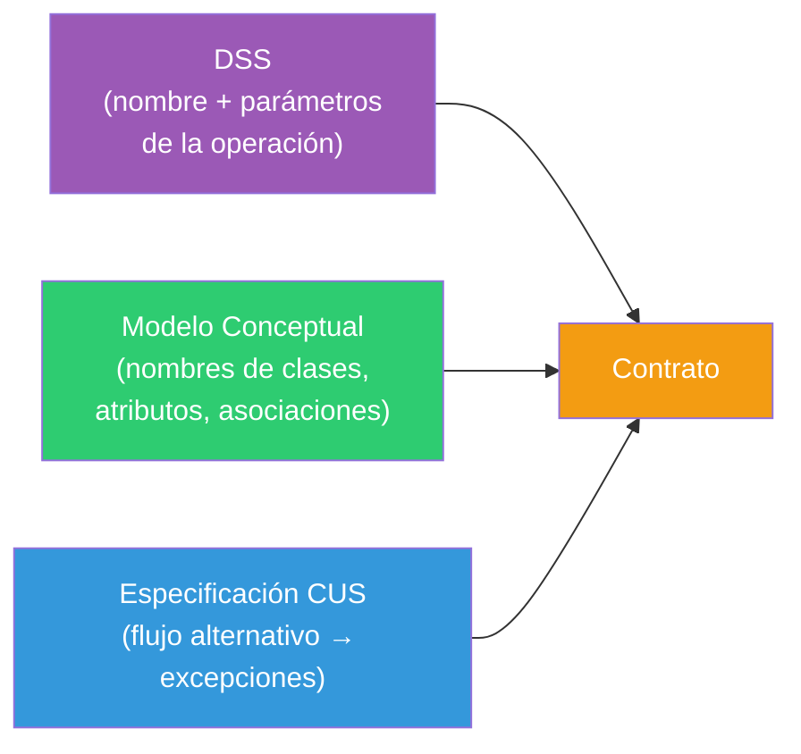
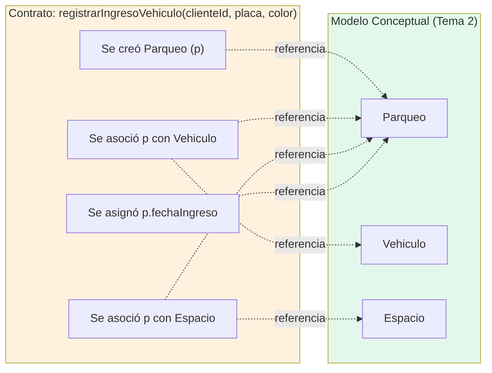

# Tema 4 — Contratos de Operaciones

> 🔗 Continúa el caso SCEV. Toma las operaciones del Tema 3 y el vocabulario del Tema 2, y los combina.

---

# Objetivo del tema

El DSS (Tema 3) dice **que** existe una operación llamada `registrarIngresoVehiculo(clienteId, placa, color)`, pero no dice **qué efecto** produce esa operación sobre el estado del sistema. Sin esa información, cualquier persona del equipo tendría que "adivinar" qué hace realmente cada operación, lo cual es inaceptable cuando distintas personas van a diseñar/implementar distintas partes del sistema.

El Contrato de Operación resuelve exactamente ese problema: describe, de forma precisa y verificable, **los cambios de estado** que produce ejecutar una operación del sistema — sin explicar el algoritmo interno (eso sigue siendo tarea del diseño, fuera de este examen).

En RUP, los contratos pertenecen al **Flujo de Trabajo de Análisis**, y son el artefacto que **cierra** la pregunta "¿qué promete el sistema al ejecutar esta operación?", dejando lista la especificación funcional exacta que el diseño deberá satisfacer.

> 🔑 **Idea central**: un contrato describe **QUÉ** cambia (en términos de instancias, atributos y asociaciones del Modelo Conceptual), nunca **CÓMO** cambia. Es la contraparte formal, orientada a objetos, de un contrato de software clásico: precondición → ejecución → postcondición garantizada.

---

# Panorama general



- **¿Qué viene antes?** La lista de operaciones del sistema (Tema 3) y el vocabulario de clases/atributos/asociaciones (Tema 2).
- **¿Qué produce?** Un documento formal por cada operación, con precondiciones y postcondiciones expresadas en términos de instancias creadas/eliminadas, atributos modificados y asociaciones formadas/rotas.
- **¿Quién usa este resultado?** La Realización del CU en Análisis (Tema 5), que junta el DSS + los contratos + el Modelo Conceptual para mostrar el panorama de Análisis completo de un CU. Más adelante (fuera del examen) el diseño usa los contratos como especificación exacta de lo que cada método debe lograr.
- **¿Qué sigue después?** El cierre del Modelo de Análisis (Tema 5), que es el último tema del rango de examen.

---

# Conceptos fundamentales

## 1. ¿Qué es un Contrato de Operación?

> 🔑 **Definición**: documento que describe los cambios de estado que produce el sistema al ejecutar una operación, en términos de creación/eliminación de instancias, modificación de atributos y formación/ruptura de asociaciones — usando el vocabulario exacto del Modelo Conceptual.

## 2. Plantilla completa (memorízala, aparece tal cual en examen)

| Campo | Descripción |
|---|---|
| **Nombre** | Firma exacta de la operación, tal como aparece en el DSS: `nombreOperacion(parámetros)` |
| **Responsabilidades** | Descripción breve e informal de qué logra la operación |
| **Tipo** | Casi siempre "Sistema" |
| **Referencias cruzadas** | Requisitos que cubre esta operación (ej. R10, R13) |
| **Notas** | Aclaraciones adicionales |
| **Excepciones** | Qué pasa si algo sale mal (ej. "si el cliente no existe, mostrar error") |
| **Salida** | Información que sale del sistema hacia otro sistema externo (si aplica) |
| **Precondiciones** | Qué debe ser cierto ANTES de ejecutar la operación |
| **Postcondiciones** | Qué es cierto DESPUÉS — el corazón del contrato |

## 3. Postcondiciones: los 5 tipos de cambio de estado

> 🔑 Toda postcondición debe caer en una de estas categorías. Si no cae en ninguna, probablemente no es una postcondición válida.

| Tipo de cambio | Ejemplo |
|---|---|
| **Creación de instancia** | "Se creó una instancia de `Parqueo` (p)" |
| **Modificación de atributo** | "Se asignó `p.numeroCorrelativo` = valor generado" |
| **Asociación formada** | "Se asoció `p` con el `Espacio` seleccionado" |
| **Asociación rota** | "Se desasoció el `Espacio` del `Parqueo` anterior (al liberar el espacio)" |
| **Eliminación de instancia** | "Se eliminó la instancia de `Ticket` temporal" |

> ⚠️ **El error de examen #1 de este tema**: escribir postcondiciones como **pasos de un algoritmo** ("se calcula el total", "se recorre la lista de espacios") en vez de **estados resultantes** ("se asignó X = Y", "se creó una instancia de Z"). Las postcondiciones se escriben en **pasado**, como una fotografía de lo que ya cambió, nunca como instrucciones de cómo llegar ahí.

> ⚠️ **Por qué se escriben en pasado**: esto es intencional y tiene una razón de examen: fuerza a describir el **resultado observable**, no el procedimiento. "Se creó una instancia de Parqueo" no dice nada sobre cómo se creó (¿con un `new`? ¿insertando una fila en una tabla?) — esa decisión es del diseño, no del análisis.

## 4. Precondiciones vs. postcondiciones

| | Precondición | Postcondición |
|---|---|---|
| ¿Cuándo se cumple? | ANTES de ejecutar | DESPUÉS de ejecutar con éxito |
| ¿Quién la garantiza? | El actor / el estado previo del sistema | El sistema, como resultado de ejecutar la operación |
| ¿Se prueba o se asume? | Se asume que es verdadera al empezar | Se garantiza que será verdadera al terminar |

## 5. ¿De dónde saca el contrato su información?



> 🧩 Esta es la razón por la que el orden de los temas de esta guía no es casualidad: no puedes escribir un contrato correcto si no tienes primero el DSS (Tema 3, para saber la firma) y el Modelo Conceptual (Tema 2, para saber qué instancias/atributos/asociaciones existen).

---

# Diagramas

Este tema no introduce un nuevo tipo de diagrama UML — los contratos son **texto estructurado**, no un diagrama. Sin embargo, es habitual usarlos junto con una vista del Modelo Conceptual para verificar que cada postcondición referencia elementos que realmente existen en el diagrama de clases.

### "Diagrama de trazabilidad" contrato ↔ modelo conceptual (aproximación con Mermaid)

**¿Para qué sirve esta vista?** Verificar visualmente que cada postcondición de un contrato usa clases/asociaciones que sí existen en el Modelo Conceptual — es el chequeo de consistencia más común que pide un profesor.

**¿Cuándo utilizarla?** Al finalizar de escribir un contrato, como autorrevisión.



> **Error frecuente**: escribir en una postcondición una clase o asociación que **no existe** en el Modelo Conceptual (por ejemplo, "se actualizó el historial de movimientos" cuando `HistorialDeMovimientos` nunca se modeló como clase). Todo contrato debe ser 100% trazable al Modelo Conceptual — si no lo es, hay que volver al Tema 2 y corregir el modelo.

---

# Ejemplo completo

Escribimos los contratos completos para las 3 operaciones que identificamos en el DSS del Tema 3.

### Contrato 1 — `iniciarSolicitudParqueo()`

```
Nombre:              iniciarSolicitudParqueo()
Responsabilidades:   Preparar el sistema para recibir los datos de una nueva
                     solicitud de parqueo.
Tipo:                Sistema
Precondiciones:      El Trabajador inició sesión correctamente.
Postcondiciones:     • No se crean instancias todavía (esta operación solo
                       habilita el formulario; no hay cambio de estado
                       persistente).
```

> 🧩 Nota de examen: no todas las operaciones tienen postcondiciones "ricas". Una operación que solo prepara una interfaz puede legítimamente no crear ni modificar nada — pero eso debe declararse explícitamente, no omitirse.

### Contrato 2 — `registrarIngresoVehiculo(clienteId, placa, color)`

```
Nombre:              registrarIngresoVehiculo(clienteId, placa, color)
Responsabilidades:   Registrar el ingreso de un vehículo, generar su
                     correlativo de parqueo y emitir el ticket.
Tipo:                Sistema
Referencias cruzadas: R10, R11, R13, R16
Excepciones:         Si clienteId no corresponde a un cliente registrado,
                     el sistema informa error y no continúa.
                     Si no hay espacio disponible, el sistema informa
                     "sin disponibilidad" y no crea el Parqueo.
Precondiciones:      Existe un Cliente registrado con clienteId.
                     Existe al menos un Espacio libre.
Postcondiciones:     • Se creó una instancia de Vehiculo (v) [creación de
                       instancia], si no existía previamente uno con la
                       misma placa.
                     • Se asignó v.placa = placa, v.color = color
                       [modificación de atributo].
                     • Se creó una instancia de Parqueo (p) [creación de
                       instancia].
                     • Se asignó p.fechaIngreso = fecha actual,
                       p.horaIngreso = hora actual [modificación de
                       atributo].
                     • Se asignó p.numeroCorrelativo = siguiente correlativo
                       de 6 dígitos [modificación de atributo].
                     • Se asoció p con v [asociación formada].
                     • Se asoció p con el Cliente correspondiente a
                       clienteId [asociación formada].
                     • Se creó una instancia de Ticket (t) [creación de
                       instancia].
                     • Se asoció t con p [asociación formada].
```

### Contrato 3 — `reportarUbicacion(sectorId, piso, espacioId)`

```
Nombre:              reportarUbicacion(sectorId, piso, espacioId)
Responsabilidades:   Registrar el espacio físico ocupado por el vehículo
                     recién ingresado, según lo detectado por el sensor.
Tipo:                Sistema
Referencias cruzadas: R12
Precondiciones:      Existe un Parqueo (p) recién creado sin Espacio
                     asociado todavía.
Postcondiciones:     • Se asoció p con el Espacio identificado por
                       espacioId [asociación formada].
                     • Se asignó Espacio.estado = "Ocupado" [modificación
                       de atributo].
```

### Verificación de trazabilidad (autorrevisión del Tema 4)

| Postcondición | Clase/asociación del Modelo Conceptual referenciada |
|---|---|
| "Se creó una instancia de Vehiculo" | `Vehiculo` ✅ existe en Tema 2 |
| "Se asoció p con v" | Asociación `Parqueo — Registra-a — Vehiculo` ✅ existe |
| "Se asoció p con el Espacio" | Asociación `Parqueo — Ocupa — Espacio` ✅ existe |
| "Se creó una instancia de Ticket" | `Ticket` ✅ existe |

### Lo que este tema deja listo para el Tema 5

Los tres contratos completos, junto con el DSS (Tema 3) y el Modelo Conceptual (Tema 2), son exactamente las tres piezas que se integran en la **Realización del CU "Gestionar Parqueo" en Análisis**, el tema final del rango de examen.

---

# Casos típicos de examen

- **Dar una operación (nombre + parámetros) y un fragmento del Modelo Conceptual, y pedir el contrato completo.**
- **Dar un contrato con postcondiciones mal escritas** (como pasos de algoritmo, no como estados) y pedir corregirlas.
- **Pedir que clasifiques cada postcondición** según los 5 tipos de cambio de estado.
- **Preguntar por qué las postcondiciones se escriben en pasado.**
- **Pedir la precondición correcta** dada una postcondición y un escenario (razonamiento inverso).
- **Verificar trazabilidad**: dado un contrato y un Modelo Conceptual, señalar qué postcondición referencia algo que NO existe en el modelo (y por tanto es un error).
- Comparación importante que casi siempre aparece: **contrato de operación vs. especificación del CUS** (ambos describen "lo que pasa", pero uno en lenguaje natural para el cliente y otro en notación semiformal para el equipo de desarrollo).

---

# Preguntas de recuperación

1. ¿Por qué un contrato de operación no debe describir el algoritmo interno con el que el sistema logra el cambio de estado?
2. Enumera los 5 tipos de cambio de estado que puede describir una postcondición, con un ejemplo propio de cada uno.
3. ¿Por qué las postcondiciones se escriben en tiempo pasado y qué problema evita esta convención?
4. ¿Qué información exacta necesitas del DSS (Tema 3) y del Modelo Conceptual (Tema 2) para poder escribir un contrato completo?
5. ¿Cómo verificarías que un contrato es "trazable" al Modelo Conceptual, y qué harías si encuentras una postcondición que no lo es?
6. ¿Qué diferencia hay entre la precondición de una operación y la postcondición de la operación anterior en el mismo flujo?
7. Explica con un ejemplo por qué una operación puede legítimamente no tener postcondiciones "ricas" (que crean o modifican instancias).

---

# Ejercicios

### 1 (conceptual)
Explica, con tus propias palabras, por qué "se calculó el total de la reserva" NO es una postcondición válida, y reescríbela como una postcondición correcta usando alguno de los 5 tipos de cambio de estado.

### 2 (conceptual)
Dado el contrato de `registrarIngresoVehiculo` del ejemplo completo de este tema, identifica cuál de sus postcondiciones es "asociación formada" y cuál es "modificación de atributo", justificando cada clasificación.

### 3 (interpretación)
Retomando el DSS de "Reservar Clase Grupal" del gimnasio (Tema 3), escribe el contrato completo de la operación principal de esa lista (la que registra la reserva).

### 4 (interpretación)
Para el mismo contrato del ejercicio 3, escribe al menos una excepción coherente con el flujo alternativo que definiste en el Tema 1 (por ejemplo, sin cupos disponibles).

### 5 (diseño/análisis)
Verifica la trazabilidad del contrato que escribiste en el ejercicio 3 contra el Modelo Conceptual del gimnasio que construiste en el Tema 2. Señala si hay alguna postcondición que referencie algo inexistente en el modelo, y corrígelo.

### 6 (diseño/análisis)
Escribe el contrato completo de la operación `reportarUbicacion` del ejemplo de SCEV, pero para el escenario en que el sensor detecta que el vehículo se retiró del espacio (liberación de espacio). Debes incluir una postcondición de tipo "asociación rota".

### 7 (diseño/análisis)
Escribe los contratos completos de las 3 operaciones que identificaste en el ejercicio 4 del Tema 3 para el CUS "Registrar Pagos" de SCEV, asegurando consistencia total con el Modelo Conceptual del Tema 2 (clase `Pago`, `PagoEnEfectivo`, `PagoConTarjeta`).

---

# Autoevaluación

- [ ] Puedo escribir de memoria los 8 campos de la plantilla de un contrato.
- [ ] Puedo clasificar cualquier postcondición en uno de los 5 tipos de cambio de estado.
- [ ] Puedo explicar por qué las postcondiciones se escriben en pasado y no como instrucciones.
- [ ] Puedo verificar la trazabilidad de un contrato contra un Modelo Conceptual dado.
- [ ] Dado un DSS y un Modelo Conceptual, puedo escribir un contrato completo y correcto en menos de 10 minutos por operación.
- [ ] Entiendo la diferencia entre la precondición de una operación y la postcondición de la anterior.
- [ ] Puedo distinguir un contrato bien escrito de uno que describe un algoritmo en vez de un estado.

---

# Resumen ejecutivo

Un **Contrato de Operación** documenta, para cada operación del sistema identificada en el DSS (Tema 3), los **cambios de estado** que produce — nunca el algoritmo interno. Usa la plantilla: Nombre, Responsabilidades, Tipo, Referencias cruzadas, Notas, Excepciones, Salida, Precondiciones, **Postcondiciones**. Las postcondiciones son el corazón del contrato y deben caer siempre en uno de **5 tipos**: creación de instancia, modificación de atributo, asociación formada, asociación rota, eliminación de instancia — y se escriben en **tiempo pasado** ("se creó...", "se asoció...") para forzar que describan un **resultado**, no un procedimiento. Todo el vocabulario usado en las postcondiciones (nombres de clases, atributos, asociaciones) debe ser 100% trazable al Modelo Conceptual (Tema 2); si el contrato menciona algo que el modelo no tiene, hay un error que debe corregirse retrocediendo al Tema 2. El contrato es la pieza final antes de poder decir que un caso de uso está completamente analizado: junto con el DSS y el Modelo Conceptual, forma las tres piezas que se integran en la **Realización del CU en Análisis** (Tema 5), el cierre del Modelo de Análisis completo.
