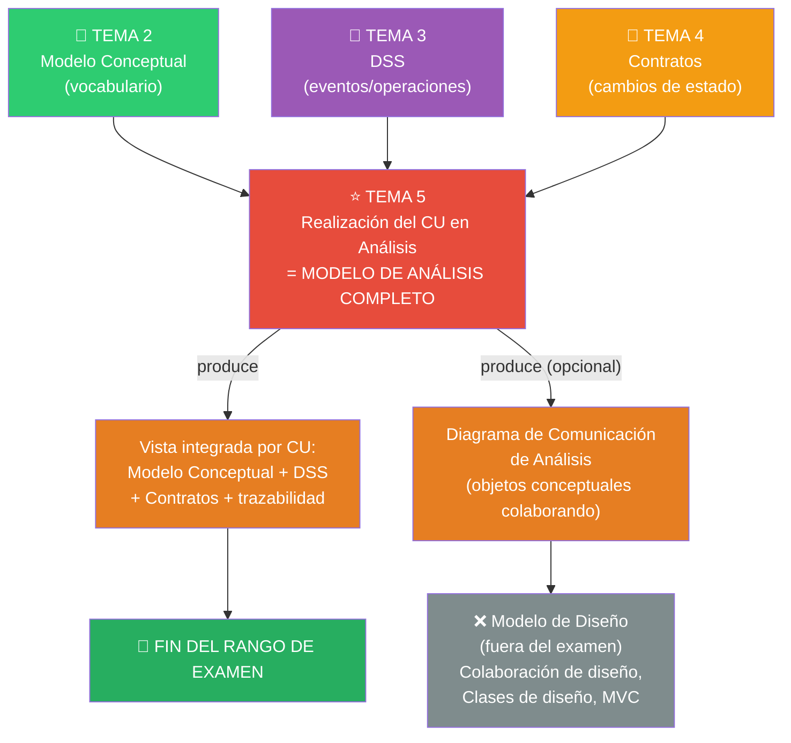
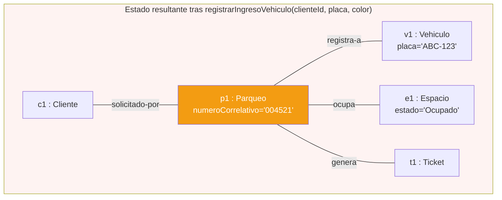
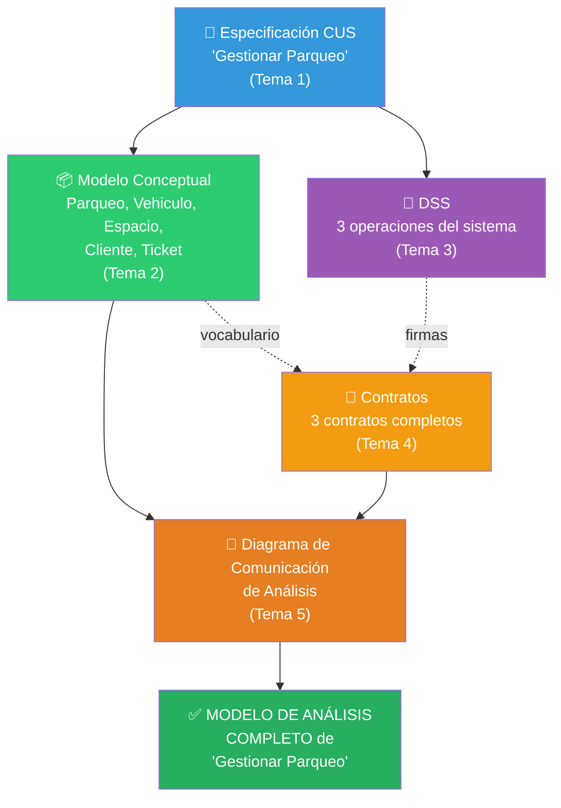

# Tema 5 — Realización del CU en Análisis (Modelo de Análisis COMPLETO)

> 🔗 Este es el **tema de cierre** del rango de examen. Integra los Temas 2, 3 y 4 en un solo panorama por Caso de Uso.

---

# Objetivo del tema

Hasta ahora, cada tema produjo una pieza por separado: el Modelo Conceptual (Tema 2) dice qué conceptos existen; el DSS (Tema 3) dice qué mensajes llegan al sistema; los Contratos (Tema 4) dicen qué cambia con cada mensaje. El problema que resuelve este tema es: **¿cómo se ve todo esto junto, para UN caso de uso específico?**

La respuesta es la **Realización de Caso de Uso en Análisis** (a veces llamada RCUS de análisis): el conjunto de artefactos —Modelo Conceptual + DSS + Contratos, y opcionalmente un diagrama de interacción a nivel de objetos conceptuales— que documenta **cómo ese caso de uso concreto se resuelve en términos de análisis**, todavía sin ninguna decisión de diseño de software.

En RUP, esto es literalmente el **cierre del Flujo de Trabajo de Análisis**. El material del curso lo nombra de forma explícita: *"Modelo de Análisis (realizaciones)"* (ver `sem08/9 Modelos UML C_largman Analisis.pdf`) y *"Realizar el modelo de análisis (realizaciones — diagrama de secuencia/colaboración por cada RCUS)"* (ver `sem12/Lab_14 sol.pdf`, paso 8). Es decir: **"Modelo de Análisis completo" no es un artefacto nuevo que no hayas visto — es la unión coherente de los tres artefactos de los Temas 2, 3 y 4, para cada caso de uso**.

> 🔑 **Idea central**: el Modelo de Análisis completo de un sistema = (Modelo Conceptual) + (un DSS por cada CUS) + (un Contrato por cada operación del sistema) + (la trazabilidad entre los tres). No hay "un cuarto artefacto misterioso" — hay una **integración**.

---

# Panorama general

- **¿Qué viene antes?** Los tres artefactos de Análisis ya construidos por separado: Modelo Conceptual (Tema 2), DSS (Tema 3), Contratos (Tema 4).
- **¿Qué produce este tema?** La integración explícita de los tres, más —opcionalmente— un **Diagrama de Comunicación de Análisis** que muestra, a nivel de objetos conceptuales (no clases de software), cómo colaboran para lograr lo que el contrato promete.
- **¿Quién usa este resultado?** El equipo de Diseño (fuera de este examen), que parte de esta realización para decidir CÓMO implementarla con clases de software, patrones y una arquitectura concreta (por ejemplo, MVC).
- **¿Qué sigue después (fuera del examen)?** El Modelo de Diseño: Diagramas de Colaboración de diseño (con objetos de software reales), Diagrama de Clases de Diseño (con métodos y tipos), arquitectura MVC.

---

# Conceptos fundamentales

## 1. ¿Qué significa "realizar" un caso de uso?

> 🔑 **Definición**: la "realización" de un caso de uso es la explicación de CÓMO ese caso de uso se cumple en términos de objetos que colaboran e interactúan. En Análisis, esos objetos son conceptuales (instancias del Modelo Conceptual); en Diseño (fuera de este examen), son objetos de software con métodos.

Esto explica por qué el mismo término "realización" aparece dos veces en el curso, en dos niveles distintos — y por qué es una fuente enorme de confusión en examen:

| | Realización en Análisis (este tema) | Realización en Diseño (fuera del examen) |
|---|---|---|
| Objetos que colaboran | Objetos **conceptuales** (instancias del Modelo Conceptual, sin métodos) | Objetos de **software** (instancias de clases de diseño, con métodos) |
| Pregunta que responde | ¿Qué conceptos del dominio participan y cómo se relacionan para cumplir el contrato? | ¿Qué clases de software, con qué métodos, colaboran para implementar la operación? |
| Diagrama típico | Diagrama de Comunicación de Análisis (aproximado, informal) | Diagrama de Colaboración de Diseño (formal, con mensajes = llamadas a métodos) |

> ⚠️ **Por qué existe esta ambigüedad en el material del curso**: distintas fuentes (Larman, apuntes del profesor) usan "diagrama de secuencia/colaboración" de forma intercambiable al hablar de "realización", porque conceptualmente ambos tipos de diagrama de interacción sirven para mostrar colaboración entre objetos — la diferencia real no está en el TIPO de diagrama (secuencia vs. colaboración), sino en el NIVEL de los objetos que aparecen (conceptuales vs. software). Ver Tema 7 (Conceptos confusos) para más detalle.

## 2. Las 3 preguntas que responde la Realización de Análisis completa

Para cada caso de uso, la realización de análisis debe poder responder:

1. **¿Qué mensajes llegan al sistema y en qué orden?** → responde el DSS (Tema 3).
2. **¿Qué cambia en el estado del dominio con cada mensaje?** → responde el Contrato (Tema 4).
3. **¿Con qué vocabulario (clases, atributos, asociaciones) se describe ese cambio?** → responde el Modelo Conceptual (Tema 2).

Si puedes responder las tres preguntas para un caso de uso, tienes su Modelo de Análisis completo.

## 3. El Diagrama de Comunicación de Análisis (aproximación)

Es un diagrama opcional que ayuda a **visualizar** cómo los objetos conceptuales colaboran para cumplir un contrato, mostrando la operación del sistema como el mensaje de entrada, y las postcondiciones como los "efectos" que se despliegan sobre los objetos conceptuales involucrados.

> ⚠️ **Diferencia crítica con un Diagrama de Colaboración de Diseño**: aquí los objetos son conceptuales (siguen sin tener métodos propios ni responsabilidades de software); el diagrama es una **ayuda visual informal** para verificar que el contrato es completo y consistente con el Modelo Conceptual — no es un artefacto formal de diseño de interacción entre software.

## 4. Verificación de completitud del Modelo de Análisis

Antes de decir que el Modelo de Análisis de un CU está completo, verifica:

- [ ] ¿Existe la especificación expandida del CUS? (Tema 1)
- [ ] ¿Todas las clases mencionadas en el flujo del CUS están en el Modelo Conceptual? (Tema 2)
- [ ] ¿Existe un DSS que cubra el flujo básico y al menos los flujos alternativos relevantes? (Tema 3)
- [ ] ¿Cada operación del DSS tiene su contrato? (Tema 4)
- [ ] ¿Cada postcondición del contrato es trazable al Modelo Conceptual? (Tema 4 + Tema 2)
- [ ] ¿Ninguno de los artefactos anteriores menciona clases de software, bases de datos o métodos? (Regla de oro del Análisis)

> 🔑 Esta checklist ES literalmente lo que un profesor revisa para calificar un "Modelo de Análisis completo" en un examen o trabajo práctico.

## 5. Análisis vs. Diseño — el límite que cierra el rango de examen

| | Análisis (Temas 1-5, dentro del examen) | Diseño (fuera del examen) |
|---|---|---|
| Dominio | Del problema | De la solución |
| Pregunta | ¿QUÉ hace el sistema? | ¿CÓMO lo hace? |
| Objetos | Conceptuales, sin métodos | De software, con métodos y tipos |
| Artefactos | CUS, Modelo Conceptual, DSS, Contratos, Realización de Análisis | Diagrama de Colaboración de Diseño, Diagrama de Clases de Diseño, esquema de BD, MVC |

---

# Diagramas

## Diagrama de Comunicación de Análisis — CU "Gestionar Parqueo"

**¿Para qué sirve?** Mostrar, para el escenario principal del CU, cómo los objetos conceptuales (instancias del Modelo Conceptual) se relacionan para que se cumplan las postcondiciones del contrato de `registrarIngresoVehiculo`.

**¿Cuándo utilizarlo?** Como cierre visual de la realización de análisis de un CU, útil para detectar inconsistencias antes de pasar a diseño.

**Elementos**: objetos conceptuales (rectángulos con `nombre : Clase`), líneas de asociación entre objetos (sin flecha de mensaje formal — es una vista de "estado resultante", no de intercambio de mensajes de software), anotación de qué contrato originó esa colaboración.

> **Errores frecuentes en este diagrama**: (1) agregarle mensajes con sintaxis de llamada a método (`p1.calcularImporte()`) — eso ya es diseño, aquí solo mostramos asociaciones y objetos conceptuales; (2) omitir algún objeto que el contrato sí menciona en sus postcondiciones (inconsistencia entre Tema 4 y este diagrama); (3) confundir este diagrama con un diagrama de objetos "estático" del Tema 2 — aquí el foco es que representa **el resultado de ejecutar una operación concreta**, no una fotografía genérica cualquiera.

## Vista de trazabilidad completa — de "Final de Sistema" a "Modelo de Análisis"

**¿Para qué sirve?** Mostrar, para un solo CU, la cadena completa de artefactos que conforman su Modelo de Análisis completo — el resumen visual de todo el rango de examen.

---

# Ejemplo completo

Cerramos el hilo de SCEV integrando todo lo construido en los Temas 1 a 4 para el CU **"Gestionar Parqueo"**.

### Resumen de las piezas ya construidas

| Pieza | Contenido (resumen) | Tema |
|---|---|---|
| Especificación CUS | Flujo básico de 9 pasos + 2 alternativos | 1 |
| Modelo Conceptual | `Parqueo`, `Vehiculo`, `Espacio`, `Sector`, `Cliente`, `Ticket`, `TipoTarifa`, `Pago` (+subclases) | 2 |
| DSS | 3 mensajes: `iniciarSolicitudParqueo()`, `registrarIngresoVehiculo(...)`, `reportarUbicacion(...)` | 3 |
| Contratos | 3 contratos completos, con postcondiciones trazables | 4 |

### Verificación de completitud (checklist aplicada)

- [x] Especificación expandida del CUS existe (Tema 1).
- [x] Todas las clases del flujo (`Cliente`, `Vehículo`, `Espacio`, `Ticket`) están en el Modelo Conceptual.
- [x] El DSS cubre el flujo básico completo y el flujo alternativo "sin disponibilidad".
- [x] Cada una de las 3 operaciones del DSS tiene su contrato.
- [x] Cada postcondición de cada contrato referencia clases/asociaciones existentes en el Modelo Conceptual (verificado en el Tema 4).
- [x] Ningún artefacto menciona bases de datos, formularios de software concretos o métodos con implementación.

### Diagrama de Comunicación de Análisis final

(Mostrado arriba en la sección **Diagramas**.)

### Conclusión del hilo conductor

Con esto, el **Modelo de Análisis completo** del caso de uso "Gestionar Parqueo" del sistema SCEV queda cerrado: se puede explicar, sin ninguna decisión de software, exactamente qué conceptos existen, qué eventos llegan al sistema y qué cambia de estado con cada uno. **Este es el punto exacto donde termina el rango de tu examen.** Lo que sigue (fuera del examen) sería decidir con qué clases de software, qué patrones y qué arquitectura (por ejemplo MVC) se implementa todo esto.

---

# Casos típicos de examen

- **Pedir "el Modelo de Análisis completo" de un CU nuevo**, esperando que entregues: Modelo Conceptual del CU + DSS + Contratos, todo consistente entre sí (esto es probablemente el ejercicio más largo/integrador del examen).
- **Dar un contrato y un Modelo Conceptual con una inconsistencia deliberada** (una postcondición que menciona algo que no existe en el modelo) y pedir detectarla y corregirla.
- **Preguntar la diferencia entre "realización en análisis" y "realización en diseño"** — el punto de confusión más citado del curso.
- **Pedir dibujar el Diagrama de Comunicación de Análisis** de un contrato dado.
- **Preguntar explícitamente dónde termina el Análisis y empieza el Diseño**, con ejemplos concretos para clasificar (esto es literalmente la frontera del examen, así que suele aparecer como pregunta directa).
- Comparación importante que casi siempre aparece: **Modelo de Análisis vs. Modelo de Diseño** en su totalidad (todos los artefactos de cada lado, no solo un diagrama).

---

# Preguntas de recuperación

1. ¿Por qué "Modelo de Análisis completo" no es un artefacto nuevo, sino la integración de otros tres que ya conoces? Nómbralos.
2. ¿Qué diferencia hay entre la "realización" de un caso de uso en Análisis y su "realización" en Diseño?
3. Da la checklist completa (al menos 5 puntos) que usarías para verificar que el Modelo de Análisis de un CU está completo.
4. ¿Por qué un Diagrama de Comunicación de Análisis no debe mostrar llamadas a métodos con sintaxis de software?
5. ¿Qué preguntas exactas responden, en conjunto, el Modelo Conceptual, el DSS y los Contratos, tal que juntas describen completamente un caso de uso en Análisis?
6. ¿Dónde exactamente termina el Análisis y empieza el Diseño? Da un ejemplo de un artefacto de cada lado.
7. Si encuentras una postcondición de un contrato que menciona una clase inexistente en el Modelo Conceptual, ¿a qué tema regresarías a corregir el error y por qué?

---

# Ejercicios

### 1 (conceptual)
Explica por qué decir "ya terminé el Modelo de Análisis" sin haber verificado la trazabilidad entre Modelo Conceptual, DSS y Contratos es una afirmación riesgosa (y probablemente incompleta).

### 2 (conceptual)
Un compañero afirma: "el Diagrama de Comunicación de Análisis y el Diagrama de Colaboración de Diseño son el mismo diagrama con otro nombre". Explica por qué esta afirmación es incorrecta y qué los diferencia realmente.

### 3 (interpretación)
Aplica la checklist de completitud de este tema al caso de uso "Reservar Clase Grupal" del gimnasio (que has venido construyendo desde el Tema 1). Señala qué puntos de la checklist ya cumples con el trabajo hecho en los Temas 1 a 4, y cuáles te faltarían para decir que su Modelo de Análisis está completo.

### 4 (interpretación)
Dibuja el Diagrama de Comunicación de Análisis del contrato principal de "Reservar Clase Grupal" (el que escribiste en el Tema 4, ejercicio 3), mostrando los objetos conceptuales involucrados y sus asociaciones resultantes.

### 5 (diseño/análisis)
Integra en un solo documento el Modelo de Análisis completo del CU "Registrar Pagos" de SCEV: retoma el Modelo Conceptual (Tema 2), el DSS (Tema 3, ejercicio 7) y los contratos (Tema 4, ejercicio 7) que ya construiste, verifica su trazabilidad cruzada y señala explícitamente si encuentras alguna inconsistencia entre ellos.

### 6 (diseño/análisis)
Para el CU "Gestionar Estacionamientos" de SCEV (verificar estado/disponibilidad y generar reportes — ver la especificación real del Tema 1, sección Ejemplo completo, Paso 3), construye desde cero su Modelo de Análisis completo: Modelo Conceptual parcial, DSS y al menos 2 contratos.

### 7 (diseño/análisis)
Explica, en un párrafo, qué decisiones de Diseño (fuera del examen) tendrías que tomar a continuación para implementar el CU "Gestionar Parqueo" — sin llegar a tomarlas, solo identificando qué preguntas de "CÓMO" quedan abiertas después de completar su Modelo de Análisis.

---

# Autoevaluación

- [ ] Puedo explicar, sin ver mis notas, que "Modelo de Análisis completo" = Modelo Conceptual + DSS + Contratos + su integración por CU.
- [ ] Puedo distinguir la "realización" en Análisis (objetos conceptuales) de la "realización" en Diseño (objetos de software).
- [ ] Puedo aplicar la checklist de completitud de un Modelo de Análisis a un CU nuevo.
- [ ] Puedo construir un Diagrama de Comunicación de Análisis a partir de un contrato dado.
- [ ] Puedo identificar exactamente dónde termina el Análisis y empieza el Diseño, con ejemplos de artefactos de cada lado.
- [ ] Dado un CU nuevo (no visto en clase), puedo producir su Modelo de Análisis completo de punta a punta en un tiempo razonable de examen.
- [ ] Puedo detectar inconsistencias de trazabilidad entre Modelo Conceptual, DSS y Contratos.

---

# Resumen ejecutivo

El **Modelo de Análisis completo** de un caso de uso no es un artefacto nuevo: es la **integración verificada** de tres piezas que ya construiste por separado — el **Modelo Conceptual** (Tema 2, vocabulario del dominio), el **Diagrama de Secuencia del Sistema** (Tema 3, eventos/operaciones) y los **Contratos de Operaciones** (Tema 4, cambios de estado) — más, opcionalmente, un **Diagrama de Comunicación de Análisis** que muestra visualmente cómo colaboran objetos *conceptuales* (sin métodos) para cumplir un contrato. La palabra "realización" se usa en dos niveles que el examen ama confundir: en **Análisis** (este tema) los objetos que colaboran son conceptuales; en **Diseño** (fuera del examen) son objetos de software con métodos — el diagrama puede parecer similar pero el nivel de abstracción es completamente distinto. Para verificar que un Modelo de Análisis está realmente completo, se aplica una checklist: especificación de CUS lista, todas las clases del flujo están en el Modelo Conceptual, el DSS cubre el flujo básico y alternativos relevantes, cada operación tiene su contrato, cada postcondición es trazable al Modelo Conceptual, y **nada** menciona software, bases de datos o métodos concretos. Justo aquí, con el Modelo de Análisis completo y verificado, **termina el rango de tu examen**: lo que sigue es Diseño (Colaboración de diseño, Clases de diseño con métodos, arquitectura como MVC), fuera de este alcance.
