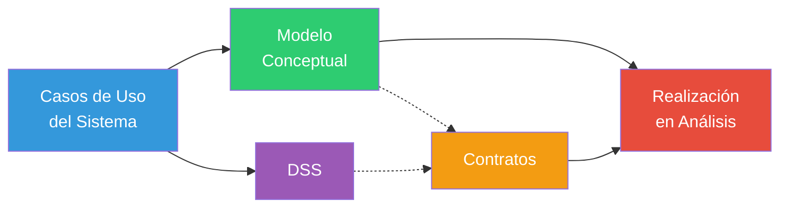

# 06 — Cheatsheet General (Final de Sistema → Modelo de Análisis completo)

> Referencia rápida de una sola sentada. Si solo puedes leer un archivo antes del examen, que sea este + el archivo `07_conceptos_confusos.md`.

---

## 1. El flujo completo en una línea

```
CUS (Tema 1) → Modelo Conceptual (Tema 2) → DSS (Tema 3) → Contratos (Tema 4) → Realización de Análisis (Tema 5)
```



---

## 2. Plantilla — Especificación de CUS (Tema 1)

| Campo | Contenido |
|---|---|
| Nombre CUS | Verbo + sustantivo |
| Actores | Lista |
| Descripción | 1-2 líneas |
| Precondición | Estado requerido antes |
| Flujo básico | Pasos numerados (escenario de éxito) |
| Flujo alternativo | Variantes, referenciadas a un paso del básico |
| Postcondición | Estado después de éxito |

### Relaciones entre CUS

| Relación | Regla | Dirección de flecha |
|---|---|---|
| `«include»` | Obligatoria, siempre se ejecuta | Base → Incluido |
| `«extend»` | Opcional, condicional | **Extendido → Base** (¡ojo, invertida!) |
| Generalización | El hijo hereda y puede sobrescribir | Hijo → Padre (triángulo) |

---

## 3. Modelo Conceptual (Tema 2)

### Proceso de 4 pasos
1. Identificar clases candidatas (lista de categorías + heurística de Abbott).
2. Dibujarlas.
3. Agregar asociaciones (nombre + multiplicidad).
4. Agregar atributos (solo tipos simples).

### ¿Atributo o clase? — la prueba
> Si tiene identidad propia (ocupa espacio, es entidad legal, tiene ciclo de vida propio) → **clase**. Si es un dato simple → **atributo**. Ante la duda → **clase**.

### Relaciones especiales

| Relación | Símbolo | ¿La parte sobrevive sin el todo? | Multiplicidad del todo |
|---|---|---|---|
| Agregación | ◇ | Sí | Cualquiera |
| Composición | ◆ | No | Siempre `1` |
| Generalización | △ | N/A | N/A |

**Reglas de generalización**: Regla del 100% (todo lo del padre aplica al hijo) + regla "es-un-tipo-de".

**Multiplicidad**: `1` exacto uno · `0..1` cero o uno · `*`/`0..*` cero o más · `1..*` uno o más.

**Nunca en el Modelo Conceptual**: métodos, clases de software, bases de datos, tipos de datos complejos como atributo.

---

## 4. Diagrama de Secuencia del Sistema — DSS (Tema 3)

### Reglas de oro
1. El **actor siempre inicia** el mensaje (nunca el sistema).
2. Un mensaje **solo** por cada paso donde el actor interactúa realmente (no por cada línea del flujo).
3. Parámetros = datos que el actor aporta en ese paso.
4. Retornos = flechas punteadas.
5. Repeticiones → `loop`; ramas → `alt`.

### Fórmula memorizable
> **Mensaje del DSS = Operación del sistema** (misma firma, mismos parámetros).

---

## 5. Contrato de Operación (Tema 4)

### Plantilla

| Campo | Contenido |
|---|---|
| Nombre | Firma exacta (igual que en el DSS) |
| Responsabilidades | Qué logra, en prosa breve |
| Tipo | Sistema |
| Referencias cruzadas | Requisitos que cubre |
| Notas | Aclaraciones |
| Excepciones | Qué pasa si algo falla |
| Salida | Info hacia fuera del sistema (si aplica) |
| Precondiciones | Antes |
| **Postcondiciones** | Después — el corazón del contrato |

### Los 5 tipos de postcondición (memorízalos)

1. Creación de instancia
2. Modificación de atributo
3. Asociación formada
4. Asociación rota
5. Eliminación de instancia

> Se escriben siempre en **pasado**: "se creó...", "se asoció...", "se asignó...". Nunca como pasos de algoritmo ("se calcula...", "se recorre...").

---

## 6. Realización del CU en Análisis (Tema 5)

### Fórmula memorizable
> **Modelo de Análisis completo = Modelo Conceptual + DSS + Contratos + su integración/trazabilidad, para cada CU.**

### Checklist de completitud
- [ ] Especificación expandida del CUS lista
- [ ] Todas las clases del flujo están en el Modelo Conceptual
- [ ] El DSS cubre flujo básico + alternativos relevantes
- [ ] Cada operación del DSS tiene su contrato
- [ ] Cada postcondición es trazable al Modelo Conceptual
- [ ] Nada menciona software, BD o métodos concretos

### Análisis vs. Diseño (el límite del examen)

| | Análisis (SÍ entra) | Diseño (NO entra) |
|---|---|---|
| Pregunta | ¿QUÉ? | ¿CÓMO? |
| Objetos | Conceptuales | De software (con métodos) |
| Artefactos | CUS, Modelo Conceptual, DSS, Contratos, Realización de Análisis | Colaboración de diseño, Clases de diseño, BD, MVC |

---

## 7. Glosario ultra-rápido

| Término | Definición en una línea |
|---|---|
| Actor del Sistema | Entidad externa (persona, dispositivo, sistema) que interactúa directamente con el software |
| CUS | Descripción estructurada de un proceso completo con valor para un actor |
| Include | Relación obligatoria; factoriza comportamiento común |
| Extend | Relación opcional; modela comportamiento condicional |
| Modelo Conceptual | Clases del dominio del problema, sin software |
| Clase de especificación | Describe información que sobrevive sin instancias asociadas (catálogos) |
| Agregación | Todo-parte débil, la parte sobrevive sin el todo |
| Composición | Todo-parte fuerte, la parte NO sobrevive sin el todo |
| DSS | Diagrama que muestra al sistema como caja negra recibiendo eventos del actor |
| Operación del sistema | Cada mensaje distinto que llega al sistema en el DSS |
| Contrato de operación | Documento de precondiciones/postcondiciones de una operación |
| Postcondición | Estado garantizado después de ejecutar la operación (nunca el algoritmo) |
| Realización de CU (Análisis) | Integración de Modelo Conceptual + DSS + Contratos para un CU, con objetos conceptuales |
| Modelo de Análisis completo | El conjunto de realizaciones de todos los CUS + el Modelo Conceptual global |

---

## 8. Errores de examen más comunes (top 10)

1. Invertir la flecha de `«extend»`.
2. Confundir Actor de Negocio con Actor del Sistema.
3. Meter clases de software o métodos en el Modelo Conceptual.
4. Modelar como atributo algo que tiene identidad propia (debería ser clase).
5. Confundir agregación con composición (no aplicar la pregunta "¿sobrevive la parte?").
6. Hacer que el sistema "inicie" un mensaje en el DSS.
7. Convertir cada línea del flujo básico en un mensaje del DSS (en vez de solo las interacciones reales del actor).
8. Escribir postcondiciones como pasos de algoritmo en vez de estados resultantes.
9. Escribir postcondiciones que mencionan clases/asociaciones que no existen en el Modelo Conceptual (falla de trazabilidad).
10. Confundir "realización en Análisis" (objetos conceptuales) con "realización en Diseño" (objetos de software).
