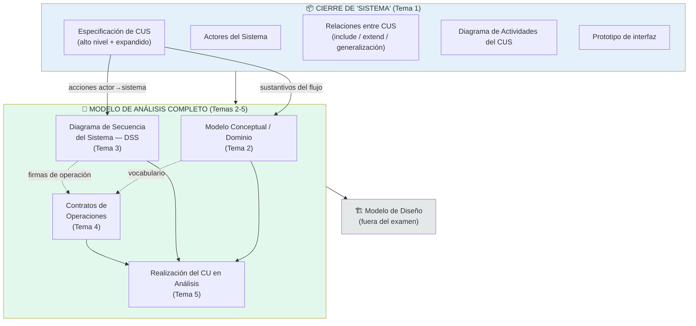
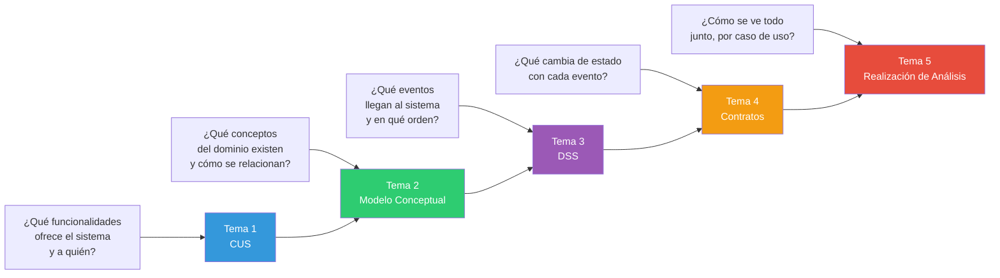
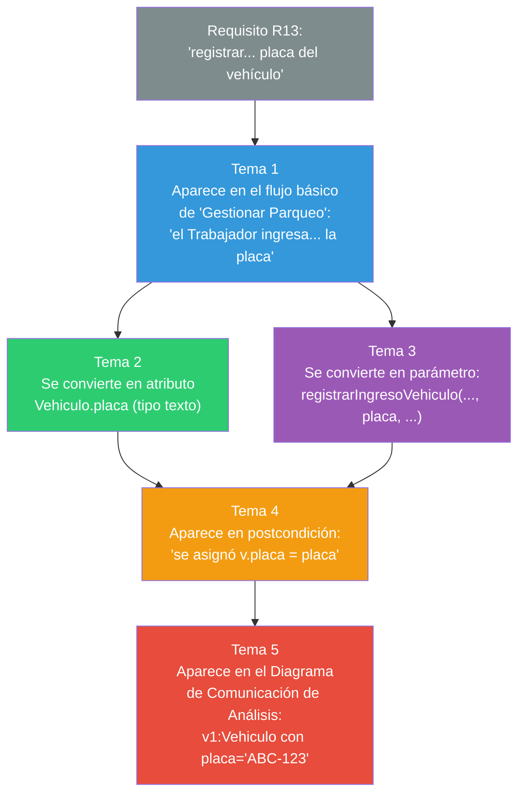
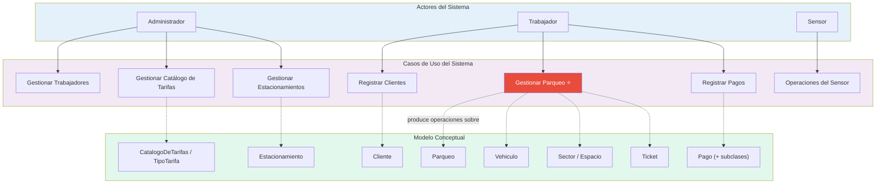
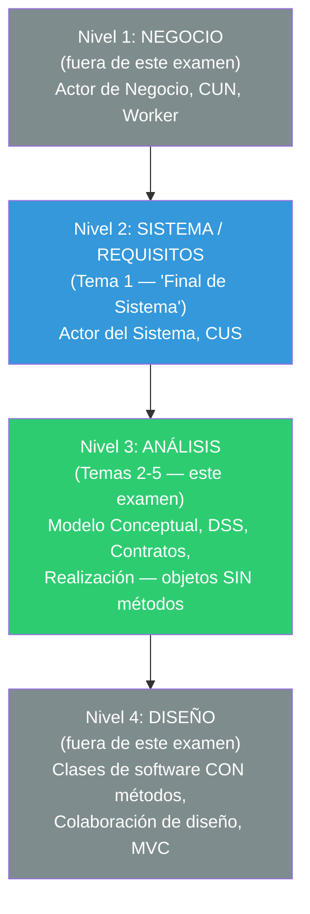

# 08 — Mapa Conceptual Completo del Rango de Examen

> El flujo entero, de "Final de Sistema" a "Modelo de Análisis completo", visto desde distintos ángulos.

---

## 1. Vista de artefactos (qué se produce en cada paso)

---

## 2. Vista de preguntas (qué pregunta responde cada tema)

---

## 3. Vista de trazabilidad (cómo un solo dato viaja por todos los temas)

Sigue el dato **"placa del vehículo"** a través de todo el rango, en el caso SCEV:

> 🔑 Esta es la mejor forma de estudiar para el examen: elige UN dato cualquiera de tu propio caso de estudio y sigue su rastro por los 5 temas. Si puedes hacerlo sin trabarte, entendiste la trazabilidad completa del rango.

---

## 4. Vista de "quién produce, quién consume" (tabla resumen)

| Tema | Insumo (qué necesita) | Producto (qué entrega) | Consumidor directo |
|---|---|---|---|
| 1. CUS | Requisitos + Actores del Sistema | Especificación CUS + Diagrama de CUS + Actividades + Prototipo | Temas 2 y 3 |
| 2. Modelo Conceptual | Flujo del CUS (sustantivos) | Clases, atributos, asociaciones | Temas 4 y 5 |
| 3. DSS | Flujo del CUS (verbos actor→sistema) | Lista de operaciones del sistema | Tema 4 |
| 4. Contratos | Operaciones (Tema 3) + vocabulario (Tema 2) | Precondiciones/postcondiciones por operación | Tema 5 |
| 5. Realización de Análisis | Temas 2, 3 y 4 integrados | Modelo de Análisis completo verificado | Diseño (fuera del examen) |

---

## 5. Vista de "todo el sistema SCEV" — mapa conceptual final

Panorama completo de SCEV, uniendo el Modelo Conceptual completo (Tema 2) con las operaciones (Tema 3) que actúan sobre él:

---

## 6. Los 3 niveles de abstracción que NUNCA hay que mezclar

> 🔑 El examen vive completo dentro del **Nivel 2 (el final) + Nivel 3 (completo)**. Cualquier pregunta que te obligue a usar vocabulario del Nivel 1 (Workers, CUN) o del Nivel 4 (métodos, BD, MVC) probablemente es, o una pregunta de contexto/comparación, o una señal de que te saliste del alcance.
