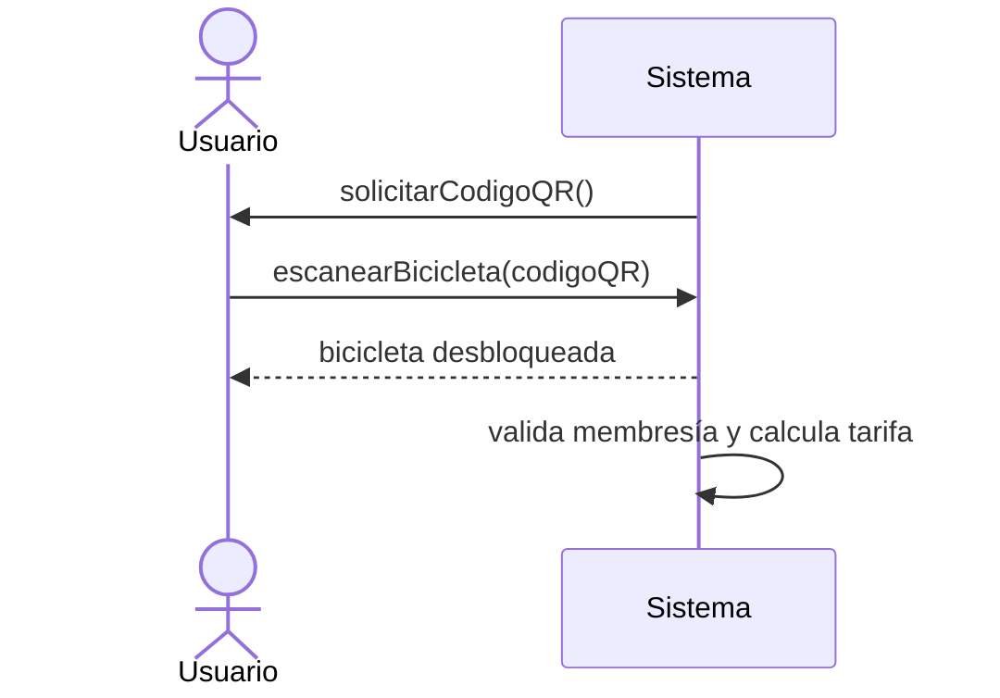

# 09 — Simulacro de Examen Final

> **Alcance**: Desde Final de Sistema hasta Modelo de Análisis completo (Temas 1 a 5 de esta guía).
> **Formato**: igual al de los laboratorios/exámenes del curso (construcción de artefactos + preguntas conceptuales), no de alternativa múltiple.
> **Recomendación**: resuélvelo a libro cerrado, cronometrado (90-120 min), y corrige después con `10_respuestas_simulacro.md` — que está en un archivo separado a propósito, para que no puedas verlas mientras resuelves.

---

## Caso de estudio del simulacro

> ### 🚲 Sistema de Alquiler de Bicicletas Urbanas ("BiciYa")
>
> Una empresa municipal ofrece bicicletas eléctricas en estaciones distribuidas por la ciudad. Los usuarios registrados pueden alquilar una bicicleta desde una app móvil, escaneando el código QR de la bicicleta en la estación. Cada estación tiene anclajes ("docks"); un anclaje se libera cuando se retira una bicicleta y se ocupa cuando se devuelve una.
>
> Cada bicicleta tiene un sensor que reporta periódicamente al sistema su nivel de batería. Un operador de mantenimiento revisa el estado de las bicicletas y puede marcarlas como "en mantenimiento" (fuera de servicio) o "disponibles" nuevamente.
>
> El costo del alquiler se calcula según los minutos de uso y el tipo de membresía del usuario (básica o premium; la premium tiene tarifa por minuto reducida). Al finalizar el alquiler (cuando el usuario devuelve la bicicleta en cualquier estación), el sistema calcula el costo, lo cobra a la tarjeta registrada del usuario y genera un recibo digital.

---

## Parte I — Preguntas conceptuales (20 puntos, 2 puntos c/u)

Responde de forma completa y justificada. No se aceptan respuestas de una sola palabra.

1. Explica por qué el "Usuario" de BiciYa es un Actor del Sistema y no solo un Actor de Negocio, usando la definición exacta de cada uno.
2. ¿El sensor de batería de cada bicicleta debería considerarse un Actor del Sistema? Justifica tu respuesta.
3. Explica la diferencia entre `include` y `extend`, y decide (con justificación) qué relación usarías entre "Iniciar Alquiler" y una posible operación "Validar Membresía Activa".
4. En el Modelo Conceptual de BiciYa, ¿"nivelDeBatería" debería ser un atributo de `Bicicleta` o debería existir una clase separada? Justifica con la prueba correspondiente.
5. Explica la diferencia entre agregación y composición aplicada a la relación entre `Estación` y `Anclaje` (Dock).
6. ¿Por qué el DSS del CUS "Iniciar Alquiler" no debería incluir un mensaje explícito para "el sistema valida la membresía del usuario"?
7. Da un ejemplo de postcondición correcta y uno incorrecto (mal escrito como algoritmo) para la operación `finalizarAlquiler(bicicletaId, estacionId)`.
8. ¿Qué diferencia hay entre el Modelo de Análisis completo de un CU y el Modelo Conceptual del sistema completo?
9. Explica con tus propias palabras por qué "realización del CU en Análisis" y "realización del CU en Diseño" no son lo mismo, aunque ambos se llamen "realización".
10. Menciona 3 elementos que NUNCA deberían aparecer en un Modelo Conceptual, y explica por qué cada uno rompe la regla del Análisis.

---

## Parte II — Verdadero y Falso, justificado (10 puntos, 2 puntos c/u)

Indica si cada afirmación es verdadera o falsa, y **justifica en 1-2 líneas**. Una respuesta sin justificación no obtiene puntaje aunque sea correcta.

1. "El diagrama de actividades de un CUS puede reemplazar completamente a la especificación expandida en texto."
2. "En un Diagrama de Secuencia del Sistema, el sistema puede iniciar un mensaje si necesita pedirle datos adicionales al actor."
3. "Una clase de especificación (catálogo) se usa cuando la información debe sobrevivir aunque no existan instancias asociadas."
4. "Los contratos de operaciones documentan cómo el sistema calcula internamente cada valor, para que el programador sepa qué algoritmo usar."
5. "El Modelo de Análisis completo de un caso de uso puede considerarse terminado aunque una de sus postcondiciones mencione una clase que no está en el Modelo Conceptual."

---

## Parte III — Caso práctico integrador (50 puntos)

Usando el caso de estudio "BiciYa" descrito arriba, desarrolla lo siguiente:

### 1. Actores del Sistema (5 puntos)
Identifica todos los actores del sistema de BiciYa y justifica cada uno en una línea.

### 2. Diagrama de Casos de Uso del Sistema (8 puntos)
Construye el diagrama de CUS completo de BiciYa (mínimo 5 CUS), incluyendo al menos una relación `include` y una `extend`, con los actores correctamente conectados.

### 3. Especificación expandida de un CUS (10 puntos)
Escribe la especificación expandida completa (precondición, flujo básico de al menos 7 pasos, al menos 1 flujo alternativo, postcondición) del CUS **"Iniciar Alquiler"**.

### 4. Modelo Conceptual (10 puntos)
A partir de tu especificación del punto 3, construye el Modelo Conceptual de BiciYa (mínimo 7 clases), incluyendo al menos una relación de composición, una de agregación (o justifica por qué no aplica) y una generalización coherente con el dominio (pista: tipos de membresía o tipos de bicicleta).

### 5. Diagrama de Secuencia del Sistema (8 puntos)
Construye el DSS del CUS "Iniciar Alquiler", incluyendo el mensaje generado por el sensor de batería si es relevante para el flujo, y representando el flujo alternativo con un marco `alt`.

### 6. Contrato de Operación (9 puntos)
Escribe el contrato completo de la operación principal que identificaste en el DSS del punto 5 (la que efectivamente registra el inicio del alquiler), con al menos 4 postcondiciones cubriendo al menos 3 tipos distintos de cambio de estado.

---

## Parte IV — Detección de errores (20 puntos)

A continuación se presenta un fragmento de Modelo de Análisis de BiciYa **con errores deliberados**. Identifica **al menos 6 errores**, indicando en cada caso: (a) qué está mal, (b) a qué tema/regla corresponde, (c) cómo lo corregirías.

### Fragmento del Modelo Conceptual (con errores)

```
Clase: Alquiler
  atributos: minutosUso, costoTotal, usuario: String, calcularCosto()

Clase: Bicicleta
  atributos: codigoQR, nivelBateria

Asociación: Estacion "1" -- "1" Anclaje  (agregación, multiplicidad todo=1)
```

### Fragmento del DSS (con errores)



### Fragmento del Contrato (con errores)

```
Nombre:            escanearBicicleta(codigoQR)
Postcondiciones:   • El sistema recorre la lista de bicicletas hasta encontrar
                     la que coincide con codigoQR.
                   • Se calcula la tarifa según el algoritmo de membresía.
                   • Se guardó el registro en la tabla AlquilerActivo de la
                     base de datos.
```

---

## Distribución de puntaje

| Parte | Puntos |
|---|---|
| I — Preguntas conceptuales | 20 |
| II — Verdadero y Falso justificado | 10 |
| III — Caso práctico integrador | 50 |
| IV — Detección de errores | 20 |
| **Total** | **100** |
