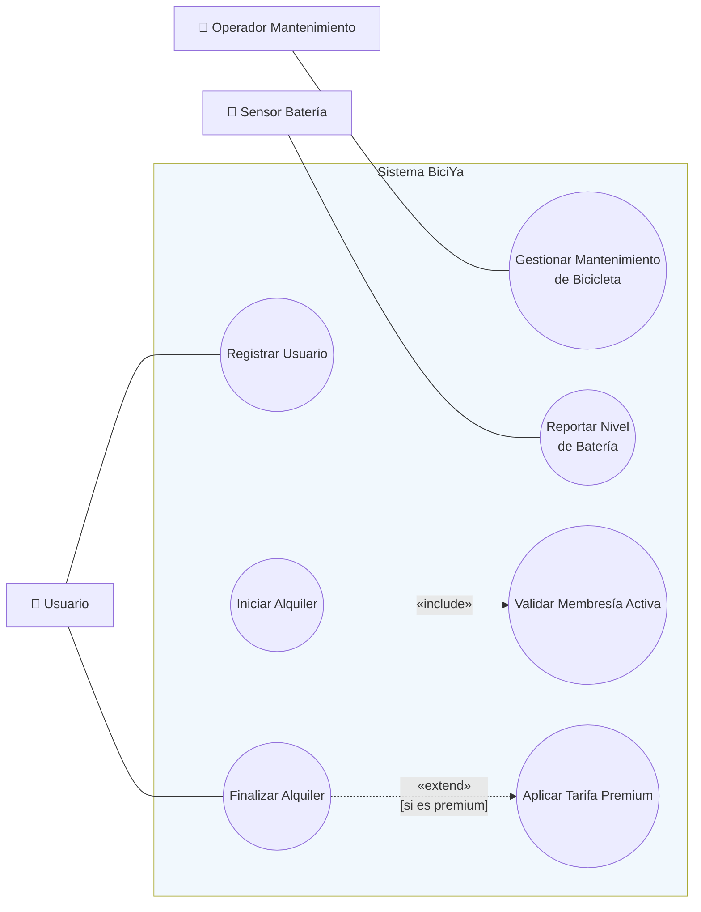
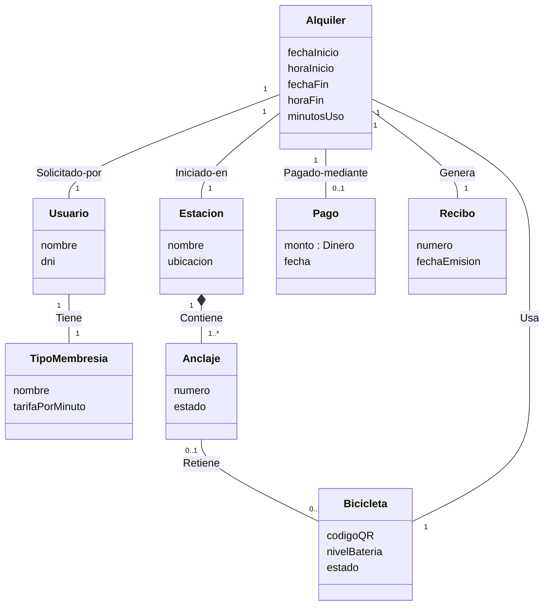
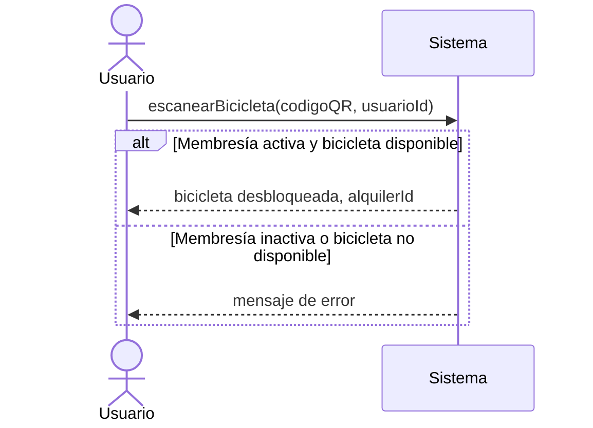

# 10 — Respuestas del Simulacro de Examen Final

> ⚠️ Archivo separado a propósito. No lo abras antes de intentar resolver `09_simulacro_examen.md` completo — el valor de un simulacro está en fallar primero contigo mismo, no con el profesor.

---

## Parte I — Preguntas conceptuales (respuestas modelo)

**1.** Un Actor de Negocio interactúa con la empresa/proceso de negocio en general (podría existir sin ningún software). El "Usuario" de BiciYa, en cambio, interactúa **directamente con la app/software** para escanear un QR, iniciar y finalizar alquileres — por definición, eso lo convierte en Actor del Sistema. (Podría además haber sido Actor de Negocio "cliente del servicio municipal de bicicletas" antes de que existiera la app, y al aparecer el software se convierte también en Actor del Sistema.)

**2.** Sí. Aunque no es una persona, el sensor de batería es una entidad **externa** al software que le **envía eventos** (reportes de nivel de batería) de forma directa. Cumple la definición de actor del sistema independientemente de si es humano o dispositivo.

**3.** `include` es obligatorio (el CU base siempre ejecuta al incluido) y factoriza comportamiento común a varios CU; `extend` es condicional (solo ocurre bajo cierta situación) y modela comportamiento opcional. En este caso, "Validar Membresía Activa" **siempre** debe ejecutarse antes de iniciar cualquier alquiler (no es opcional) — por lo tanto la relación correcta es **`include`**, con flecha de "Iniciar Alquiler" hacia "Validar Membresía Activa".

**4.** Debe ser **atributo simple** de `Bicicleta` (`nivelBateria: número`), porque es un dato numérico sin identidad propia — no es una entidad reconocible por sí misma ni tiene su propio ciclo de vida independiente de la bicicleta. (Distinto sería si se necesitara un **historial** de niveles de batería a través del tiempo — ahí sí convendría una clase `LecturaDeBateria` con su propia asociación a `Bicicleta`, pero el enunciado no lo pide.)

**5.** Depende de la regla del negocio: si un `Anclaje` (dock) no tiene sentido de existir fuera de su `Estación` (se destruye la estación física, se destruyen sus anclajes) → **composición** (◆), con multiplicidad `1` del lado de `Estación`. Sería agregación (◇) solo si los anclajes pudieran reasignarse o existir de forma independiente, lo cual no es típico en este dominio — por eso la respuesta esperada es **composición**.

**6.** Porque "el sistema valida la membresía" es una acción **interna** del sistema, reacción a un mensaje ya recibido (por ejemplo, `escanearBicicleta(...)`), no una nueva interacción iniciada por el actor. El DSS solo muestra mensajes que cruzan la frontera actor↔sistema, nunca lógica interna.

**7.** Correcta: *"Se asignó Alquiler.estado = 'Finalizado' [modificación de atributo]"*. Incorrecta (algoritmo): *"El sistema recorre el registro de alquileres activos y calcula el costo multiplicando los minutos por la tarifa"* — describe el procedimiento, no el resultado.

**8.** El Modelo Conceptual es solo el vocabulario de clases/atributos/asociaciones del dominio completo. El Modelo de Análisis completo de UN CU es más amplio: incluye la porción relevante del Modelo Conceptual + el DSS de ese CU + sus contratos + la verificación de que todo es consistente entre sí (Tema 5).

**9.** Ambas usan la palabra "realización" porque en ambos casos se trata de mostrar cómo colaboran objetos para cumplir un caso de uso — pero en Análisis esos objetos son **conceptuales** (sin métodos, instancias del Modelo Conceptual) y en Diseño son objetos de **software** (con métodos concretos, parte del Modelo de Diseño). Confundirlos lleva a mezclar decisiones de diseño dentro del análisis (contaminación prematura del modelo).

**10.** (a) Métodos/operaciones con implementación — porque el análisis no decide CÓMO se hace nada; (b) Clases de software como tablas de base de datos o formularios — porque son decisiones de implementación, no conceptos del dominio; (c) Tipos de datos de programación (`int`, `String` de Java) — porque el modelo conceptual usa tipos de dato simples informales, no tipos ligados a un lenguaje de programación.

---

## Parte II — Verdadero y Falso (respuestas modelo)

**1. Falso.** El diagrama de actividades es un complemento visual para flujos con decisiones/bucles complejos, pero no sustituye la especificación textual, que sigue siendo la fuente formal con precondición, postcondición y campos estructurados que un diagrama de actividades no captura.

**2. Falso.** En un DSS, el actor siempre inicia el mensaje; el sistema solo responde. Si el sistema "necesita" un dato, es porque ya fue solicitado dentro de un mensaje anterior del actor — el sistema nunca envía el primer mensaje de una interacción.

**3. Verdadero.** Esa es exactamente la definición y la razón de ser de una clase de especificación/catálogo (ej. `TipoTarifa`, `TipoMembresía`): mantiene la información aunque se eliminen todas las instancias asociadas.

**4. Falso.** Los contratos documentan QUÉ cambia (postcondiciones en términos de instancias/atributos/asociaciones), nunca CÓMO se calcula internamente. Describir el algoritmo es tarea de diseño/implementación, no de un contrato de análisis.

**5. Falso.** Si una postcondición menciona una clase que no existe en el Modelo Conceptual, hay una falla de trazabilidad — el Modelo de Análisis NO puede considerarse completo ni consistente hasta corregir esa inconsistencia (regresando al Modelo Conceptual o corrigiendo el contrato).

---

## Parte III — Caso práctico integrador (solución de referencia)

### 1. Actores del Sistema

| Actor | Justificación |
|---|---|
| `Usuario` | Interactúa directamente con la app para escanear, iniciar y finalizar alquileres |
| `OperadorMantenimiento` | Interactúa con el sistema para cambiar el estado de las bicicletas |
| `SensorBateria` | Dispositivo externo que envía reportes de nivel de batería al sistema |

*(Nota: "bicicleta" y "estación" son conceptos del dominio, NO actores — no inician interacción con el sistema por sí mismos.)*

### 2. Diagrama de Casos de Uso del Sistema (referencia)



**Criterio de calificación**: se acepta cualquier variante razonable siempre que (a) los actores no se conecten entre sí, (b) `include` sea obligatorio y `extend` opcional con la flecha en la dirección correcta, (c) el sensor tenga su propio CUS.

### 3. Especificación expandida — "Iniciar Alquiler" (referencia)

```
Nombre CUS:      Iniciar Alquiler
Actores:         Usuario
Descripción:     Permite a un usuario registrado alquilar una bicicleta
                 disponible escaneando su código QR.
Precondición:    El usuario inició sesión en la app y tiene una membresía
                 activa.

FLUJO BÁSICO:
1.  El Usuario abre la app y selecciona "Alquilar bicicleta".
2.  El Sistema activa la cámara para escanear.
3.  El Usuario escanea el código QR de la bicicleta.
4.  El Sistema valida que el usuario tenga membresía activa. «include:
    Validar Membresía Activa»
5.  El Sistema verifica que la bicicleta esté disponible (no en
    mantenimiento).
6.  El Sistema desbloquea la bicicleta y libera el anclaje.
7.  El Sistema registra el inicio del alquiler (fecha, hora, usuario,
    bicicleta, estación de origen).
8.  El Sistema confirma al Usuario que la bicicleta está desbloqueada.
9.  El CUS finaliza.

FLUJO ALTERNATIVO:
5a. Bicicleta no disponible (en mantenimiento):
    1. El Sistema informa que la bicicleta no está disponible.
    2. El CUS finaliza.
4a. Membresía no activa:
    1. El Sistema informa que la membresía no está activa y ofrece
       renovarla.
    2. El CUS finaliza.

Postcondición:  La bicicleta quedó desbloqueada y asociada a un alquiler
                activo del usuario.
```

### 4. Modelo Conceptual (referencia)



**Criterio de calificación**: mínimo 7 clases ✅ (`Usuario`, `TipoMembresia`, `Bicicleta`, `Estacion`, `Anclaje`, `Alquiler`, `Pago`, `Recibo` = 8); composición ✅ (`Estacion *-- Anclaje`); generalización esperada: `TipoMembresia` podría modelarse también como generalización (`MembresíaBásica`/`MembresíaPremium`) — ambas soluciones (clase de especificación o generalización) son válidas si se justifican.

### 5. DSS — "Iniciar Alquiler" (referencia)



**Criterio de calificación**: el mensaje del sensor de batería NO es relevante para el flujo de "Iniciar Alquiler" en este caso (pertenece al CUS "Reportar Nivel de Batería", que es independiente) — reconocer que NO debe incluirse aquí también es una respuesta correcta y demuestra comprensión, no un error.

### 6. Contrato — `escanearBicicleta(codigoQR, usuarioId)` (referencia)

```
Nombre:              escanearBicicleta(codigoQR, usuarioId)
Responsabilidades:   Iniciar un alquiler validando membresía y
                     disponibilidad, y desbloquear la bicicleta.
Tipo:                Sistema
Excepciones:         Si el usuario no tiene membresía activa o la
                     bicicleta no está disponible, no se crea el alquiler.
Precondiciones:      Existe un Usuario con usuarioId y membresía activa.
                     Existe una Bicicleta con codigoQR en estado
                     "Disponible".
Postcondiciones:     • Se creó una instancia de Alquiler (a) [creación de
                       instancia].
                     • Se asignó a.fechaInicio y a.horaInicio [modificación
                       de atributo].
                     • Se asoció a con el Usuario [asociación formada].
                     • Se asoció a con la Bicicleta [asociación formada].
                     • Se asignó Bicicleta.estado = "En uso" [modificación
                       de atributo].
                     • Se desasoció la Bicicleta de su Anclaje [asociación
                       rota].
```

**Criterio de calificación**: mínimo 4 postcondiciones ✅ (hay 6); mínimo 3 tipos distintos ✅ (creación, modificación de atributo, asociación formada, asociación rota = 4 tipos presentes).

---

## Parte IV — Detección de errores (solución)

### Errores en el Modelo Conceptual

1. **`calcularCosto()` dentro de la clase `Alquiler`** → Es un método. Regla rota: el Modelo Conceptual (Tema 2) nunca tiene métodos. Corrección: eliminarlo; el "cálculo del costo" se documenta como postcondición de un contrato (Tema 4), no como método de una clase conceptual.
2. **`usuario: String` como atributo de `Alquiler`** → Debería ser una **asociación** hacia la clase `Usuario` (que tiene identidad propia: nombre, DNI, membresía), no un atributo de texto libre. Regla rota: prueba de "¿atributo o clase?" (Tema 2).
3. **`Estacion "1" -- "1" Anclaje` etiquetada como "agregación" con multiplicidad todo=1** → Si de verdad es agregación (parte sobrevive sin el todo), la multiplicidad del todo NO tiene por qué ser exactamente `1..*` fijo de esa forma sin más contexto — pero el error más importante es conceptual: dado que un anclaje no tiene sentido fuera de su estación física, la relación correcta casi siempre es **composición**, no agregación (ver Tema 7, ítem 5). Corrección: usar `◆` (composición) con multiplicidad `1..*` del lado de `Anclaje`.

### Errores en el DSS

4. **`Sistema->>Usuario: solicitarCodigoQR()` como primer mensaje** → El sistema no puede iniciar la interacción; el actor siempre inicia el mensaje (Tema 3, regla #1). Corrección: el primer mensaje debe ser del `Usuario` hacia el `Sistema` (por ejemplo, `Usuario->>Sistema: iniciarEscaneo()`).
5. **`Sistema->>Sistema: valida membresía y calcula tarifa`** → Es lógica interna, no un mensaje del DSS (que solo muestra interacción actor↔sistema, caja negra). Corrección: eliminar ese mensaje; la validación de membresía se resuelve dentro del contrato de `escanearBicicleta`, no como un mensaje visible en el DSS.

### Errores en el Contrato

6. **"El sistema recorre la lista de bicicletas hasta encontrar la que coincide..."** → Es un paso de algoritmo, no una postcondición de estado. Corrección: eliminar; no es información que corresponda a un contrato de análisis.
7. **"Se calcula la tarifa según el algoritmo de membresía."** → Igual que el anterior: describe CÓMO, no QUÉ cambió. Corrección: reemplazar por una postcondición de estado, por ejemplo "Se asignó Alquiler.tarifaAplicada = tarifa correspondiente al TipoMembresía del Usuario [modificación de atributo]".
8. **"Se guardó el registro en la tabla AlquilerActivo de la base de datos."** → Menciona una tabla de base de datos, un artefacto de software/implementación que no existe en el Modelo Conceptual. Corrección: reemplazar por "Se creó una instancia de Alquiler (a) [creación de instancia]", sin mencionar cómo se persiste.

**Criterio de calificación**: se pedían mínimo 6 errores; aquí se documentan 8, cubriendo los tres fragmentos. Cualquier estudiante que identifique al menos 6 con su tema/regla correcto y su corrección obtiene el puntaje completo de esta parte.

---

## Pauta de autoevaluación global

| Rango de puntaje (sobre 100) | Interpretación |
|---|---|
| 90-100 | Dominas el rango completo. Repasa solo `07_conceptos_confusos.md` la noche anterior. |
| 70-89 | Buen nivel. Repasa los temas donde perdiste más puntos y vuelve a hacer la Parte III. |
| 50-69 | Nivel medio. Vuelve a leer completos los temas 1 a 5 en orden, resolviendo sus ejercicios antes de repetir el simulacro. |
| < 50 | Vuelve a `00_indice.md` y sigue el plan de estudio de "3+ días" desde cero. |
