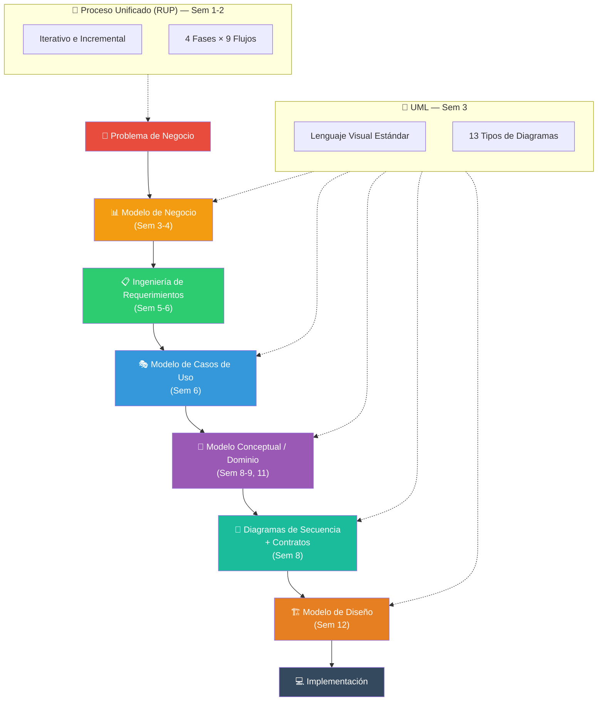
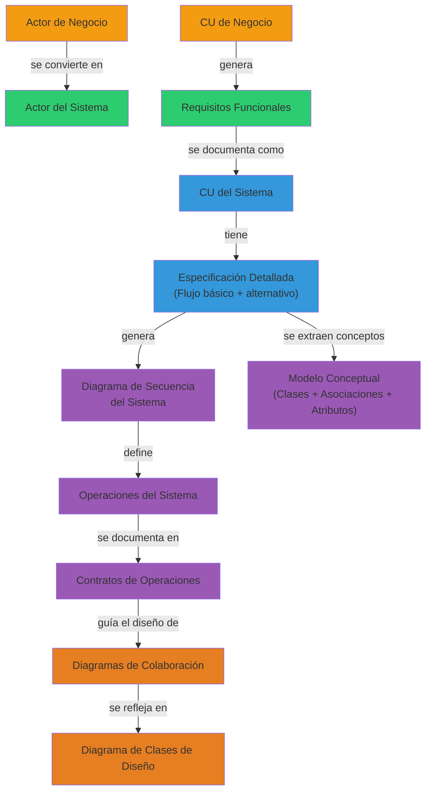

# 01 — Mapa General: El Panorama Completo

> **Pregunta central**: ¿Cómo nace un sistema de información desde un problema de negocio hasta su diseño?

---

## 1. La Gran Historia

Todo sistema de información comienza con un **problema de negocio**. El proceso completo puede verse como una cadena de transformaciones:

```
PROBLEMA DEL NEGOCIO → ENTENDER EL NEGOCIO → DEFINIR QUÉ CONSTRUIR → DISEÑAR CÓMO CONSTRUIRLO
```

Cada eslabón de esta cadena tiene herramientas, artefactos y disciplinas asociadas. Este archivo te muestra **dónde encaja cada pieza**.

---

## 2. Flujo Maestro: De la Idea al Diseño



---

## 3. Las Tres Dimensiones del Curso

### Dimensión 1: El Marco Metodológico (¿Cómo nos organizamos?)

| Concepto | Qué es | Archivo |
|----------|--------|---------|
| Proceso de Software | Forma disciplinada de construir software | 🔗 [02](02_sistemas_informacion.md) |
| Ciclo de Vida | Secuencia de etapas desde la concepción hasta el retiro | 🔗 [02](02_sistemas_informacion.md) |
| RUP | Proceso unificado: iterativo, basado en arquitectura, guiado por CU | 🔗 [03](03_rup.md) |
| 6 Mejores Prácticas | Principios que RUP implementa para mitigar riesgos | 🔗 [03](03_rup.md) |

### Dimensión 2: El Lenguaje (¿Cómo nos comunicamos?)

| Concepto | Qué es | Archivo |
|----------|--------|---------|
| UML | Lenguaje visual estándar para modelar sistemas OO | 🔗 [05](05_uml.md) |
| Diagramas Estructurales | Clases, Objetos, Componentes, Despliegue | 🔗 [09](09_clases_objetos.md) |
| Diagramas de Comportamiento | CU, Secuencia, Colaboración, Actividad, Estado | 🔗 [07](07_casos_uso.md), [11](11_secuencia_contratos.md) |

### Dimensión 3: Los Modelos (¿Qué producimos en cada etapa?)

```mermaid
flowchart LR
    subgraph NEGOCIO["Modelado de Negocio"]
        MN1["Actor de Negocio"]
        MN2["CU de Negocio"]
        MN3["Worker de Negocio"]
        MN4["Entidad de Negocio"]
        MN5["Realización CUN"]
    end

    subgraph REQUISITOS["Captura de Requisitos"]
        R1["Visión"]
        R2["SRS"]
        R3["Actor del Sistema"]
        R4["CU del Sistema"]
        R5["Especificación CUS"]
    end

    subgraph ANALISIS["Análisis"]
        A1["Modelo Conceptual<br/>/Dominio"]
        A2["Diagrama de Secuencia<br/>del Sistema"]
        A3["Contratos de<br/>Operaciones"]
    end

    subgraph DISENO["Diseño"]
        D1["Diagramas de<br/>Colaboración"]
        D2["Diagrama de<br/>Clases de Diseño"]
        D3["Arquitectura<br/>(MVC)"]
    end

    NEGOCIO --> REQUISITOS --> ANALISIS --> DISENO

    style NEGOCIO fill:#f39c12,color:#fff
    style REQUISITOS fill:#2ecc71,color:#fff
    style ANALISIS fill:#9b59b6,color:#fff
    style DISENO fill:#e67e22,color:#fff
```



---

## 4. La Cadena de Trazabilidad

> 🔑 **Concepto crítico**: Cada artefacto posterior se **deriva** de uno anterior. Nada aparece de la nada.



---

## 5. Relación Semanas ↔ Temas ↔ Fase RUP

| Semana | Tema Principal | Fase RUP | Flujo de Trabajo |
|--------|---------------|----------|-----------------|
| 1 | Sistemas de Información, Ciclos de Vida, Intro RUP | — | — |
| 2 | 6 Mejores Prácticas de RUP | — | — |
| 3 | UML + Modelo de Negocio | Inicio | Modelado de Negocio |
| 4 | Modelo de Negocio (RUP) + Realizaciones | Inicio | Modelado de Negocio |
| 5 | Requerimientos (niveles, tipos, FURPS+) | Inicio → Elaboración | Requisitos |
| 6 | Captura de Requisitos + Relaciones entre CUS | Elaboración | Requisitos |
| 7 | Examen Parcial | — | — |
| 8 | Etapa de Análisis (Larman) — CU expandido, DSS, Contratos | Elaboración | Análisis |
| 9 | Diagramas de Clases y Objetos | Elaboración | Análisis |
| 10 | Examen Parcial | — | — |
| 11 | Modelo de Dominio (Larman completo) | Elaboración | Análisis |
| 12 | Análisis y Diseño OO — Diagramas de Colaboración, MVC | Elaboración → Construcción | Diseño |
| 13 | Trabajo Final / Presentaciones | Construcción | Implementación |

---

## 6. Mapa Mental: ¿Dónde Encaja Cada Diagrama UML?

| Diagrama | Fase del Proceso | ¿Qué modela? | Archivo |
|----------|-----------------|--------------|---------|
| **CU de Negocio** | Modelado de Negocio | Procesos del negocio | 🔗 [04](04_modelo_negocio.md) |
| **Actividad (Negocio)** | Modelado de Negocio | Flujo de un proceso de negocio | 🔗 [04](04_modelo_negocio.md) |
| **CU del Sistema** | Requisitos | Funcionalidades que ofrece el sistema | 🔗 [07](07_casos_uso.md) |
| **Actividad (Sistema)** | Requisitos | Flujo detallado de un CUS | 🔗 [07](07_casos_uso.md) |
| **Secuencia del Sistema** | Análisis | Eventos actor ↔ sistema (caja negra) | 🔗 [11](11_secuencia_contratos.md) |
| **Clases (Conceptual)** | Análisis | Conceptos del dominio y sus relaciones | 🔗 [08](08_modelo_conceptual.md) |
| **Objetos** | Análisis | Instancias concretas de las clases | 🔗 [09](09_clases_objetos.md) |
| **Colaboración** | Diseño | Interacción entre objetos software | 🔗 [12](12_colaboracion.md) |
| **Clases (Diseño)** | Diseño | Clases software con métodos y tipos | 🔗 [09](09_clases_objetos.md) |
| **Componentes** | Implementación | Organización del código | 🔗 [05](05_uml.md) |
| **Despliegue** | Implementación | Distribución física del sistema | 🔗 [05](05_uml.md) |

---

## Preguntas de recuperación

1. ¿Por qué el Modelo de Negocio es necesario antes de capturar requisitos del sistema? ¿Qué ocurriría si saltáramos esta etapa?
2. Explica cómo un Caso de Uso de Negocio se transforma en uno o más Casos de Uso del Sistema. ¿Qué información se pierde y qué se gana en esta transición?
3. ¿Qué problema resuelve la trazabilidad entre artefactos (por ejemplo, de CUS a Modelo Conceptual)? ¿Por qué es importante mantener esta cadena?
4. Si un proyecto decide no seguir RUP pero sí usar UML, ¿qué dimensiones del curso se pierden y cuáles se mantienen?
5. ¿En qué etapa del proceso (Negocio, Requisitos, Análisis, Diseño) se define QUÉ hace el sistema y en cuál se define CÓMO lo hace? ¿Por qué esta distinción es fundamental?
6. ¿Cómo explicarías a un compañero que recién entra al curso la diferencia entre un Diagrama de Secuencia del Sistema y un Diagrama de Colaboración?
7. ¿Qué relación tiene el concepto de "iteración" en RUP con la gestión de riesgos en un proyecto de software?

---

## 7. Preguntas de Autoevaluación

1. ¿Cuál es la diferencia entre un **Actor de Negocio** y un **Actor del Sistema**?
2. ¿Por qué el **Modelo de Negocio** se hace ANTES de capturar requisitos?
3. ¿Qué artefacto conecta los **Casos de Uso** con el **Modelo Conceptual**?
4. ¿Cuál es la diferencia entre un **Diagrama de Secuencia** y un **Diagrama de Colaboración**?
5. ¿Qué contiene un **Contrato de Operación** y por qué es necesario?
6. ¿Cuál es la diferencia entre el **Modelo Conceptual** y el **Diagrama de Clases de Diseño**?

> 💡 Si puedes responder estas 6 preguntas con confianza, tienes una comprensión sólida del panorama completo.
