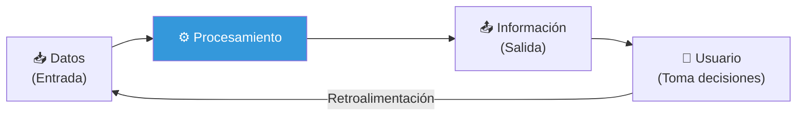
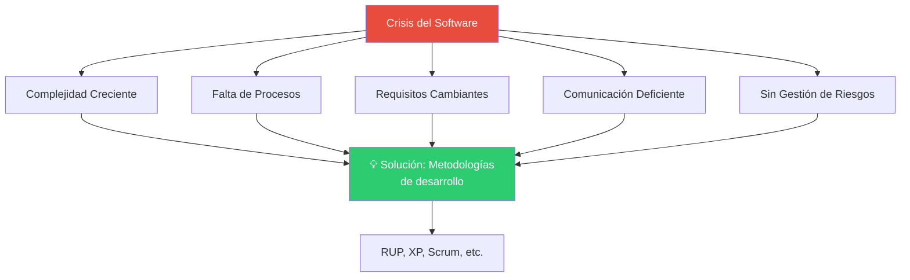
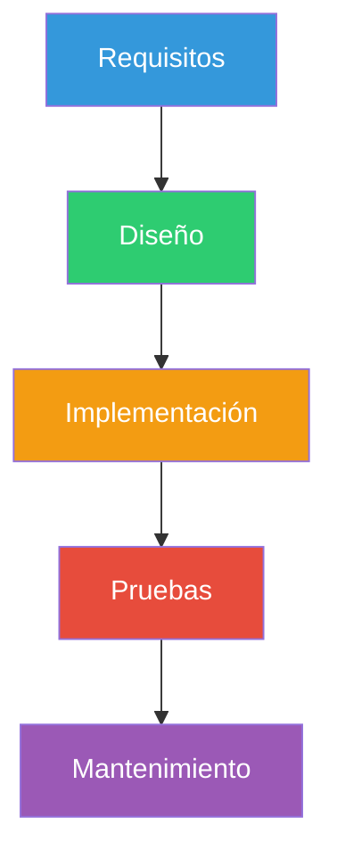
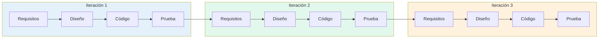
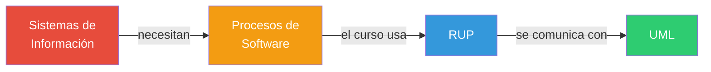

# 02 — Sistemas de Información: El Fundamento

> **Pregunta central**: ¿Qué es un SI, por qué fracasan los proyectos de software y qué procesos existen para evitarlo?

---

## 1. ¿Qué es un Sistema de Información?

Un **Sistema de Información (SI)** es un conjunto organizado de elementos que interactúan para procesar datos y producir información útil para la toma de decisiones.

### Componentes de un SI

| Componente | Descripción | Ejemplo |
|-----------|-------------|---------|
| **Hardware** | Equipos físicos | Servidores, PCs, terminales POS |
| **Software** | Programas que procesan datos | ERP, CRM, Sistema de Ventas |
| **Datos** | Hechos sin procesar | Códigos de producto, precios |
| **Personas** | Usuarios y operadores | Cajeros, administradores |
| **Procedimientos** | Reglas de operación | Política de devoluciones |
| **Redes** | Infraestructura de comunicación | Internet, LAN |

---

## 2. La Crisis del Software

> 🔑 **¿Por qué importa esto?** La crisis del software demostró que construir software no es como construir puentes — necesita procesos especializados.

### Síntomas históricos de la crisis

- ❌ Proyectos que **exceden presupuesto** (media: 189% sobre el original)
- ❌ Proyectos que **exceden plazos** (media: 222% sobre lo estimado)
- ❌ Software entregado que **no cumple requisitos**
- ❌ **31%** de proyectos cancelados antes de terminar
- ❌ Software difícil de **mantener y evolucionar**

### ¿Qué causó la crisis?

---

## 3. El Proceso de Software

### Definición (IEEE 12207)

> Un **proceso de software** es un conjunto de actividades, métodos, prácticas y transformaciones que las personas emplean para desarrollar y mantener software y sus productos asociados.

### Elementos de un Proceso de Software

| Elemento | Pregunta que responde | En RUP se llama... |
|---------|----------------------|-------------------|
| **Actividades** | ¿Qué hay que hacer? | Actividades |
| **Roles** | ¿Quién lo hace? | Workers (Trabajadores) |
| **Artefactos** | ¿Qué se produce? | Artefactos |
| **Flujo de trabajo** | ¿En qué orden? | Workflows |

---

## 4. Modelos de Ciclo de Vida

> 🧩 **Conexión**: El ciclo de vida es la "plantilla" general. RUP (🔗 [03](03_rup.md)) es una instanciación concreta del modelo iterativo/incremental.

### 4.1 Modelo Secuencial (Cascada)

| ✅ Ventajas | ❌ Desventajas |
|------------|---------------|
| Simple y fácil de entender | No tolera cambios en requisitos |
| Bueno para proyectos pequeños y bien definidos | El software funcional se ve al final |
| Hitos claros | Riesgo alto: errores se descubren tarde |

### 4.2 Modelo Iterativo e Incremental

| ✅ Ventajas | ❌ Desventajas |
|------------|---------------|
| Tolera cambios en requisitos | Más complejo de gestionar |
| Retroalimentación temprana del usuario | Requiere más disciplina |
| Riesgo se mitiga iteración a iteración | Puede ser difícil definir incrementos |

> ⚠️ **No confundir**: *Iterativo* = repetir fases para refinar. *Incremental* = cada iteración agrega funcionalidad. RUP es **ambos**.

### 4.3 Modelo Evolutivo (Prototipos / Espiral)

- Basado en construir **prototipos** que evolucionan
- El modelo en espiral de Boehm añade **análisis de riesgo** en cada vuelta
- Cada "vuelta" de la espiral es una iteración que incluye: planificación, análisis de riesgo, desarrollo y evaluación del cliente

---

## 5. Tabla Comparativa de Modelos

| Criterio | Cascada | Iterativo | Espiral |
|----------|---------|-----------|---------|
| **Flexibilidad** | Baja | Alta | Alta |
| **Riesgo** | Alto (tardío) | Bajo (distribuido) | Muy bajo |
| **Retroalimentación** | Solo al final | Cada iteración | Cada vuelta |
| **Ideal para** | Requisitos estables | Requisitos cambiantes | Proyectos grandes y riesgosos |
| **Ejemplo** | Firmware simple | RUP, Scrum | Proyectos militares/espaciales |

---

## 6. Conexión con el Resto del Curso

- Este archivo establece el **por qué**: por qué necesitamos procesos, por qué no basta con "programar directamente".
- El **cómo** específico lo cubre RUP → 🔗 [03_rup.md](03_rup.md)
- El **lenguaje** para comunicar los modelos es UML → 🔗 [05_uml.md](05_uml.md)

---

## Preguntas de recuperación (Falta evaluar)

1. ¿Por qué la "crisis del software" fue un punto de inflexión en la industria? ¿Qué síntomas de esa crisis siguen siendo relevantes hoy en día?

Los puntos relevantes fueron que las empreses no podia cumplir con los plazos establecidos, ademas que estos mismos se excedian en los presupuesto asi como tambien el codigo era dificil de mantener

2. Explica la diferencia entre un modelo de ciclo de vida secuencial (cascada) y uno iterativo. ¿En qué tipo de proyecto elegirías cada uno y por qué?

La diferencia siento que radica en que el secuencial al finalizar el proyecto e tiene que este no presenta ningun tipo de seguimiento o algo posterior, en cambio en el iterativo se presenta que la etapa de pruebas alimenta a la siguiente etapa o iteracion. Por ello, el modelo secuencial lo usaria para hacer un proyecto personal, donde los requerimientos no cambien, es decir proyectos pequeños, en cambio el modelo iterativo lo usaria para hacer algun programa grande por ejemplo un POS que requiera un buen planteamiento inicial y que con los requerimientos nuevos que surgan evolucione el software a la par.

3. ¿Qué problema resuelve la definición de roles, actividades y artefactos en un proceso de software? ¿Por qué no basta con "programar directamente"?

Bueno, teniendo en mente la crisis del software, esta definicion previa resulta en la solucion de los problemas como la complejidad al momento de codificar, el dificil mantenimiento, etc. al ser un paso previo a la codificacion

4. ¿Es lo mismo un sistema de información que software? Si tuvieras que explicarle esta diferencia a un gerente de negocio, ¿qué ejemplos usarías?

No, un sistema de informacion, hace lo que dice su nombre, procesa informacion, es decir hay datos de entrada (input) un proceso que transforma estos datos y datos de salida (output) los cuales son informacion para el usuario, por otro lado el software seria una parte de este sistema como lo puede ser un CRM, ERP, etc., un ejemplo simple es el sistema bancario, este tiene usuarios, trabajadores, PCs, servidores, bases de datos, etc. estos son parte del sistema de informacion, pero el software seria el programa que corre en las PCs, en los servidores, en su app movil que al final terminan siendo parte de este sistema

5. ¿Cómo se relaciona el concepto de "iteración" con la gestión de cambios en los requisitos de un proyecto?

La iteracion implica una mejora y agregacion de funcionalidades, por esos los requisitos en cada iteracion van aumentanto y mejorando

6. ¿Qué ventajas ofrece el modelo en espiral respecto al modelo cascada para proyectos con alto riesgo técnico?

Pues el modelo espiral gira en torno o tiene como particularidad que le pone enfasis a la gestion de riesgo como parte del flujo de desarrollo del proyecto, en cambio el modelo de cascada no implementa esto