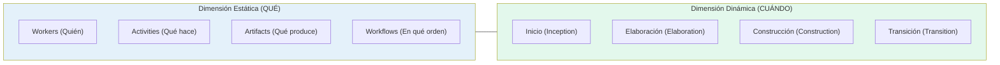
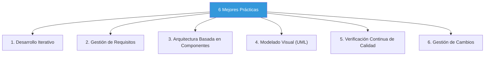
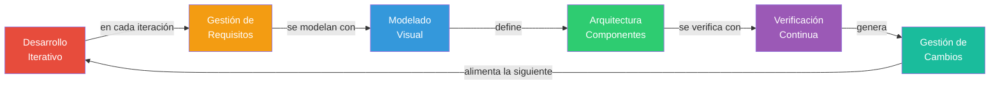

# 03 — RUP: El Proceso Unificado

> **Pregunta central**: ¿Qué es RUP, cómo se organiza y cuáles son sus mejores prácticas?

---

## 1. ¿Qué es RUP?

El **Rational Unified Process (RUP)** es un proceso de desarrollo de software que es:
- **Iterativo e incremental** — El proyecto avanza en ciclos
- **Centrado en la arquitectura** — La arquitectura guía todo el desarrollo
- **Dirigido por Casos de Uso** — Los CU impulsan cada flujo de trabajo

> 🧩 **Conexión**: RUP es la **respuesta concreta** a la crisis del software (🔗 [02](02_sistemas_informacion.md)). Implementa el modelo iterativo dentro de un marco disciplinado.

---

## 2. Las Dos Dimensiones de RUP



---

## 3. Dimensión Dinámica: Las 4 Fases


### Detalle de cada fase

| Fase | Objetivo | Hito (Milestone) | % Esfuerzo aprox. |
|------|----------|------------------|--------------------|
| **Inicio** | Definir alcance, viabilidad, riesgos principales. Responder: ¿tiene sentido este proyecto? | Objetivos del Ciclo de Vida (LCO) | ~10% |
| **Elaboración** | Establecer la arquitectura base, mitigar riesgos técnicos, refinar requisitos | Arquitectura del Ciclo de Vida (LCA) | ~30% |
| **Construcción** | Desarrollar todos los componentes e integrarlos. La mayor parte del código se escribe aquí | Capacidad Operativa Inicial (IOC) | ~50% |
| **Transición** | Entregar al usuario, formación, pruebas beta, despliegue | Release del Producto | ~10% |

> ⚠️ **Error común**: Pensar que "Inicio = Requisitos", "Elaboración = Diseño", etc. **NO** es así. Cada fase ejecuta TODOS los flujos, pero con diferente intensidad.

### Distribución del esfuerzo por fase

```
FLUJOS DE TRABAJO    | INICIO |  ELABORACIÓN  | CONSTRUCCIÓN | TRANSICIÓN
---------------------|--------|---------------|--------------|----------
Modelo de Negocio    | ▄█████ | ██▄           |              |
Requisitos           | ▄▄▄███ | ██████████▄▄  | ▄▄▄          |
Análisis y Diseño    |     ▄▄ | ▄▄▄▄▄▄▄█████  | ██████████▄▄ | ▄█▄
Implementación       |        |       ▄▄▄▄▄▄  | ▄▄▄▄▄▄██████ | ████▄▄▄
Pruebas              |        |         ▄▄▄▄  | ▄▄▄▄▄▄▄▄████ | █████████▄
Despliegue           |        |               |     ▄▄▄▄▄▄▄█ | ██████████
```

---

## 4. Dimensión Estática: Los 9 Flujos de Trabajo

### Flujos de Ingeniería (6)

| # | Flujo | Propósito | Artefactos Clave |
|---|-------|-----------|-----------------|
| 1 | **Modelado de Negocio** | Entender el negocio del cliente | Modelo CU Negocio, Modelo Análisis Negocio |
| 2 | **Requisitos** | Definir qué debe hacer el sistema | Visión, SRS, Modelo CU Sistema |
| 3 | **Análisis y Diseño** | Definir cómo se construirá | Modelo Conceptual, Diag. Secuencia, Clases Diseño |
| 4 | **Implementación** | Escribir el código | Código fuente, Componentes |
| 5 | **Pruebas** | Verificar que funciona correctamente | Casos de Prueba, Resultados |
| 6 | **Despliegue** | Entregar el producto al usuario | Paquete de instalación, Manuales |

### Flujos de Soporte (3)

| # | Flujo | Propósito |
|---|-------|-----------|
| 7 | **Gestión del Proyecto** | Planificar, monitorear, controlar |
| 8 | **Gestión de Configuración y Cambios** | Controlar versiones y cambios |
| 9 | **Entorno** | Proveer herramientas y procesos al equipo |

---

## 5. Elementos de la Dimensión Estática

### Workers (Roles)

Un **worker** define el comportamiento y responsabilidades de un individuo o grupo. Un mismo individuo puede asumir múltiples roles.

| Worker | Responsabilidad | Fase principal |
|--------|----------------|---------------|
| Analista de Negocio | Modela el negocio del cliente | Inicio |
| Analista de Sistemas | Captura requisitos, define CU | Inicio / Elaboración |
| Arquitecto de Software | Define la arquitectura | Elaboración |
| Diseñador | Diseña componentes y clases | Elaboración / Construcción |
| Desarrollador | Implementa el código | Construcción |
| Tester | Verifica y valida | Construcción / Transición |

### Artefactos

Un **artefacto** es cualquier producto de trabajo: documento, modelo, código, ejecutable.

### Actividades

Una **actividad** es una unidad de trabajo con un propósito claro, realizada por un worker, que produce/modifica artefactos.

---

## 6. Las 6 Mejores Prácticas de RUP

> 🔑 **Concepto clave para examen**: Las 6 prácticas son el "corazón filosófico" de RUP.



### Detalle de cada práctica

| # | Práctica | ¿Qué problema resuelve? | ¿Cómo lo resuelve? |
|---|----------|------------------------|---------------------|
| 1 | **Desarrollo Iterativo** | Requisitos cambiantes, riesgo técnico | Ciclos cortos de 2-6 semanas con entregables funcionales |
| 2 | **Gestión de Requisitos** | Requisitos ambiguos, no rastreables | Proceso sistemático de captura, organización, documentación y rastreo |
| 3 | **Arq. Basada en Componentes** | Sistemas monolíticos difíciles de mantener | Diseño modular con componentes reutilizables y con interfaces bien definidas |
| 4 | **Modelado Visual (UML)** | Comunicación deficiente entre equipo y stakeholders | Uso de UML para representar visualmente la arquitectura y el diseño |
| 5 | **Verificación Continua** | Defectos descubiertos tarde son costosos | Pruebas integradas en cada iteración, no solo al final |
| 6 | **Gestión de Cambios** | Cambios descontrolados rompen el proyecto | Control de versiones, solicitudes de cambio formales, impacto evaluado |

### Cómo se relacionan entre sí



---

## 7. RUP vs. Otros Enfoques

| Criterio | RUP | Cascada | Scrum |
|----------|-----|---------|-------|
| Iterativo | ✅ Sí | ❌ No | ✅ Sí |
| Documentación | Extensiva | Extensiva | Mínima |
| Roles definidos | Muchos y específicos | Pocos | Pocos (3) |
| Guiado por | Casos de Uso | Fases secuenciales | Product Backlog |
| Ideal para | Proyectos medianos/grandes | Proyectos pequeños/estables | Proyectos ágiles/cambiantes |

---

## 8. Conexiones con Otros Módulos

| Concepto | Archivo relacionado |
|---------|-------------------|
| ¿Qué problema resuelve RUP? | 🔗 [02 — Sistemas de Información](02_sistemas_informacion.md) |
| ¿Cómo funciona el flujo de Modelado de Negocio? | 🔗 [04 — Modelo de Negocio](04_modelo_negocio.md) |
| ¿Qué es UML y por qué RUP lo usa? | 🔗 [05 — UML](05_uml.md) |
| ¿Cómo funciona el flujo de Requisitos? | 🔗 [06 — Requerimientos](06_requerimientos.md) |

---

## Preguntas de recuperación

1. ¿Por qué RUP afirma que la fase de Inicio NO es "la fase de requisitos"? ¿Qué implica esto para la distribución del trabajo en un proyecto?
2. Explica cómo las 6 mejores prácticas de RUP se relacionan entre sí. ¿Qué ocurriría si se implementara solo una de ellas sin las demás?
3. ¿Qué diferencia hay entre un flujo de ingeniería y un flujo de soporte en RUP? ¿Por qué los flujos de soporte son necesarios?
4. Si un "worker" en RUP no es una persona física, ¿qué es realmente? ¿Cómo afecta esto a la organización de un equipo de desarrollo?
5. ¿Por qué RUP es tanto iterativo como incremental? ¿Qué aporta cada uno de estos conceptos a la gestión del proyecto?
6. ¿En qué se diferencia RUP de metodologías ágiles como Scrum? ¿Cuándo elegirías uno u otro?

---

## 9. Preguntas de Autoevaluación

1. ¿Cuáles son las 4 fases de RUP y qué hito marca el final de cada una?
2. ¿Por qué RUP dice que la fase de Inicio NO es "la fase de requisitos"?
3. Nombra las 6 mejores prácticas y explica cómo la práctica #1 (Desarrollo Iterativo) mitiga el riesgo.
4. ¿Qué diferencia hay entre un flujo de ingeniería y un flujo de soporte?
5. ¿Un "worker" en RUP es una persona física? Explica.
