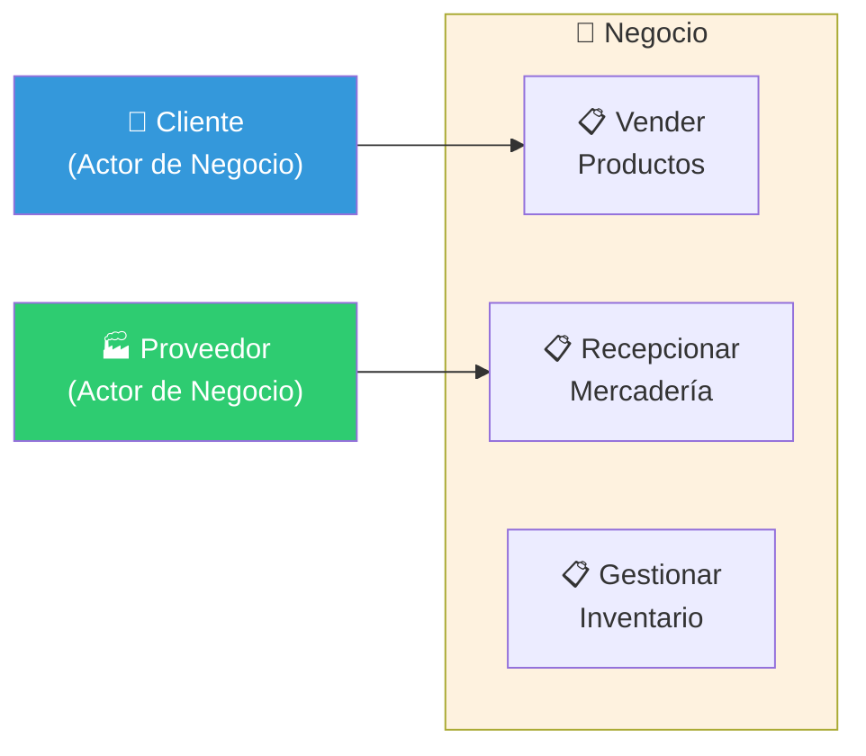
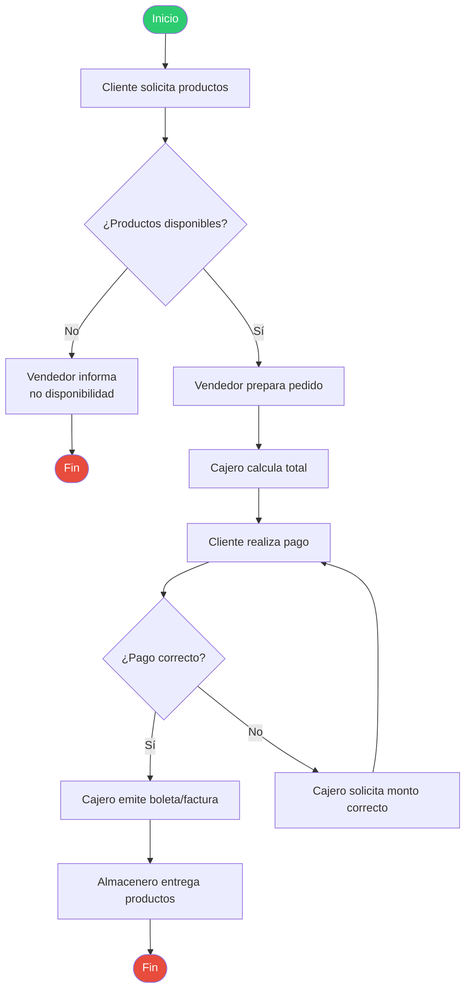
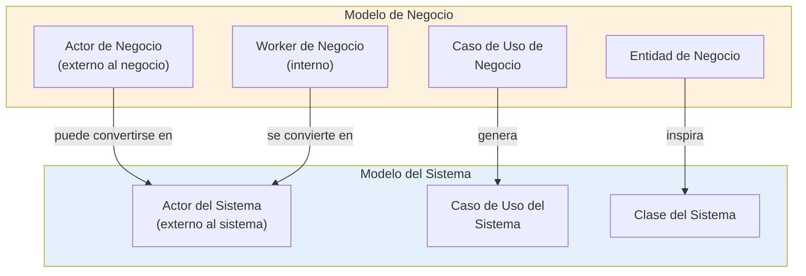

# 04 — Modelo de Negocio

> **Pregunta central**: ¿Cómo entendemos y documentamos el negocio del cliente ANTES de pensar en software?

---

## 1. ¿Por Qué Modelar el Negocio?

> 🔑 **Regla de oro**: No puedes construir un sistema para un negocio que no entiendes.

El modelado de negocio es el **primer flujo de trabajo** de RUP. Su propósito es:

1. **Entender** la estructura y dinámica de la organización del cliente
2. **Identificar** los problemas actuales y oportunidades de mejora
3. **Asegurar** que clientes, usuarios y desarrolladores tengan un entendimiento común
4. **Derivar** los requisitos del sistema a partir de las necesidades reales


---

## 2. Artefactos del Modelo de Negocio

### 2.1 Visión del Negocio

Documento de alto nivel que captura:
- **Problema** u oportunidad del negocio
- **Stakeholders** y sus necesidades
- **Características principales** del producto esperado
- **Restricciones** del negocio

### 2.2 Glosario de Negocio

Define todos los términos del dominio para evitar ambigüedades.

### 2.3 Modelo de Casos de Uso de Negocio (MCUN)

Contiene:
- **Actores de Negocio** — Entidades externas que interactúan con el negocio
- **Casos de Uso de Negocio (CUN)** — Procesos del negocio que proveen valor

### 2.4 Modelo de Análisis de Negocio (MAN)

Contiene:
- **Workers de Negocio** — Roles internos que ejecutan los procesos
- **Entidades de Negocio** — Información/objetos que el negocio maneja
- **Realizaciones de CUN** — Cómo se ejecuta cada CUN internamente

---

## 3. Los Elementos del Modelo

### 3.1 Actor de Negocio (Business Actor)

```
📌 Definición: Entidad EXTERNA al negocio que interactúa con él.
📌 Pregunta clave: ¿Quién está FUERA de la organización y necesita algo de ella?
```

| Ejemplos | NO son actores de negocio |
|----------|--------------------------|
| Cliente que compra | El cajero (es interno) |
| Proveedor que entrega mercancía | El gerente (es interno) |
| Entidad reguladora (SUNAT, SBS) | El sistema de ventas (es software) |
| Banco que procesa pagos | El almacén (es un lugar) |

> ⚠️ **Error común**: Confundir Actor de Negocio con Actor del Sistema. El Actor de Negocio interactúa con el **negocio**. El Actor del Sistema interactúa con el **software**.

### 3.2 Caso de Uso de Negocio (CUN / Business Use Case)

```
📌 Definición: Proceso del negocio que produce un resultado de valor observable 
   para un Actor de Negocio.
📌 Pregunta clave: ¿Qué procesos ejecuta el negocio para servir a sus actores?
```

| Ejemplos de CUN | Actor que lo inicia |
|-----------------|-------------------|
| Vender productos | Cliente |
| Recepcionar mercadería | Proveedor |
| Procesar reclamo | Cliente |
| Atender consulta | Cliente |

### 3.3 Worker de Negocio (Business Worker)

```
📌 Definición: Rol INTERNO al negocio que participa en la ejecución de un CUN.
📌 Pregunta clave: ¿Quién DENTRO de la organización ejecuta este proceso?
```

| Ejemplos | Responsabilidad |
|----------|----------------|
| Cajero | Cobra al cliente, registra venta |
| Almacenero | Recibe mercadería, actualiza stock |
| Vendedor | Asesora al cliente, genera cotización |

### 3.4 Entidad de Negocio (Business Entity)

```
📌 Definición: Objeto de información que el negocio crea, gestiona o referencia.
📌 Pregunta clave: ¿Qué "cosas" maneja el negocio como parte de sus procesos?
```

| Ejemplos | Contexto |
|----------|---------|
| Factura | Se crea en proceso de venta |
| Orden de Compra | Se crea en proceso de abastecimiento |
| Guía de Remisión | Se crea en proceso de despacho |
| Producto | Se referencia en múltiples procesos |

---

## 4. Diagrama de Casos de Uso de Negocio



---

## 5. Realización de Casos de Uso de Negocio (RCUN)

> 🔑 **Concepto clave**: La **realización** muestra CÓMO se ejecuta un CUN internamente, identificando qué workers participan y qué entidades se manejan.

### ¿Qué contiene una RCUN?

1. **Diagrama de Actividades**: Flujo del proceso paso a paso
2. **Workers involucrados**: Quién hace qué
3. **Entidades de Negocio**: Qué información se crea/modifica

### Ejemplo: RCUN de "Vender Productos"



### Workers y Entidades en este ejemplo

| Worker | Acciones | Entidades que maneja |
|--------|----------|---------------------|
| Vendedor | Atiende al cliente, prepara pedido | Pedido |
| Cajero | Calcula total, cobra, emite comprobante | Boleta/Factura, Pago |
| Almacenero | Entrega productos, actualiza stock | Producto, Inventario |

---

## 6. De Negocio a Sistema: La Transición Clave

> 🧩 **Esta es la conexión más importante del curso**: El Modelo de Negocio NO es el Modelo del Sistema. El sistema **automatiza partes** del negocio.



### Reglas de transición

| Elemento de Negocio | Se transforma en... | Explicación |
|---------------------|--------------------|-----------  |
| **Actor de Negocio** | Actor del Sistema (si interactúa con el SW) | El cliente que antes hablaba con el vendedor, ahora usa la app |
| **Worker de Negocio** | Actor del Sistema | El cajero que antes hacía cálculos manuales, ahora usa el sistema |
| **CUN** | Uno o más CUS | El proceso de "Vender Productos" se convierte en "Registrar Venta", "Procesar Pago", etc. |
| **Entidad de Negocio** | Clase conceptual → Clase de diseño → Tabla en BD | La "Factura" como concepto se convierte en una clase y luego en una tabla |

---

## 7. Caso Práctico: Biblioteca (Sem 3)

### Actores de Negocio
- **Estudiante**: Solicita préstamos de libros
- **Académico**: Solicita préstamos especiales

### CUN
- Prestar libro
- Devolver libro
- Consultar catálogo

### Workers
- Bibliotecario
- Auxiliar de estantería

### Entidades
- Libro, Copia, Préstamo, Carnet

---

## 8. Conexiones con Otros Módulos

| Desde | Hacia | Relación |
|-------|-------|---------|
| 🔗 [03 — RUP](03_rup.md) | Este archivo | El modelado de negocio es el primer flujo de RUP |
| Este archivo | 🔗 [06 — Requerimientos](06_requerimientos.md) | Los CUN generan los requisitos |
| Este archivo | 🔗 [07 — Casos de Uso](07_casos_uso.md) | Los CUN se descomponen en CUS |
| Este archivo | 🔗 [08 — Modelo Conceptual](08_modelo_conceptual.md) | Las entidades de negocio inspiran el modelo conceptual |

---

## Preguntas de recuperación

1. ¿Por qué es necesario modelar el negocio antes de pensar en el software? ¿Qué riesgos se corren si se salta esta etapa?
2. Explica la diferencia entre un Actor de Negocio y un Worker de Negocio usando un ejemplo concreto de un proceso que conozcas.
3. ¿Cómo se transforma una Entidad de Negocio en una clase del sistema? ¿Qué información se pierde y qué se gana en esta transición?
4. ¿Qué contiene una Realización de Caso de Uso de Negocio y por qué es necesaria si ya tenemos el diagrama de CUN?
5. Un cliente que antes hablaba con un vendedor ahora usa una app móvil. ¿Es Actor de Negocio, Actor del Sistema, o ambos? Justifica tu respuesta.
6. ¿Qué relación tiene el Modelo de Negocio con la identificación de requisitos del sistema? ¿Cómo se garantiza que no se pierda información en esta traducción?

---

## 9. Preguntas de Autoevaluación

1. ¿Cuál es la diferencia entre un **Actor de Negocio** y un **Worker de Negocio**?
2. ¿Qué contiene una **Realización de CUN**?
3. Un **cliente** que antes hablaba con un vendedor, ahora usa una app. ¿Es Actor de Negocio o Actor del Sistema? ¿Puede ser ambos?
4. ¿Qué artefactos del Modelo de Negocio se usan para derivar los CUS?
5. Dado el proceso "Recepcionar mercadería de un proveedor", identifica: Actor de Negocio, CUN, Workers y Entidades.
