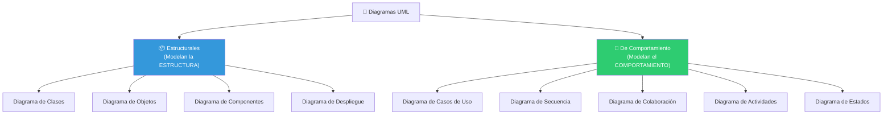

# 05 — UML: El Lenguaje de Modelado Unificado

> **Pregunta central**: ¿Qué diagramas existen en UML, cuándo se usa cada uno y cómo se leen?

---

## 1. ¿Qué es UML?

**UML (Unified Modeling Language)** es un lenguaje visual estándar para especificar, construir y documentar los artefactos de un sistema de software.

### Origen: "Los Tres Amigos"

| Autor | Aporte previo | Contribución a UML |
|-------|--------------|-------------------|
| **Grady Booch** | Método Booch | Diagramas de clases, componentes |
| **James Rumbaugh** | OMT (Object Modeling Technique) | Diagramas de estados, objetos |
| **Ivar Jacobson** | OOSE (Objectory) | Casos de uso |

> 🧩 **Conexión**: UML es el **lenguaje** que usa RUP (🔗 [03](03_rup.md)) para comunicar sus artefactos. UML no es un proceso, es un lenguaje.

### ¿Qué NO es UML?
- ❌ No es un método de desarrollo
- ❌ No es un lenguaje de programación
- ❌ No te dice CUÁNDO usar cada diagrama (eso lo dice RUP)

---

## 2. Clasificación de Diagramas UML

---

## 3. Tabla Maestra: ¿Cuándo Usar Cada Diagrama?

| Diagrama | ¿Qué modela? | ¿En qué fase? | ¿Cómo se lee? | Archivo detallado |
|----------|-------------|---------------|----------------|-------------------|
| **Casos de Uso** | Funcionalidades del sistema desde la perspectiva del usuario | Requisitos | "El actor X puede hacer Y" | 🔗 [07](07_casos_uso.md) |
| **Actividades** | Flujo de un proceso paso a paso | Negocio / Requisitos | "Primero se hace A, luego B, si C entonces D" | 🔗 [07](07_casos_uso.md) |
| **Clases (Conceptual)** | Conceptos del dominio y sus relaciones | Análisis | "Un X tiene N Y's" | 🔗 [08](08_modelo_conceptual.md) |
| **Clases (Diseño)** | Clases software con métodos y tipos | Diseño | "La clase X tiene método m() y atributo a" | 🔗 [09](09_clases_objetos.md) |
| **Objetos** | Instancias concretas de clases | Análisis | "juan:Alumno tiene nombre='Juan'" | 🔗 [09](09_clases_objetos.md) |
| **Secuencia** | Interacción temporal actor ↔ sistema | Análisis | "El actor envía msg1, el sistema responde con msg2" | 🔗 [11](11_secuencia_contratos.md) |
| **Colaboración** | Interacción entre objetos internos | Diseño | "El objeto A envía mensaje m() al objeto B" | 🔗 [12](12_colaboracion.md) |
| **Estados** | Ciclo de vida de un objeto | Diseño | "El pedido pasa de Pendiente a Aceptado" | — |
| **Componentes** | Organización del código fuente | Implementación | "El módulo A depende del módulo B" | — |
| **Despliegue** | Distribución física del sistema | Implementación | "El servidor web está en el nodo X" | — |

---

## 4. Notación Básica Común

### Estereotipos
Los estereotipos extienden el significado de un elemento UML. Se escriben entre `«guillemets»`.

| Estereotipo | Significado | Ejemplo |
|------------|------------|---------|
| `«actor»` | Rol externo | Usuario del sistema |
| `«include»` | Relación de inclusión obligatoria | CU Base incluye CU incluido |
| `«extend»` | Relación de extensión condicional | CU Base puede extenderse con CU extendido |
| `«boundary»` | Clase de interfaz | Formulario, Pantalla |
| `«control»` | Clase controladora | Gestor de procesos |
| `«entity»` | Clase de datos persistentes | Datos del negocio |

### Visibilidad de atributos y métodos

| Símbolo | Significado | Acceso |
|---------|------------|--------|
| `+` | Público (public) | Cualquiera |
| `-` | Privado (private) | Solo la propia clase |
| `#` | Protegido (protected) | La clase y sus subclases |

### Multiplicidad

| Notación | Significado |
|----------|------------|
| `1` | Exactamente uno |
| `0..1` | Cero o uno (opcional) |
| `*` | Cero o más |
| `1..*` | Uno o más |
| `n..m` | De n a m |

---

## 5. Relaciones entre Elementos

### En Diagramas de Clases

| Relación | Símbolo | Significado | Ejemplo |
|----------|---------|------------|---------|
| **Asociación** | Línea simple | "A conoce a B" | Alumno — Curso |
| **Agregación** | Rombo hueco | "A tiene partes B" (B puede existir sin A) | Equipo ◇— Jugador |
| **Composición** | Rombo relleno | "A se compone de B" (B no existe sin A) | Factura ◆— Línea |
| **Generalización** | Flecha con triángulo hueco | "B es un tipo de A" | Pago ◁— PagoEfectivo |
| **Dependencia** | Línea punteada con flecha | "A usa a B temporalmente" | Controlador ··→ Servicio |

### En Diagramas de Casos de Uso

| Relación | Significado | Regla |
|----------|------------|-------|
| `«include»` | CU Base siempre ejecuta CU incluido | Factoriza comportamiento **común** |
| `«extend»` | CU Base puede o no ejecutar CU extendido | Comportamiento **condicional/opcional** |
| **Generalización** | CU hijo hereda del CU padre | El hijo **especializa** el padre |

---

## 6. Mapa: ¿Qué Diagrama Va en Qué Modelo?

| Modelo RUP | Diagramas UML que contiene |
|-----------|---------------------------|
| Modelo de CU de Negocio | Diagrama de CU (nivel negocio) |
| Modelo de Análisis de Negocio | Diagrama de Actividades (flujo del proceso) |
| Modelo de CU del Sistema | Diagrama de CU del Sistema |
| Modelo Conceptual / Dominio | Diagrama de Clases (sin métodos, mundo real) |
| Modelo de Análisis | Diagrama de Secuencia del Sistema |
| Modelo de Diseño | Diagrama de Colaboración, Diagrama de Clases de Diseño |

---

## Preguntas de recuperación

1. ¿Por qué UML no es un proceso de desarrollo? ¿Qué papel juega en relación con metodologías como RUP?
2. Explica la diferencia entre un diagrama estructural y uno de comportamiento usando ejemplos concretos de cada tipo.
3. ¿Qué problema resuelve la distinción entre un Diagrama de Clases conceptual y uno de diseño? ¿Por qué no basta con uno solo?
4. ¿Cuándo usarías una relación de composición en lugar de agregación? ¿Qué implicaciones tiene esta decisión en el diseño del software?
5. ¿Cómo explicarías a un compañero la diferencia entre `«include»` y `«extend»` en diagramas de casos de uso usando un ejemplo del mundo real?
6. ¿Qué aporta la notación de visibilidad (+, -, #) en un diagrama de clases? ¿Por qué es importante para el diseño orientado a objetos?

---

## 7. Preguntas de Autoevaluación

1. ¿Cuál es la diferencia entre un diagrama **estructural** y uno de **comportamiento**?
2. ¿Qué diferencia hay entre un Diagrama de Clases conceptual y uno de diseño?
3. ¿Quiénes son "Los Tres Amigos" y qué aportó cada uno?
4. ¿UML es un proceso de desarrollo? Justifica.
5. ¿Cuál es la diferencia entre `«include»` y `«extend»`?
6. ¿Qué significan los símbolos `+`, `-` y `#` en un diagrama de clases?
