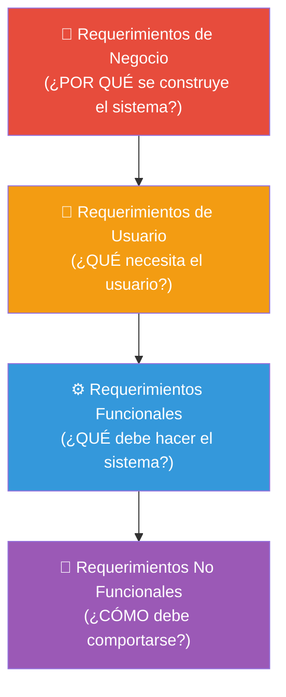

# 06 — Ingeniería de Requerimientos

> **Pregunta central**: ¿Cómo capturamos, clasificamos y documentamos lo que el sistema debe hacer?

---

## 1. ¿Qué es un Requerimiento?

> 🔑 Un **requerimiento** es una condición o capacidad que debe poseer un sistema para satisfacer un contrato, estándar, especificación u otro documento formal (IEEE 610).

Dicho de forma simple: es una **promesa** de lo que el sistema hará (y lo que NO hará).

---

## 2. Niveles de Requerimientos



| Nivel | Pregunta | Quién los define | Ejemplo |
|-------|---------|-----------------|---------|
| **De Negocio** | ¿Por qué construir esto? | Stakeholders, Dirección | "Aumentar ventas un 20%" |
| **De Usuario** | ¿Qué tareas hará el usuario? | Usuarios finales | "El cajero debe poder procesar una venta" |
| **Funcionales** | ¿Qué funciones ofrece el sistema? | Analistas | "El sistema calculará el total con impuestos" |
| **No Funcionales** | ¿Con qué cualidades? | Analistas, Arquitecto | "El tiempo de respuesta será < 5 seg" |

---

## 3. Clasificación de Requerimientos: FURPS+

> 🔑 **Modelo FURPS+**: Clasificación estándar usada por RUP para categorizar requerimientos no funcionales.

| Letra | Categoría | ¿Qué cubre? | Ejemplo |
|-------|----------|-------------|---------|
| **F** | Functionality (Funcionalidad) | Capacidades, seguridad | "El sistema permite registrar ventas" |
| **U** | Usability (Usabilidad) | Facilidad de uso, estética, documentación | "Interfaz intuitiva, con ayuda en línea" |
| **R** | Reliability (Confiabilidad) | Disponibilidad, frecuencia de fallos, recuperabilidad | "Disponibilidad 24/7, backup automático" |
| **P** | Performance (Rendimiento) | Velocidad, eficiencia, capacidad | "Respuesta < 5 seg con 100 usuarios" |
| **S** | Supportability (Soporte) | Mantenibilidad, portabilidad, configurabilidad | "Compatible con Windows y Linux" |
| **+** | Restricciones adicionales | Implementación, interfaz, operaciones, legales | "Base de datos Oracle 11g" |

### El "+" de FURPS+

| Tipo de restricción | Ejemplo |
|--------------------|---------|
| **De implementación** | "Usar Oracle 11g", "Desarrollar en Java" |
| **De interfaz** | "Compatible con IE 8.0" |
| **De operaciones** | "Backup cada 6 horas" |
| **Legales** | "Cumplir con LGPD" |

---

## 4. Clasificación por Tipo

### Funcionales vs. No Funcionales vs. Implementación

> ⚠️ **Error común en exámenes**: Confundir estos tres tipos. Usa esta prueba mental:

```
¿Describe QUÉ hace el sistema?         → FUNCIONAL
¿Describe CÓMO se comporta?            → NO FUNCIONAL
¿Describe CON QUÉ tecnología se hace?  → IMPLEMENTACIÓN (restricción)
```

### Ejemplo práctico: Sistema de Estacionamiento Vehicular

| # | Requerimiento | Tipo | Justificación |
|---|--------------|------|--------------|
| 01 | Utilizar Oracle 11g | **Implementación** | Especifica tecnología concreta |
| 02 | Disponibilidad 24/7 | **No Funcional** | Calidad del sistema, no funcionalidad |
| 03 | Administrador gestiona establecimientos | **Funcional** | Describe qué hace el sistema |
| 04 | Registrar personal del establecimiento | **Funcional** | Describe qué hace el sistema |
| 05 | Acceso desde cualquier punto | **No Funcional** | Calidad: accesibilidad |
| 06 | Respuesta < 5 segundos | **No Funcional** | Calidad: rendimiento |
| 07 | Mantener catálogo de tarifas | **Funcional** | Describe qué hace el sistema |
| 09 | Operar solo en soles | **No Funcional** | Restricción de operación |
| 17 | Almacenar datos sin pérdida | **No Funcional** | Calidad: confiabilidad |
| 18 | Seguridad con usuario/contraseña | **No Funcional** | Calidad: seguridad |
| 19 | Control de acceso con lista de permisos | **Implementación** | Especifica mecanismo concreto |
| 22 | Plataforma Web, compatible IE 8.0 | **Implementación** | Especifica tecnología |

---

## 5. Funciones Evidentes, Ocultas y Superfluas

| Tipo | Definición | El usuario la ve? | Ejemplo |
|------|-----------|-------------------|---------|
| **Evidente** | Debe realizarse y el usuario sabe que se realizó | ✅ Sí | "Mostrar el total de la venta" |
| **Oculta** | Debe realizarse pero el usuario no la ve directamente | ❌ No | "Actualizar inventario al vender" |
| **Superflua** | Opcional, no impacta significativamente | Depende | "Animación al confirmar venta" |

---

## 6. Técnicas de Captura de Requerimientos

| Técnica | Cuándo usarla | Ventajas | Desventajas |
|---------|--------------|----------|-------------|
| **Entrevistas** | Siempre (técnica base) | Profundidad, detalle, aclaración inmediata | Consume tiempo, sesgo del entrevistado |
| **JAD (Joint Application Development)** | Cuando hay múltiples stakeholders | Consenso rápido, reducción de conflictos | Costosa de organizar, requiere facilitador experto |
| **Brainstorming** | Fase exploratoria | Genera muchas ideas, creatividad | Ideas sin filtrar, necesita refinamiento |
| **Cuestionarios** | Usuarios geográficamente dispersos | Escala, datos cuantitativos | Poca profundidad, ambigüedad en respuestas |
| **Observación** | Procesos existentes | Ve lo que realmente pasa (no lo que dicen) | Efecto Hawthorne: la gente cambia al ser observada |
| **Prototipos** | Requisitos de interfaz | Retroalimentación visual inmediata | Puede crear expectativas falsas |
| **Ishikawa (Espina de pez)** | Análisis causal de problemas | Identifica raíces del problema | Solo para diagnóstico, no soluciones |

---

## 7. Artefactos de Requerimientos en RUP

### 7.1 Documento de Visión

Captura la **vista de alto nivel** del sistema. Contiene:
- Descripción del problema
- Posicionamiento del producto
- Stakeholders y sus necesidades
- Características principales del sistema
- Restricciones

### 7.2 Especificación de Requisitos de Software (SRS/ERS)

Documento detallado con **todos** los requisitos clasificados:
- Funcionales
- No funcionales (FURPS+)
- De implementación
- Reglas de negocio

### 7.3 Modelo de Casos de Uso del Sistema

> 🧩 **Conexión directa**: Los requisitos funcionales se modelan como Casos de Uso del Sistema → 🔗 [07](07_casos_uso.md)

---

## 8. Matriz Requisitos ↔ Casos de Uso

> 🔑 **Concepto clave**: Todo requisito funcional debe estar cubierto por al menos un CUS. Esta trazabilidad se documenta en una **Matriz Requisitos vs. CUS**.

| Req. # | Requisito | CUS | Justificación |
|--------|----------|-----|--------------|
| R04 | Registrar trabajadores | CUS: Registro de Trabajadores | CRUD de trabajadores |
| R07, R08 | Gestionar tarifas | CUS: Gestión de Catálogo | Mantener y personalizar tarifas |
| R10, R13 | Registrar solicitud de parqueo, ingreso/salida | CUS: Gestión de Parqueo | Proceso completo de estacionamiento |
| R11 | Registrar datos del cliente | CUS: Registro de Clientes | CRUD de clientes |
| R14-R16 | Calcular importe, fracciones, generar ticket | CUS: Registro de Pagos | Proceso de cobro |
| R03, R20 | Gestionar establecimientos, reportes | CUS: Gestión de Estacionamientos | Administración y reportería |

---

## 9. Conexiones con Otros Módulos

| Desde | Hacia | Relación |
|-------|-------|---------|
| 🔗 [04 — Modelo de Negocio](04_modelo_negocio.md) | Este archivo | Los CUN generan los requisitos |
| Este archivo | 🔗 [07 — Casos de Uso](07_casos_uso.md) | Los requisitos funcionales se modelan como CUS |
| Este archivo | 🔗 [08 — Modelo Conceptual](08_modelo_conceptual.md) | Los requisitos de información guían los atributos |

---

## Preguntas de recuperación

1. ¿Por qué es importante distinguir entre requerimientos funcionales y no funcionales? ¿Qué problemas pueden surgir si se confunden?
2. Explica la diferencia entre un requerimiento de implementación y uno no funcional usando el ejemplo de "usar PostgreSQL 15".
3. ¿Qué problema resuelve el modelo FURPS+ en la clasificación de requerimientos? ¿Por qué el "+" es importante?
4. ¿Cómo se relaciona la Matriz Requisitos vs. CUS con la trazabilidad en un proyecto? ¿Qué garantiza esta matriz?
5. ¿En qué situaciones elegirías una técnica de captura de requisitos como observación en lugar de entrevistas? ¿Qué ventajas y desventajas tiene cada una?
6. ¿Por qué es necesario documentar tanto requerimientos evidentes como ocultos? ¿Qué ocurriría si solo se documentaran los evidentes?

---

## 10. Preguntas de Autoevaluación

1. ¿Cuál es la diferencia entre un requerimiento **funcional** y uno **no funcional**?
2. Clasifica: "El sistema debe usar PostgreSQL 15" — ¿Funcional, No Funcional o Implementación?
3. ¿Qué significa la "+" en FURPS+?
4. ¿Cuál es la diferencia entre una función **evidente** y una **oculta**?
5. ¿Qué garantiza la Matriz Requisitos vs. CUS?
6. Dado el requisito "El sistema debe generar reportes mensuales de ventas", ¿es funcional o no funcional? ¿Por qué?
