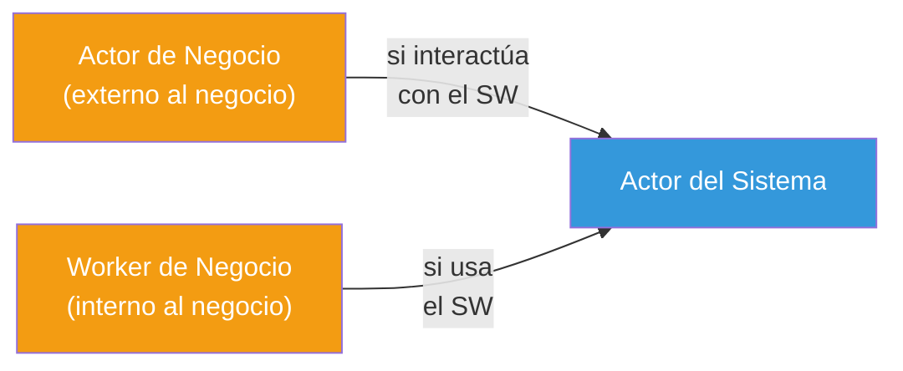
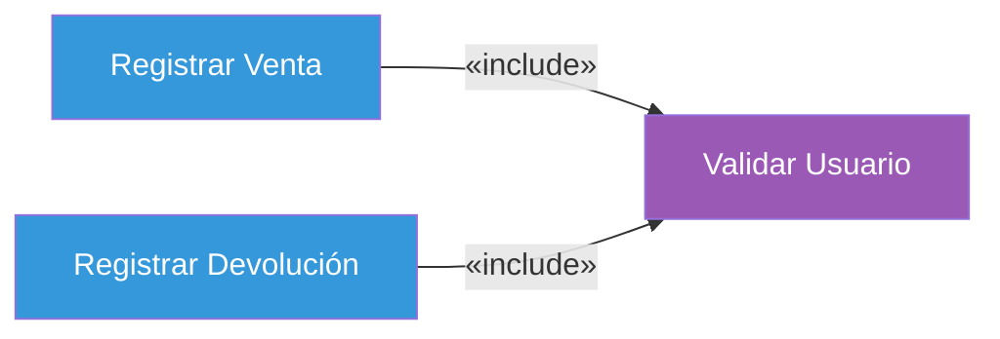
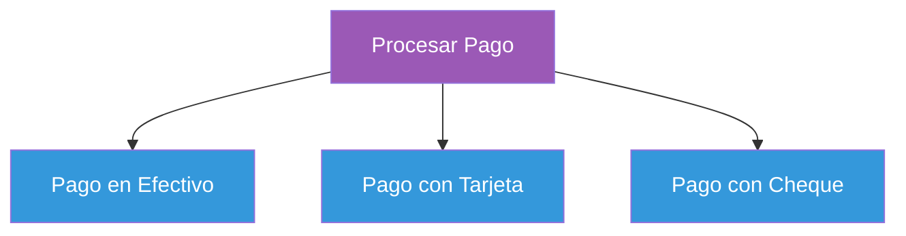
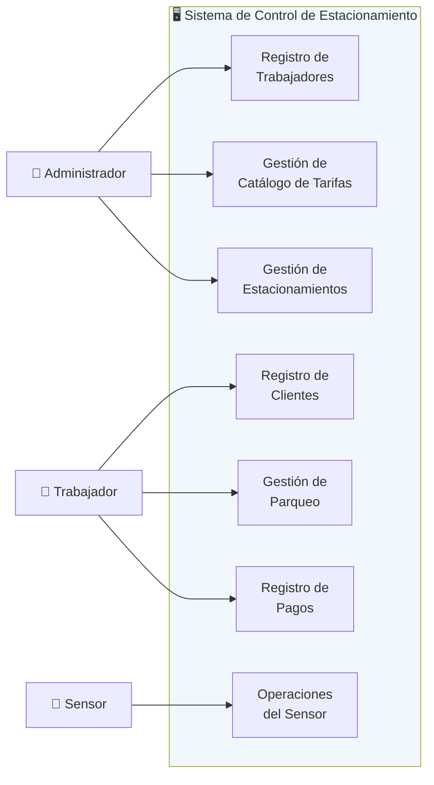
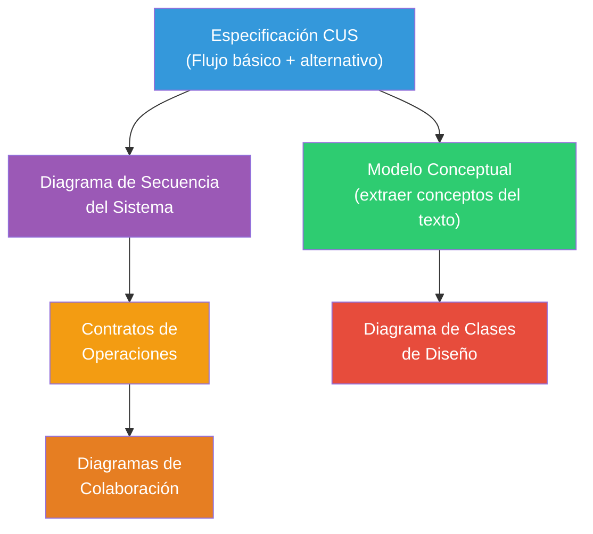

# 07 — Casos de Uso del Sistema (CUS)

> **Pregunta central**: ¿Cómo documentamos las funcionalidades del sistema, sus actores y las relaciones entre CUS?

---

## 1. ¿Qué es un Caso de Uso del Sistema?

> 🔑 Un **Caso de Uso del Sistema (CUS)** es una descripción narrativa de un proceso del dominio, en un formato estructurado de prosa, que describe la secuencia de acciones entre un actor y el sistema.

### Diferencia con el CUN

| Aspecto | CUN (Negocio) | CUS (Sistema) |
|---------|--------------|---------------|
| **Alcance** | Todo el negocio | Solo el sistema de software |
| **Actores** | Actores de Negocio (externos al negocio) | Actores del Sistema (externos al software) |
| **Propósito** | Entender el negocio | Definir qué hace el software |
| **Workers** | Sí (roles internos) | No (el sistema es uno solo) |

---

## 2. Actores del Sistema

```
📌 Definición: Entidad EXTERNA al sistema que interactúa con él.
📌 Pregunta clave: ¿Quién o qué usa directamente el sistema?
```

### Tipos de actores

| Tipo | Ejemplo | Representación |
|------|---------|---------------|
| **Persona** | Cajero, Administrador | Monigote (stick figure) |
| **Sistema externo** | Servicio de pagos, API bancaria | Rectángulo con `«actor»` |
| **Dispositivo** | Sensor ultrasónico, Lector de código de barras | Rectángulo con `«actor»` |

### ¿De dónde vienen los actores?



---

## 3. Niveles de Detalle de un CUS

### 3.1 Caso de Uso de Alto Nivel

Descripción breve (2-3 líneas) del proceso:

```
Caso de uso:  Comprar productos
Actores:      Cliente, Cajero
Tipo:         Primario
Descripción:  Un Cliente llega a la caja registradora con los artículos 
              que va a comprar. El Cajero registra los artículos y cobra 
              el importe. Al terminar, el Cliente se marcha con los productos.
```

### 3.2 Caso de Uso Expandido (Esencial)

Descripción completa con flujo básico y flujos alternativos:

```
Caso de uso:     Procesar Venta
Actores:         Cliente, Cajero
Precondición:    El Cajero está autenticado en el sistema.

FLUJO BÁSICO (Escenario Principal de Éxito):
1.  El Cliente llega al terminal PDV con mercancías.
2.  El Cajero inicia una nueva venta.
3.  El Cajero introduce el identificador del artículo.
4.  El Sistema registra la línea de venta y presenta la descripción, 
    precio y suma parcial.
    → El Cajero repite los pasos 3-4 hasta que se indique.
5.  El Sistema muestra el total con impuestos calculados.
6.  El Cajero le dice al Cliente el total y solicita el pago.
7.  El Cliente paga y el Sistema gestiona el pago.
8.  El Sistema registra la venta completa y envía información a 
    Contabilidad e Inventario.
9.  El Sistema presenta el recibo.
10. El Cliente se va con el recibo y las mercancías.

EXTENSIONES (Flujos Alternativos):
7a. Pago en efectivo:
    1. El Cajero introduce la cantidad de dinero entregada.
    2. El Sistema muestra la cantidad de cambio y abre el cajón de caja.
    3. El Cajero deposita el dinero y devuelve el cambio.
    4. El Sistema registra el pago en efectivo.

Postcondición:  La venta fue registrada. El inventario fue actualizado.
```

---

## 4. Plantilla de Especificación de CUS

> 🔑 **Para examen**: Conoce esta plantilla de memoria.

| Campo | Descripción |
|-------|------------|
| **Nombre CUS** | Verbo + Sustantivo (ej: "Registrar Venta") |
| **Descripción** | Breve resumen del propósito |
| **Actores** | Lista de actores involucrados |
| **Precondición** | Estado requerido ANTES de iniciar el CUS |
| **Flujo Básico** | Secuencia numerada paso a paso (éxito) |
| **Flujo Alternativo** | Variantes y excepciones |
| **Postcondición** | Estado DESPUÉS de completar el CUS |
| **Ref. cruzadas** | Requisitos cubiertos (R01, R02, ...) |

---

## 5. Relaciones entre Casos de Uso

### 5.1 Include (Inclusión)

```
📌 El CU Base SIEMPRE ejecuta al CU incluido.
📌 Factoriza comportamiento COMÚN a varios CU.
📌 El CU incluido NO tiene sentido ejecutarlo solo.
```



**Ejemplo**: Tanto "Registrar Venta" como "Registrar Devolución" requieren validar al usuario primero.

### 5.2 Extend (Extensión)

```
📌 El CU Base puede o NO ejecutar al CU extendido.
📌 Comportamiento CONDICIONAL u OPCIONAL.
📌 El CU extendido extiende el CU base en un "punto de extensión".
```


**Ejemplo**: Solo si el cliente paga con tarjeta se ejecuta "Procesar Pago con Tarjeta".

### 5.3 Generalización

```
📌 El CU hijo HEREDA el comportamiento del CU padre.
📌 El hijo puede AGREGAR o SOBRESCRIBIR pasos.
```



### Tabla comparativa

| Criterio | Include | Extend | Generalización |
|----------|---------|--------|---------------|
| **¿Obligatorio?** | Sí, siempre | No, condicional | El hijo hereda todo |
| **¿Quién inicia?** | El CU base invoca al incluido | El CU extendido se activa si se cumple condición | N/A |
| **Propósito** | Eliminar redundancia | Agregar opcionalidad | Crear variantes |
| **Ejemplo** | Validar Usuario | Aplicar Descuento | Tipos de Pago |

> ⚠️ **Error común**: Invertir la dirección de la flecha en `«extend»`. La flecha va **del CU extendido hacia el CU base**.

---

## 6. Diagrama de Casos de Uso del Sistema

### Ejemplo: Sistema de Estacionamiento Vehicular



---

## 7. De CUS a Otros Artefactos



---

## Preguntas de recuperación

1. ¿Por qué es necesario tener tanto un CUS de alto nivel como uno expandido? ¿En qué etapa del proyecto usarías cada uno?
2. Explica la diferencia entre las relaciones `«include»` y `«extend»` usando un ejemplo de un sistema que conozcas. ¿Cuándo usarías cada una?
3. ¿De dónde provienen los actores del sistema y cómo se relacionan con los actores de negocio y workers de negocio?
4. ¿Qué artefactos se derivan de la Especificación del CUS y por qué es importante mantener esta trazabilidad?
5. ¿Por qué la dirección de la flecha en `«extend»` es contraintuitiva? ¿Cómo recordarías correctamente su dirección?
6. ¿Qué problema resuelve la generalización entre casos de uso? ¿En qué situación es útil crear una jerarquía de CUS?

---

## 8. Preguntas de Autoevaluación

1. ¿Cuál es la diferencia entre un CUS de **alto nivel** y uno **expandido**?
2. Dado un CUS con flujo básico de 10 pasos, ¿en qué paso se especifican los flujos alternativos?
3. ¿En qué dirección va la flecha de `«extend»`?
4. Un CUS "Validar Stock" se usa en "Registrar Venta" y "Registrar Devolución". ¿Es `include` o `extend`?
5. ¿De dónde salen los actores del sistema?
6. ¿Qué artefactos se derivan de la Especificación del CUS?
