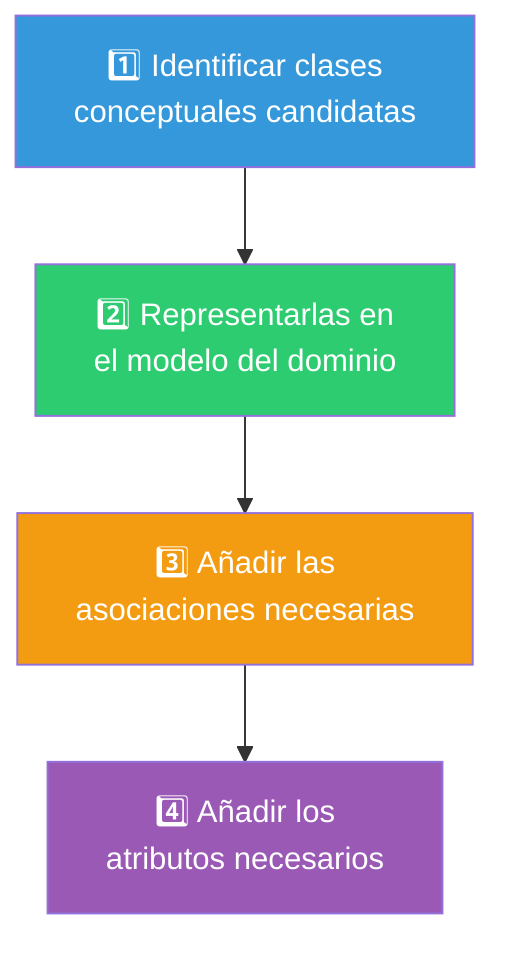
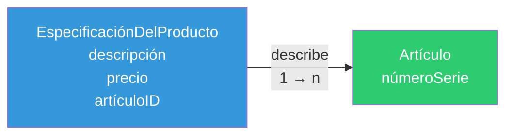
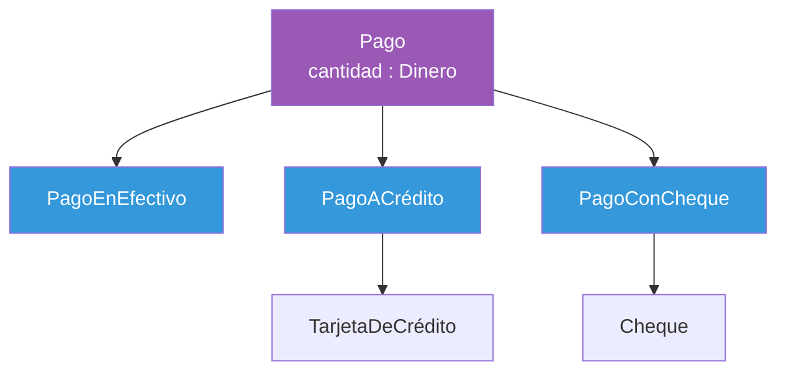
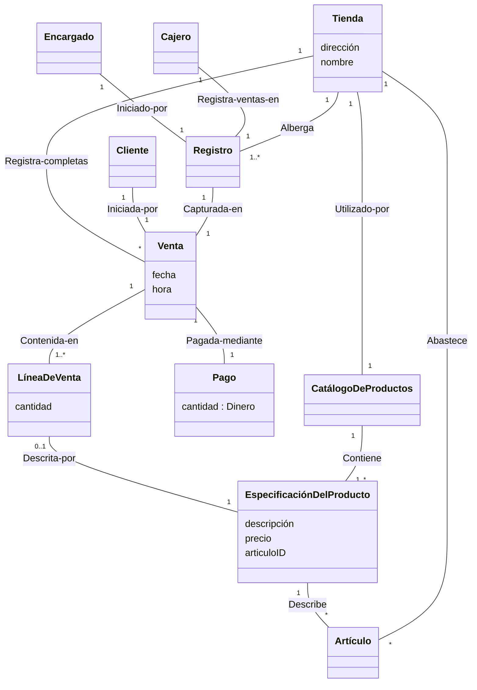

# 08 — Modelo Conceptual / Modelo de Dominio

> **Pregunta central**: ¿Cómo representamos las "cosas" del mundo real y sus relaciones, SIN pensar en software?

---

## 1. ¿Qué es el Modelo Conceptual (Modelo de Dominio)?

> 🔑 **Definición (Larman)**: Un modelo de dominio muestra **clases conceptuales significativas** en un dominio del problema. No muestra componentes software, clases software ni objetos software con responsabilidades.

### ¿Qué contiene?

| Elemento | Descripción | Ejemplo (PDV) |
|---------|-------------|---------------|
| **Clases conceptuales** | Conceptos del mundo real | Venta, Pago, Tienda |
| **Asociaciones** | Relaciones entre conceptos | Venta — Pagada-mediante — Pago |
| **Atributos** | Datos simples de cada concepto | Venta: fecha, hora |

### ¿Qué NO contiene?

- ❌ Artefactos software (ventanas, bases de datos, componentes)
- ❌ Responsabilidades o métodos
- ❌ Tipos de datos complejos como atributos

> ⚠️ **Error común**: Incluir métodos como `imprimir()` o clases como `BaseDeDatosVentas` en el modelo de dominio. Estos son artefactos software, NO pertenecen aquí.

---

## 2. ¿Por Qué es el Artefacto Más Importante del AOO?

El modelo de dominio cumple una función clave: **reducir el salto en la representación (salto semántico)**.


| Modelo del Dominio | Modelo de Diseño |
|-------------------|-----------------|
| `Venta` (concepto) | `Venta` (clase software) |
| `fecha`, `hora` (datos del dominio) | `fecha: Date`, `hora: Time` (tipos Java) |
| Sin métodos | `getTotal(): Dinero` |
| NO son lo mismo, pero el primero **inspira** el segundo |

---

## 3. Proceso de Construcción (4 Pasos)



> 🔑 **Regla de oro**: Mejor especificar en EXCESO con muchas clases "de grano fino" que especificar POR DEFECTO.

---

## 4. Paso 1: Identificar Clases Conceptuales

### Estrategia A: Lista de Categorías de Clases Conceptuales

| Categoría | Ejemplo (PDV) | Ejemplo (Aerolínea) |
|----------|---------------|---------------------|
| **Objetos tangibles/físicos** | Registro | Avión |
| **Especificaciones o descripciones** | EspecificaciónDelProducto | DescripciónDelVuelo |
| **Lugares** | Tienda | Aeropuerto |
| **Transacciones** | Venta, Pago | Reserva |
| **Líneas de transacción** | LíneaDeVenta | — |
| **Roles de personas** | Cajero | Piloto |
| **Contenedores** | Tienda, Almacén | Avión |
| **Cosas en contenedor** | Artículo | Pasajero |
| **Sistemas externos** | SistemaAutorizaciónPagoCrédito | ControlTráficoAéreo |
| **Catálogos** | CatálogoDeProductos | CatálogoDeVuelos |
| **Registros financieros** | Recibo, Factura | Billete |
| **Organizaciones** | — | CompañíaAérea |
| **Eventos** | Venta | Vuelo |

### Estrategia B: Análisis de Frases Nominales (Heurística de Abbott)

1. Tomar la **especificación expandida del CUS** (flujo básico + alternativo)
2. **Subrayar sustantivos y frases nominales**
3. Considerar cada uno como **clase candidata o atributo candidato**

> ⚠️ **Punto débil**: Imprecisión del lenguaje natural (sinónimos, ambigüedades). Complementar siempre con la lista de categorías.

### Ejemplo: Frases nominales de "Procesar Venta"

Del flujo: *"El **Cliente** llega al **terminal PDV** con **mercancías**. El **Cajero** inicia una nueva **venta**. El **Cajero** introduce el **identificador del artículo**. El **Sistema** registra la **línea de venta** y presenta la **descripción del artículo**, **precio** y **suma parcial**..."*

Clases candidatas: `Cliente`, `Registro(PDV)`, `Artículo`, `Cajero`, `Venta`, `LíneaDeVenta`, `EspecificaciónDelProducto`, `Pago`, `CatálogoDeProductos`, `Tienda`, `Encargado`

---

## 5. Error Crítico: ¿Atributo o Concepto?

> 🔑 **Si dudas, hazlo concepto**. Los atributos no deben ser habituales en un modelo de dominio.

### Prueba: ¿Es un tipo de dato simple o una entidad con identidad propia?

```
❌ INCORRECTO                  ✅ CORRECTO

  Venta                          Venta          Tienda
  tienda: String                               dirección
                                               teléfono

  Vuelo                          Vuelo          Aeropuerto
  destino: String                              nombre
```

**Regla**: Si en el mundo real es una entidad legal, organización, cosa física o algo que ocupa espacio → es un **concepto**, no un atributo.

---

## 6. Clases de Especificación/Descripción

> 🔑 **Concepto clave**: Una `EspecificaciónDelProducto` NO es un Artículo. Es una **descripción de la información** sobre los artículos.

### ¿Cuándo usar una clase de especificación?

- Se necesita la descripción **independientemente** de que existan instancias
- Eliminar instancias provocaría **pérdida de información** que debe mantenerse
- Reduce **información redundante**



> Si se venden todos los artículos y se eliminan las instancias de `Artículo`, la `EspecificaciónDelProducto` **permanece** con la descripción y el precio.

---

## 7. Paso 3: Asociaciones

### ¿Qué asociaciones registrar?

Registrar las asociaciones:
- De las que es necesario **conservar el conocimiento** de la relación
- Derivadas de la **Lista de Asociaciones Comunes** (ver tabla abajo)
- **Únicamente asociaciones útiles** para mantener el diagrama legible

### Lista de Asociaciones Comunes

| Categoría | Ejemplo (PDV) |
|----------|---------------|
| A es una parte física de B | Registro—Caja |
| A es una parte lógica de B | LíneaDeVenta—Venta |
| A está contenido físicamente en B | Registro—Tienda, Artículo—Tienda |
| A está contenido lógicamente en B | EspecificaciónDelProducto—CatálogoDeProductos |
| A es una descripción de B | EspecificaciónDelProducto—Artículo |
| A es una línea de transacción de B | LíneaDeVenta—Venta |
| A se registra/captura en B | Venta—Registro (actual), Venta—Tienda (completas) |
| A es miembro de B | Cajero—Tienda |
| A utiliza/gestiona B | Cajero—Registro |
| A se comunica con B | Cliente—Cajero |
| A está relacionado con transacción B | Cliente—Pago |
| A es transacción relacionada con B | Pago—Venta |

### Multiplicidad

| Notación | Significado |
|----------|------------|
| `1` | Exactamente uno |
| `0..1` | Cero o uno |
| `*` o `0..*` | Cero o más |
| `1..*` | Uno o más |
| `1..40` | De 1 a 40 |
| `3,5,8` | Exactamente 3, 5 u 8 |

### Nombre de asociaciones

Formato: `NombreTipo — FraseVerbal — NombreTipo`

Ejemplos: `Venta — Pagada-mediante — Pago`, `Tienda — Alberga — Registro`

---

## 8. Tipos de Relaciones Avanzadas

### 8.1 Agregación (Rombo hueco ◇)

- Todo-parte donde la parte **puede existir** sin el todo
- Ejemplo: `DiagramaUML ◇— ElementoUML` (un elemento puede estar en varios diagramas)

### 8.2 Composición (Rombo relleno ◆)

- Todo-parte donde la parte **NO existe** sin el todo
- Multiplicidad en el extremo del compuesto: siempre `1`
- Ejemplo: `Venta ◆— LíneaDeVenta`, `CatálogoDeProductos ◆— EspecificaciónDelProducto`

### 8.3 Generalización (Herencia conceptual)



**Regla del 100%**: El 100% de la definición de la superclase debe aplicarse a la subclase.

**Regla Es-Un-Tipo-De**: La subclase debe ser un **tipo** de la superclase.

### ¿Cuándo crear subclases?

| Motivación | Ejemplo |
|-----------|---------|
| La subclase tiene **atributos adicionales** | `Libro` (ISBN) es subclase de `RecursoPrestable` |
| La subclase tiene **asociaciones adicionales** | `PagoACrédito` se asocia con `TarjetaDeCrédito` |
| La subclase se **maneja diferente** | `PagoACrédito` requiere autorización, `PagoEnEfectivo` no |

### Clases Abstractas

Si **todo** miembro de una clase DEBE ser miembro de alguna subclase, la clase es **abstracta** (se escribe en cursiva).

---

## 9. Paso 4: Atributos

### Reglas para atributos

1. Solo **tipos de datos simples**: boolean, fecha, número, string, hora
2. **NO** usar conceptos complejos como atributos (usar asociación)
3. Si un atributo tiene **secciones separadas**, representarlo como clase (ej: NúmeroTeléfono)
4. Si un atributo tiene **unidades**, representar Cantidad + Unidad como clase

### Cantidades y unidades

```
❌ INCORRECTO           ✅ CORRECTO
Pago                    Pago
cantidad: Número        cantidad: Dinero    (donde Dinero = Cantidad + Moneda)
```

---

## 10. Modelo Conceptual Completo: Sistema PDV (Larman)



---

## 11. Paquetes del Modelo de Dominio

Cuando el modelo crece, se divide en **paquetes** (folders lógicos):

| Paquete | Clases que contiene |
|---------|-------------------|
| **Básico** | Tienda, Registro |
| **Productos** | Artículo, EspecificaciónDelProducto, CatálogoDeProductos |
| **Ventas** | Venta, LíneaDeVenta |
| **Pagos** | Pago, PagoEnEfectivo, PagoACrédito, PagoConCheque |
| **Transacciones Autorización** | ServicioAutorización, ServicioAutorizaciónCrédito |

**Criterios para agrupar en paquetes**:
- Misma área de interés
- Misma jerarquía de clases
- Participan en los mismos casos de uso
- Están fuertemente asociados

---

## Preguntas de recuperación

1. ¿Por qué el Modelo Conceptual no incluye métodos ni clases software? ¿Qué problema resuelve esta restricción?
2. ¿Cómo decides si algo debe ser un atributo o una clase conceptual? ¿Qué criterio usas para tomar esta decisión?
3. ¿Cuándo conviene crear una clase de especificación (como EspecificaciónDelProducto) en lugar de tener solo instancias? ¿Qué ventajas ofrece?
4. Explica la diferencia entre agregación y composición usando un ejemplo del mundo real. ¿Qué implicaciones tiene esta distinción en el diseño?
5. ¿Por qué se dice que el Modelo Conceptual reduce el "salto semántico" entre el mundo real y el software? ¿Qué ocurriría sin este artefacto?
6. ¿Cómo se relaciona la Regla del 100% con la generalización en el modelo conceptual? ¿Qué problema evita esta regla?

---

## 12. Preguntas de Autoevaluación

1. ¿Cuál es la diferencia entre el Modelo Conceptual y el Diagrama de Clases de Diseño?
2. ¿Por qué `BaseDeDatosVentas` NO pertenece al modelo de dominio?
3. Dado "El cajero trabaja en una tienda", ¿es `tienda` un atributo de Cajero o una asociación?
4. ¿Cuándo conviene crear una clase `EspecificaciónDelProducto` separada de `Artículo`?
5. ¿Cuál es la diferencia entre agregación y composición?
6. Aplica la Regla del 100% para justificar que `PagoEnEfectivo` es subclase de `Pago`.
