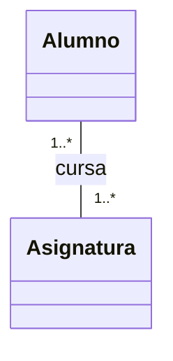
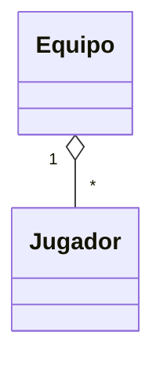
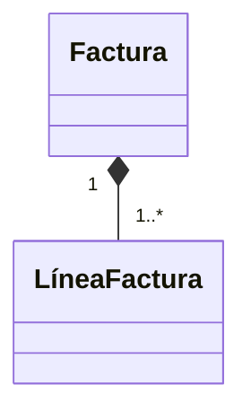
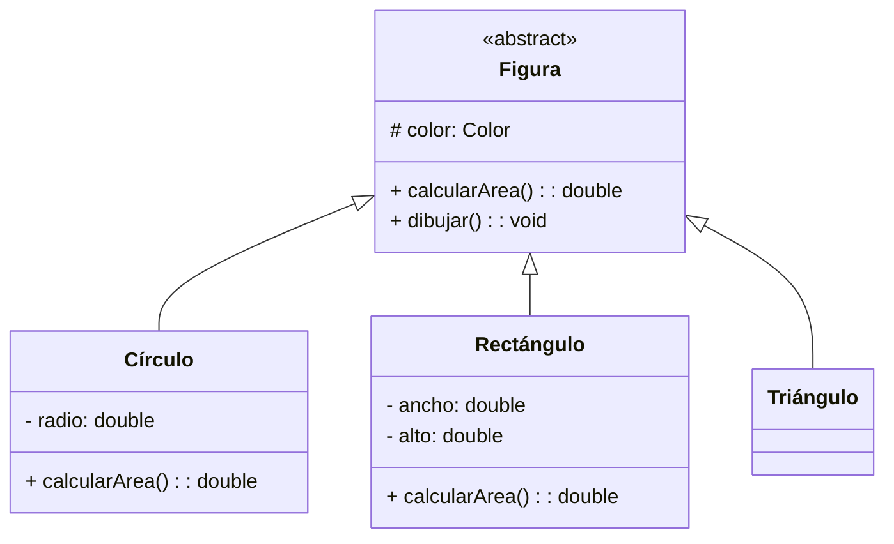
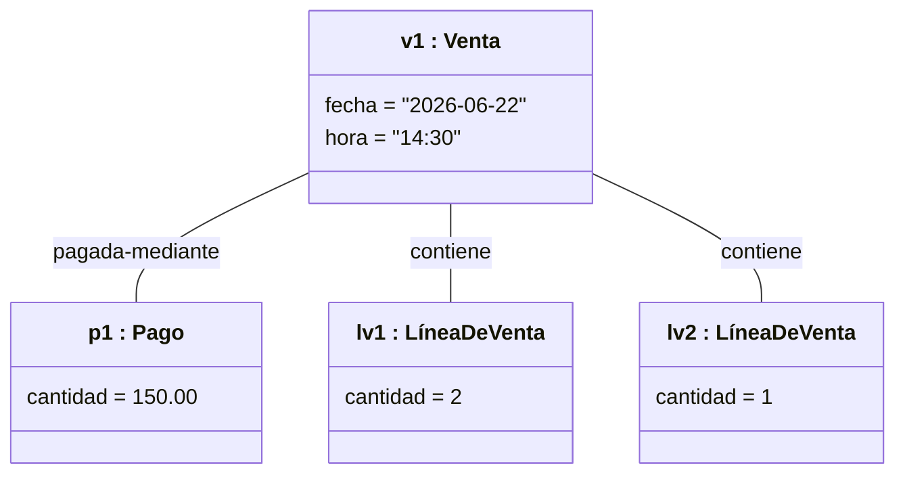
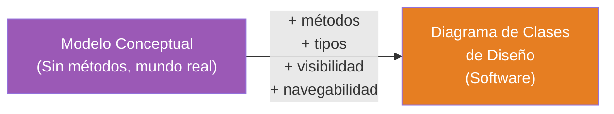
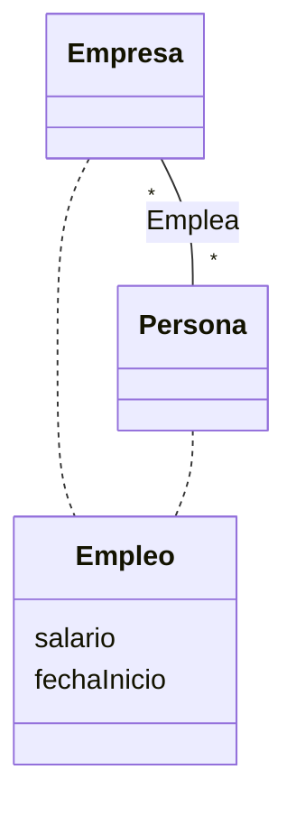

# 09 — Diagramas de Clases y Objetos

> **Pregunta central**: ¿Cómo pasamos de clases conceptuales (mundo real) a clases de diseño (software)?

---

## 1. Dos Usos del Diagrama de Clases

> ⚠️ **Distinción crítica**: El mismo "Diagrama de Clases" UML se usa en DOS contextos diferentes.

| Contexto | Propósito | ¿Tiene métodos? | ¿Tiene tipos de datos? | Archivo |
|---------|----------|-----------------|----------------------|---------|
| **Modelo Conceptual** (Análisis) | Representar conceptos del mundo real | ❌ No | Opcionales | 🔗 [08](08_modelo_conceptual.md) |
| **Diagrama de Clases de Diseño** (Diseño) | Representar clases software | ✅ Sí | ✅ Sí | Este archivo |

---

## 2. Estructura de una Clase en UML

```
┌─────────────────────────────┐
│         NombreClase         │  ← Compartimento 1: Nombre
├─────────────────────────────┤
│ - atributo1: Tipo           │  ← Compartimento 2: Atributos
│ - atributo2: Tipo = default │
│ # atributoProtegido: Tipo   │
│ + atributoPublico: Tipo     │
├─────────────────────────────┤
│ + metodo1(): TipoRetorno    │  ← Compartimento 3: Operaciones
│ + metodo2(param: Tipo): Tipo│
│ - metodoPrivado(): void     │
└─────────────────────────────┘
```

### Visibilidad

| Símbolo | Visibilidad | Acceso |
|---------|------------|--------|
| `+` | Público (public) | Cualquier clase |
| `-` | Privado (private) | Solo la propia clase |
| `#` | Protegido (protected) | La clase y sus subclases |
| `~` | Paquete (package) | Clases del mismo paquete |

### Notación de atributos

```
visibilidad nombre: tipo [multiplicidad] = valorPorDefecto {propiedades}
```

Ejemplo: `- precio: float = 0.0` — atributo privado de tipo float con valor por defecto 0.0

### Notación de operaciones

```
visibilidad nombre(listaParámetros): tipoRetorno {propiedades}
```

Ejemplo: `+ getTotal(): Dinero` — operación pública que retorna un objeto Dinero

---

## 3. Tipos de Relaciones

### 3.1 Asociación

Una línea simple entre dos clases que indica que "se conocen".



- Puede tener **nombre**, **roles** y **multiplicidad**
- Puede ser **bidireccional** (por defecto) o **unidireccional** (con flecha)

### Navegabilidad

Una flecha en un extremo indica que solo esa clase "conoce" a la otra.

```
Estudiante ────────> Asignatura
(Asignatura conoce a Estudiante, pero NO al revés)
```

### 3.2 Agregación (Rombo hueco)



- Relación todo-parte **débil**
- La parte puede existir independientemente del todo
- Multiplicidad en el extremo del todo puede ser > 1

### 3.3 Composición (Rombo relleno)



- Relación todo-parte **fuerte**
- La parte NO existe sin el todo
- Multiplicidad en el extremo del todo: siempre `1`
- Si se destruye el todo, se destruyen las partes

### 3.4 Generalización (Herencia)



- Flecha con triángulo hueco apunta a la **superclase**
- La subclase hereda atributos y métodos
- Las clases abstractas se marcan con `<<abstract>>` o nombre en *cursiva*

### Tabla resumen de relaciones

| Relación | Símbolo | Fuerza | ¿Parte existe sin todo? | Multiplicidad todo |
|----------|---------|--------|------------------------|--------------------|
| Asociación | Línea | — | N/A | Cualquiera |
| Agregación | ◇ | Débil | ✅ Sí | Cualquiera |
| Composición | ◆ | Fuerte | ❌ No | Solo `1` |
| Generalización | △ | Es-un-tipo-de | N/A | N/A |

---

## 4. Diagrama de Objetos

> 🔑 Un **diagrama de objetos** muestra **instancias concretas** de las clases en un momento dado.

### Notación

```
┌─────────────────────────┐
│ nombreObjeto : Clase    │  ← Subrayado
├─────────────────────────┤
│ atributo1 = valor1      │  ← Valores concretos
│ atributo2 = valor2      │
└─────────────────────────┘
```

### Ejemplo



### Diferencias clave Clase vs. Objeto

| Diagrama de Clases | Diagrama de Objetos |
|-------------------|-------------------|
| Muestra la **estructura general** | Muestra un **escenario concreto** |
| `Venta` (concepto genérico) | `v1:Venta` (una venta específica) |
| `fecha: Date` (tipo) | `fecha = "2026-06-22"` (valor) |
| Muestra multiplicidad | Muestra instancias reales |
| NO tiene métodos en modelo conceptual | Nunca tiene métodos |

---

## 5. Del Modelo Conceptual al Diagrama de Clases de Diseño



### Ejemplo: Evolución de la clase Venta

| Modelo Conceptual | Diagrama de Clases de Diseño |
|-------------------|---------------------------|
| `Venta` | `Venta` |
| `fecha` | `- fecha: Date` |
| `hora` | `- hora: Time` |
| (sin métodos) | `+ getTotal(): Dinero` |
| (sin navegabilidad) | Flechas de navegabilidad |

---

## 6. Clases Asociación

Cuando existe información que **pertenece a la relación** entre dos clases (no a ninguna de las dos por separado):



**¿Cuándo usar clases asociación?**
- Hay atributos **relacionados con la asociación** misma
- La asociación es **muchos-a-muchos**
- El tiempo de vida de la instancia **depende de la asociación**

Ejemplo: El `comercianteID` pertenece a la relación `Tienda ↔ ServicioAutorización`, no a ninguna de las dos.

---

## Preguntas de recuperación

1. ¿Por qué el mismo "Diagrama de Clases" UML se usa en dos contextos diferentes (conceptual y diseño)? ¿Qué riesgos existen si no se distinguen claramente?
2. ¿Qué agrega el Diagrama de Clases de Diseño que el Modelo Conceptual NO tiene? ¿Por qué estos elementos son necesarios para la implementación?
3. Si destruyo un Pedido, ¿se destruyen sus LíneasDePedido? ¿Qué tipo de relación es y por qué? ¿Qué implicaciones tiene esto en el código?
4. ¿Cuándo se usa una clase asociación en lugar de una asociación simple? ¿Qué problema resuelve este patrón de diseño?
5. ¿Qué diferencia fundamental hay entre un diagrama de clases y uno de objetos? ¿En qué situación usarías cada uno?
6. ¿Cómo se transforma el Modelo Conceptual en un Diagrama de Clases de Diseño? ¿Qué decisiones de diseño debes tomar durante esta transformación?

---

## 7. Preguntas de Autoevaluación

1. ¿Cuáles son los 3 compartimentos de una clase UML?
2. ¿Cuál es la diferencia entre un diagrama de clases **conceptual** y uno de **diseño**?
3. Si destruyo un `Pedido`, ¿se destruyen sus `LíneasDePedido`? ¿Qué tipo de relación es?
4. ¿Cuándo se usa una **clase asociación**?
5. Dado `v1:Venta` con `fecha="2026-06-22"`, ¿es un diagrama de clases o de objetos?
6. ¿Qué agrega el Diagrama de Clases de Diseño que el Modelo Conceptual NO tiene?
