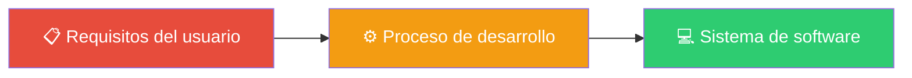
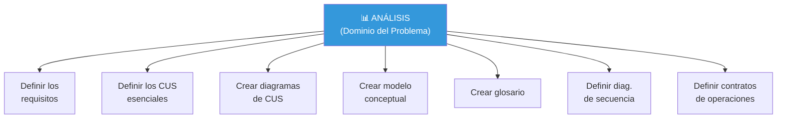
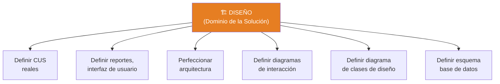
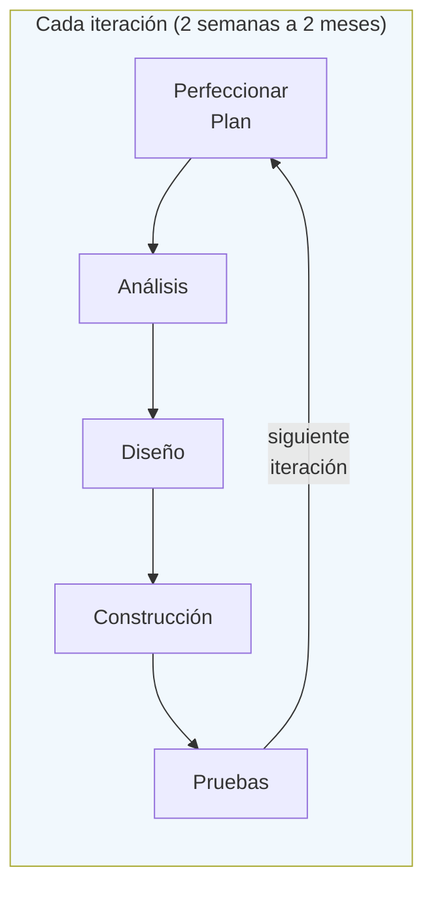
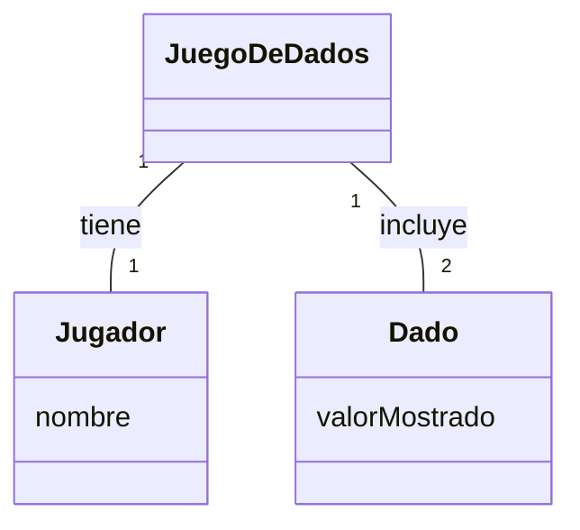
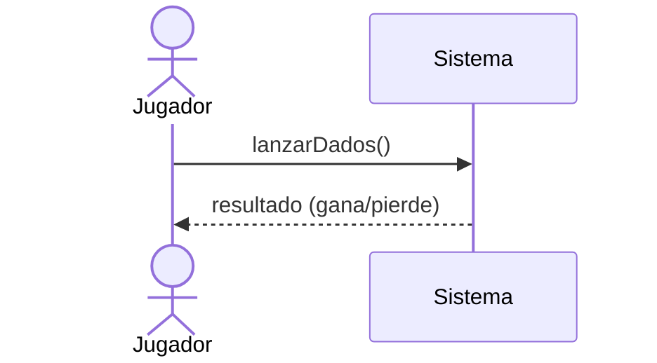
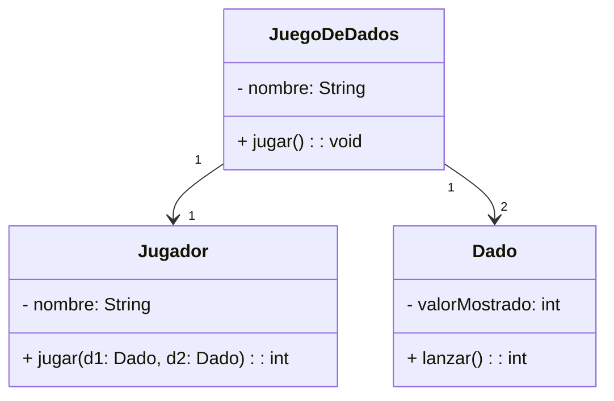
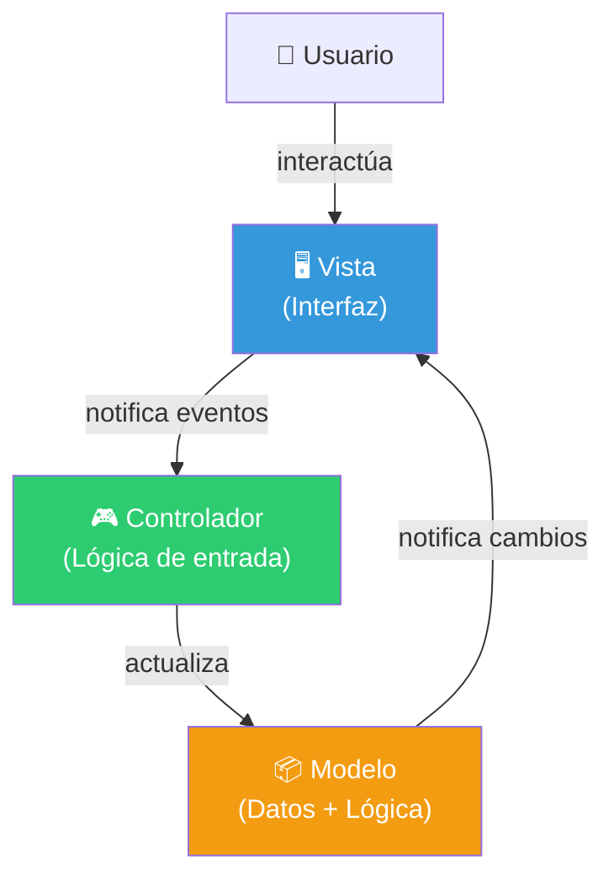

# 10 — Análisis y Diseño Orientado a Objetos

> **Pregunta central**: ¿Cómo pasamos del dominio del problema al dominio de la solución?

---

## 1. Vista General del Proceso



> Un **proceso de desarrollo de software** es una forma disciplinada de asignar tareas y responsabilidades en una empresa de desarrollo: **quién** hace **qué**, **cuándo** y **cómo**.

---

## 2. Etapa de Análisis vs. Etapa de Diseño

> 🔑 **Distinción fundamental**: El análisis investiga el PROBLEMA. El diseño crea la SOLUCIÓN.

| Aspecto | Análisis | Diseño |
|---------|---------|--------|
| **Dominio** | Del problema | De la solución |
| **Pregunta** | ¿QUÉ hay que hacer? | ¿CÓMO se va a hacer? |
| **Foco** | Conceptos del mundo real | Componentes software |
| **Artefactos** | Modelo conceptual, DSS, Contratos | Diag. colaboración, Clases diseño, BD |
| **Lenguaje** | Dominio del negocio | Dominio técnico |

### Tareas de la etapa de Análisis



### Tareas de la etapa de Diseño



---

## 3. Herramientas de Análisis: Resumen

| Herramienta | Pregunta que responde | Archivo detallado |
|------------|----------------------|-------------------|
| **Casos de Uso** | ¿Cuáles son los procesos del dominio? | 🔗 [07](07_casos_uso.md) |
| **Modelo Conceptual** | ¿Cuáles son los conceptos y términos? | 🔗 [08](08_modelo_conceptual.md) |
| **Diagramas de Secuencia del Sistema** | ¿Cuáles son los eventos y operaciones del sistema? | 🔗 [11](11_secuencia_contratos.md) |
| **Contratos de Operaciones** | ¿Qué promete el sistema al ejecutar cada operación? | 🔗 [11](11_secuencia_contratos.md) |

---

## 4. Herramientas de Diseño: Resumen

| Herramienta | Pregunta que responde | Archivo detallado |
|------------|----------------------|-------------------|
| **Diagramas de Colaboración** | ¿Cómo interactúan los objetos internamente? | 🔗 [12](12_colaboracion.md) |
| **Diagrama de Clases de Diseño** | ¿Cuáles son las clases software, sus métodos y relaciones? | 🔗 [09](09_clases_objetos.md) |
| **Esquema de BD** | ¿Cómo se persisten los datos? | — |

---

## 5. El Ciclo de Desarrollo Iterativo



### Ejemplo de iteraciones con Casos de Uso

| Iteración | CU tratados | Nivel de detalle |
|-----------|-------------|-----------------|
| Ciclo 1 | CU A | Versión simplificada |
| Ciclo 2 | CU A, CU B | CU A completo, CU B iniciado |
| Ciclo 3 | CU B, CU C | Ambos completos |

---

## 6. El Flujo Completo: Del CUS al Código

### Ejemplo: Juego de Dados

> 📋 "Un jugador lanza dos dados. Si el total es 7, gana; en caso contrario, pierde."

#### Paso 1: Caso de Uso

```
CUS: Jugar un juego
Actor: Jugador
Descripción: El jugador recoge y lanza los dados.
             Si los puntos suman 7, gana; si no, pierde.
```

#### Paso 2: Modelo Conceptual



#### Paso 3: Diagrama de Secuencia



#### Paso 4: Diagrama de Colaboración

Los objetos internos se envían mensajes para cumplir la operación `lanzarDados()`.

#### Paso 5: Diagrama de Clases de Diseño



#### Paso 6: Código

```java
class Dado {
    int valorMostrado;
    
    public int lanzar() {
        this.valorMostrado = (int)(Math.random() * 6) + 1;
        return this.valorMostrado;
    }
}

class Jugador {
    String nombre;
    
    public int jugar(Dado d1, Dado d2) {
        return d1.lanzar() + d2.lanzar();
    }
}
```

---

## 7. El Patrón MVC (Modelo-Vista-Controlador)

> 🔑 **Concepto de diseño**: MVC separa la aplicación en tres áreas para manejar cambios de interfaz sin afectar la lógica.



| Componente | Responsabilidad | Ejemplo (PDV) |
|-----------|----------------|--------------|
| **Modelo** | Datos y lógica principal | Cálculo de total, gestión de inventario |
| **Vista** | Mostrar información al usuario | Pantalla de cobro, recibo |
| **Controlador** | Recibir entrada del usuario, coordinar | Procesar el botón "Cobrar" |

### Beneficios de MVC

- ✅ Múltiples **vistas** del mismo modelo
- ✅ Sincronización cuando varios usuarios usan la misma app
- ✅ Se puede **intercambiar** la vista sin modificar el modelo (plug & play)
- ✅ La interfaz puede ser un applet Java, una app standalone, o una web

---

## Preguntas de recuperación

1. ¿Por qué es fundamental distinguir entre la etapa de Análisis y la de Diseño? ¿Qué problemas pueden surgir si se mezclan?
2. Explica cómo el patrón MVC permite cambiar la interfaz de usuario sin afectar la lógica del negocio. ¿Qué componente de MVC encapsula los datos?
3. ¿En qué paso del flujo completo (del CUS al código) se define la estructura de datos y en cuál se define la interacción entre objetos?
4. ¿Por qué el análisis produce un Modelo Conceptual sin métodos mientras que el diseño produce un Diagrama de Clases con métodos? ¿Qué representa cada uno?
5. ¿Qué ventajas ofrece el desarrollo iterativo respecto a un enfoque secuencial? ¿Cómo se relaciona esto con la gestión de riesgos?
6. ¿Cómo se transforman los artefactos de análisis (CUS, Modelo Conceptual, DSS) en artefactos de diseño (Diagramas de Colaboración, Clases de Diseño)?

---

## 8. Preguntas de Autoevaluación

1. ¿Cuál es la diferencia fundamental entre la etapa de **Análisis** y la de **Diseño**?
2. En el ejemplo del juego de dados, ¿en qué paso se define la estructura de datos y en cuál la interacción?
3. ¿Qué componente de MVC encapsula los datos y la funcionalidad principal?
4. ¿Por qué el análisis produce un Modelo Conceptual (sin métodos) y el diseño produce un Diagrama de Clases de Diseño (con métodos)?
5. ¿Cuánto dura una iteración típica en el proceso iterativo?
