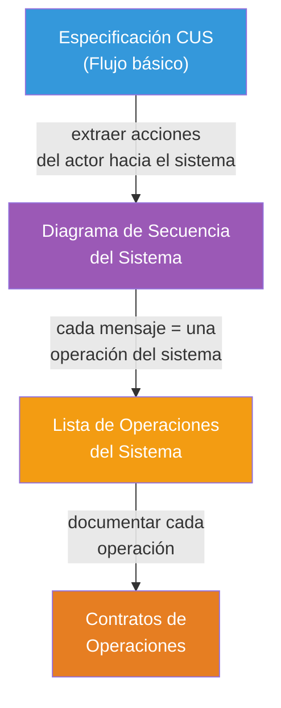
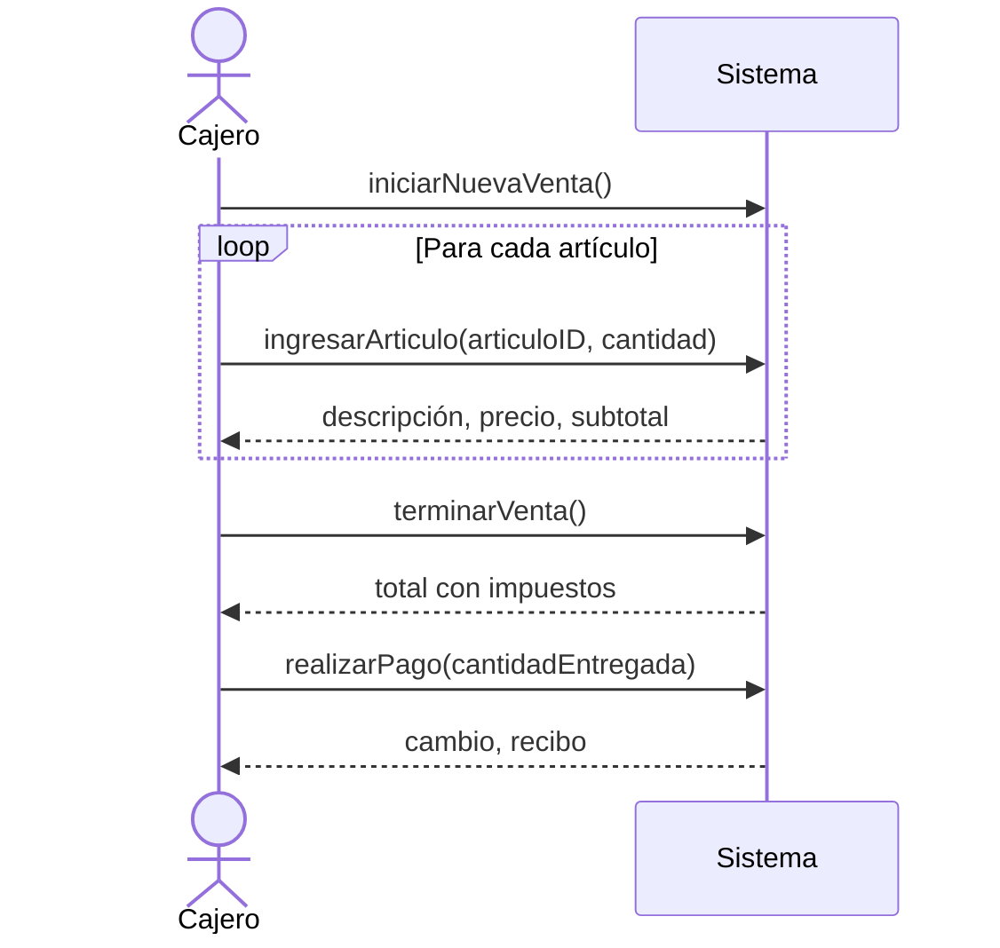

# 11 — Diagramas de Secuencia del Sistema (DSS) y Contratos de Operaciones

> **Pregunta central**: ¿Cómo modelamos la interacción actor-sistema y qué promete cada operación?

---

## 1. ¿Qué es un Diagrama de Secuencia del Sistema (DSS)?

> 🔑 **Definición**: Un DSS muestra gráficamente los **eventos** que originan los actores y que **impactan al sistema**, tratando al sistema como una "caja negra".

### Características clave

| Aspecto | Valor |
|---------|-------|
| **Perspectiva** | Caja negra: ¿QUÉ hace el sistema, NO CÓMO lo hace? |
| **Se deriva de** | La Especificación del CUS (flujo básico + alternativo) |
| **Elementos** | Actor(es), el Sistema (como una línea de vida), mensajes (eventos) |
| **Fase RUP** | Análisis (Elaboración) |
| **Produce** | Lista de **operaciones del sistema** |

---

## 2. Cómo Construir un DSS

### Proceso



### Reglas

1. **El actor inicia siempre** — Los mensajes van del actor al sistema
2. **Un mensaje por paso** del flujo básico que implica interacción con el sistema
3. **Los parámetros** del mensaje son los datos que el actor proporciona
4. **Las respuestas** del sistema se muestran como flechas punteadas de retorno

---

## 3. Ejemplo: DSS de "Procesar Venta" (PDV)

Flujo básico (resumido):
1. El Cajero inicia nueva venta
2. El Cajero introduce el identificador del artículo
3. El Sistema registra la línea de venta y muestra descripción, precio, subtotal
4. Repite 2-3 hasta terminar
5. El Cajero indica fin de venta
6. El Sistema muestra total con impuestos
7. El Cajero ingresa pago
8. El Sistema registra la venta y muestra cambio



### Operaciones del Sistema identificadas

De este DSS se extraen las siguientes **operaciones del sistema**:

| Operación | Parámetros | Descripción |
|-----------|-----------|-------------|
| `iniciarNuevaVenta()` | — | Crea una nueva venta en el sistema |
| `ingresarArticulo(articuloID, cantidad)` | ID del artículo, cantidad | Registra una línea de venta |
| `terminarVenta()` | — | Indica que no hay más artículos |
| `realizarPago(cantidadEntregada)` | Monto entregado | Procesa el pago |

---

## 4. ¿Qué es un Contrato de Operación?

> 🔑 **Definición**: Un contrato describe los **cambios de estado** del sistema cuando se ejecuta una operación. Define QUÉ cambia, no CÓMO cambia.

### Campos de un Contrato

| Campo | Descripción | Ejemplo |
|-------|------------|---------|
| **Nombre** | Nombre de la operación | `ingresarArticulo(articuloID, cantidad)` |
| **Responsabilidades** | Descripción informal de qué hace | "Registrar una línea de venta" |
| **Tipo** | Sistema | Sistema |
| **Ref. cruzadas** | Requisitos cubiertos | R1.1, R1.3 |
| **Notas** | Aclaraciones | "El articuloID viene del escáner" |
| **Excepciones** | Errores posibles | "Si articuloID no existe, mostrar error" |
| **Salida** | Información que se envía fuera del sistema | — |
| **Precondiciones** | Estado requerido ANTES de la operación | "Existe una venta en curso" |
| **Postcondiciones** | Estado DESPUÉS de la operación | (ver abajo) |

### Postcondiciones: El Corazón del Contrato

> 🔑 Las postcondiciones describen cambios de estado en términos de:

| Tipo de cambio | Ejemplo |
|---------------|---------|
| **Creación de instancia** | "Se creó una instancia de LíneaDeVenta (ldv)" |
| **Modificación de atributo** | "Se asignó ldv.cantidad = cantidad" |
| **Asociación formada** | "Se asoció ldv con la Venta actual" |
| **Asociación rota** | "Se desasoció X de Y" |
| **Eliminación de instancia** | "Se eliminó la instancia de X" |

> ⚠️ **Error común**: Escribir postcondiciones como acciones ("Se calcula el total"). Las postcondiciones describen **estados resultantes**, no pasos procedurales.

---

## 5. Ejemplo Completo de Contratos: "Procesar Venta"

### Contrato 1: iniciarNuevaVenta()

```
Nombre:           iniciarNuevaVenta()
Responsabilidades: Crear una nueva venta y prepararla para recibir líneas.
Tipo:             Sistema
Precondiciones:   El Cajero está autenticado.
Postcondiciones:  • Se creó una nueva instancia de Venta (v) [creación de instancia]
                  • Se asoció v con el Registro actual [asociación formada]
                  • Se inicializaron los atributos de v (fecha=hoy, hora=ahora)
                    [modificación de atributos]
```

### Contrato 2: ingresarArticulo(articuloID, cantidad)

```
Nombre:           ingresarArticulo(articuloID, cantidad)
Responsabilidades: Registrar la venta de un artículo y presentar su información.
Tipo:             Sistema
Ref. cruzadas:    R1.1, R1.3, R1.9
Excepciones:      Si articuloID no es válido, indicar error.
Precondiciones:   Existe una venta en curso.
Postcondiciones:  • Se creó una instancia de LíneaDeVenta (ldv) [creación de instancia]
                  • Se asoció ldv con la Venta actual [asociación formada]
                  • Se asignó ldv.cantidad = cantidad [modificación de atributo]
                  • Se asoció ldv con EspecificaciónDelProducto basándose en
                    articuloID [asociación formada]
```

### Contrato 3: terminarVenta()

```
Nombre:           terminarVenta()
Responsabilidades: Indicar el final del ingreso de artículos y calcular total.
Tipo:             Sistema
Precondiciones:   Existe una venta en curso con al menos una línea.
Postcondiciones:  • Se asignó Venta.esCompleta = true [modificación de atributo]
```

### Contrato 4: realizarPago(cantidadEntregada)

```
Nombre:           realizarPago(cantidadEntregada)
Responsabilidades: Registrar el pago y completar la venta.
Tipo:             Sistema
Precondiciones:   Existe una venta completada (esCompleta = true).
Postcondiciones:  • Se creó una instancia de Pago (p) [creación de instancia]
                  • Se asignó p.cantidad = cantidadEntregada [modificación de atributo]
                  • Se asoció p con la Venta actual [asociación formada]
                  • Se asoció la Venta actual con la Tienda (para registro 
                    permanente) [asociación formada]
```

---

## 6. Caso de Estudio Extendido: Guía de Recepción por Compra

El material del curso incluye un caso más complejo basado en Larman con las siguientes operaciones:

| Operación | Postcondiciones principales |
|-----------|---------------------------|
| `ingresarOpcion()` | Despliega interfaz, genera número correlativo y fecha |
| `crearGuiaRecCompra(Num, Fecha)` | Crea instancias de EncGuiaRecCompra y DetGuiaRecCompra, forma asociaciones con Terminal |
| `ingresarCodEmpleado(Código)` | Busca empleado, despliega datos, forma asociación con EncGuia |
| `ingresarRutProveedor(RUT)` | Busca proveedor, despliega datos, forma asociación con EncGuia |
| `ingresarCodProducto(Código)` | Busca producto, crea línea de detalle, forma asociaciones |
| `ingresarPrecioCantidad(P, C)` | Asigna precio y cantidad a la línea de detalle |
| `grabarLínea()` | Calcula valor línea y total, graba en BD, crea nueva línea |
| `terminarTransacción()` | Graba todo, actualiza inventario, limpia interfaz |

> 🧩 **Conexión**: Cada contrato referencia elementos del Modelo Conceptual (clases, asociaciones, atributos). Las postcondiciones "dibujan" los cambios sobre ese modelo.

---

## 7. DSS vs. Diagrama de Colaboración

| Aspecto | DSS | Diagrama de Colaboración |
|---------|-----|-------------------------|
| **Fase** | Análisis | Diseño |
| **Perspectiva** | Externa (caja negra) | Interna (caja blanca) |
| **Participantes** | Actor + Sistema | Objetos internos del sistema |
| **Muestra** | QUÉ hace el sistema | CÓMO lo hace internamente |
| **Mensajes** | Operaciones del sistema | Invocación de métodos entre objetos |

---

## Preguntas de recuperación

1. ¿Por qué el DSS trata al sistema como una "caja negra"? ¿Qué información se oculta y qué se muestra en este diagrama?
2. ¿De dónde se extraen los mensajes del DSS y qué representa cada mensaje en términos de operaciones del sistema?
3. ¿Por qué las postcondiciones de un contrato se expresan en pasado ("Se creó...", "Se asoció...")? ¿Qué problema resuelve esta convención?
4. Explica la diferencia entre un DSS y un Diagrama de Colaboración. ¿En qué fase del proceso se usa cada uno y qué perspectiva ofrecen?
5. ¿Qué tipos de cambios de estado se pueden describir en las postcondiciones de un contrato? ¿Por qué es importante clasificarlos?
6. ¿Cómo se relacionan los contratos de operaciones con el Modelo Conceptual? ¿Qué elementos del modelo conceptual se usan en las postcondiciones?

---

## 8. Preguntas de Autoevaluación

1. ¿Cuál es la diferencia entre un **DSS** y un **Diagrama de Colaboración**?
2. ¿De dónde se extraen los mensajes del DSS?
3. ¿Qué tipos de postcondiciones existen en un contrato?
4. ¿Por qué las postcondiciones se expresan en **pasado** ("Se creó...", "Se asoció...")?
5. Dado el flujo: "El Cajero escanea un artículo. El sistema muestra la descripción y el precio." — ¿Cuál es la operación del sistema? ¿Cuáles son sus parámetros?
6. Escribe las postcondiciones de `iniciarNuevaVenta()` usando los 3 tipos de cambio.
