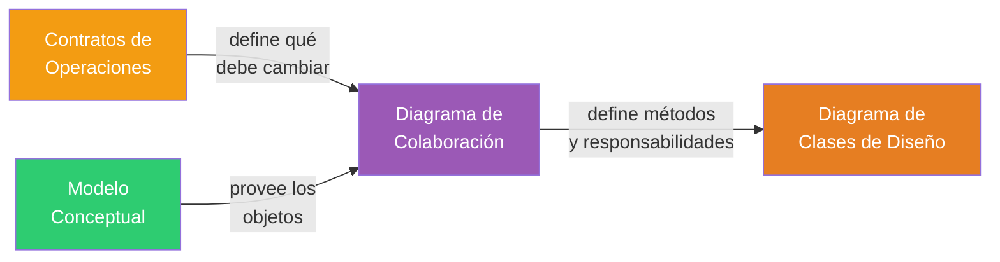
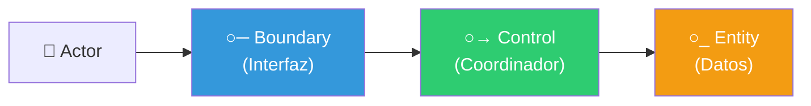

# 12 — Diagramas de Colaboración (Interacción)

> **Pregunta central**: ¿Cómo interactúan los objetos internamente para cumplir las operaciones del sistema?

---

## 1. ¿Qué es un Diagrama de Colaboración?

> 🔑 **Definición**: Un diagrama de colaboración (o comunicación, en UML 2.x) muestra cómo los **objetos internos** del sistema interactúan a través de **mensajes** para realizar una tarea.

### Diferencia con el DSS

| Aspecto | DSS (Secuencia del Sistema) | Diagrama de Colaboración |
|---------|----------------------------|-------------------------|
| **Fase** | Análisis | Diseño |
| **Perspectiva** | Caja negra (actor ↔ sistema) | Caja blanca (objeto ↔ objeto) |
| **Muestra** | QUÉ hace el sistema | CÓMO lo hace |
| **Participantes** | Actor, Sistema | Objetos software internos |
| **Se deriva de** | Especificación del CUS | Contratos + Modelo Conceptual |

---

## 2. Contexto: ¿De dónde viene y hacia dónde va?



> 🧩 **Conexión clave**: Para cada **operación del sistema** (identificada en el DSS) se construye UN diagrama de colaboración cuyo **mensaje inicial** es esa operación.

---

## 3. Notación

### Elementos del diagrama

| Elemento | Representación | Ejemplo |
|---------|---------------|---------|
| **Objeto** | Rectángulo con `nombre:Clase` | `r:Registro` |
| **Enlace** | Línea entre objetos | `r:Registro — v:Venta` |
| **Mensaje** | Flecha numerada sobre el enlace | `1: crearLíneaDeVenta(id, cant)` |
| **Numeración** | Indica orden de ejecución | `1:`, `1.1:`, `1.2:`, `2:` |

### Numeración jerárquica

```
1: mensaje del actor al primer objeto
  1.1: primer submensaje generado por el mensaje 1
  1.2: segundo submensaje generado por el mensaje 1
    1.2.1: submensaje generado por 1.2
2: segundo mensaje del actor
```

---

## 4. Principio de Diseño: Un Diagrama por Operación

| Operación del Sistema | Diagrama de Colaboración |
|----------------------|-------------------------|
| `iniciarNuevaVenta()` | Diagrama que muestra cómo se crea la Venta |
| `ingresarArticulo(id, cant)` | Diagrama que muestra cómo se crea la LíneaDeVenta |
| `terminarVenta()` | Diagrama que muestra cómo se calcula el total |
| `realizarPago(monto)` | Diagrama que muestra cómo se registra el pago |

---

## 5. Ejemplo: "pasarProducto" (Caso PDV)

Operación: `ingresarArticulo(articuloID, cantidad)`

Postcondiciones del contrato:
- Se creó una instancia de `LíneaDeVenta`
- Se asoció `LíneaDeVenta` con la `Venta` actual
- Se asignó `ldv.cantidad = cantidad`
- Se asoció `ldv` con `EspecificaciónDelProducto` (por articuloID)

### Diagrama (representación textual)

```
:Registro ──1: ingresarArticulo(id, cant)──> v:Venta
                                               │
                                               ├──1.1: spec := buscar(id)──> :CatálogoDeProductos
                                               │                               │
                                               │                               └──1.1.1: spec := buscar(id)──> :EspecificaciónDelProducto
                                               │
                                               └──1.2: crearLíneaDeVenta(spec, cant)──> ldv:LíneaDeVenta
```

### Lectura del diagrama

1. El `Registro` recibe el mensaje `ingresarArticulo(id, cant)` y lo delega a la `Venta` actual
2. La `Venta` pide al `CatálogoDeProductos` que busque la especificación del artículo
3. El catálogo busca en sus `EspecificaciónDelProducto`
4. La `Venta` crea una nueva `LíneaDeVenta` con la especificación encontrada y la cantidad

---

## 6. De Colaboración a Clases de Diseño

Cada **mensaje** en un diagrama de colaboración se convierte en un **método** en la clase receptora:

| Mensaje en Colaboración | Método en Clase de Diseño |
|------------------------|--------------------------|
| `1: ingresarArticulo(id, cant)` → `v:Venta` | `Venta.ingresarArticulo(id: ArticuloID, cant: int)` |
| `1.1: buscar(id)` → `:CatálogoDeProductos` | `CatálogoDeProductos.buscar(id: ArticuloID): EspecificaciónDelProducto` |
| `1.2: crearLíneaDeVenta(spec, cant)` → `ldv:LíneaDeVenta` | Constructor de `LíneaDeVenta` |

---

## 7. Diagrama de Colaboración vs. Diagrama de Secuencia (de diseño)

> ⚠️ **No confundir**: Existe el DSS (caja negra, análisis) y el Diagrama de Secuencia de diseño (caja blanca, diseño). El diagrama de colaboración es **equivalente** al de secuencia de diseño.

| Criterio | Diagrama de Colaboración | Diagrama de Secuencia (diseño) |
|----------|-------------------------|-------------------------------|
| **Organización** | Espacial (red de objetos) | Temporal (líneas de vida verticales) |
| **Énfasis** | Relaciones entre objetos | Orden temporal de mensajes |
| **Numeración** | Necesaria (para indicar orden) | Implícita (de arriba a abajo) |
| **Equivalencia** | Son dos vistas de la MISMA información |

---

## 8. Clases de Análisis (Boundary, Control, Entity)

En algunos enfoques, los objetos del diagrama de colaboración se clasifican en tres estereotipos:

| Estereotipo | Símbolo | Responsabilidad | Ejemplo |
|------------|---------|----------------|---------|
| `«boundary»` | ○─ | Interfaz con el actor | Pantalla de venta, Formulario |
| `«control»` | ○→ | Coordina el proceso | GestorDeVentas, ControladorPago |
| `«entity»` | ○_ | Almacena datos persistentes | Venta, Producto, Cliente |



---

## Preguntas de recuperación

1. ¿Cuál es el mensaje inicial de un diagrama de colaboración y de dónde proviene? ¿Por qué es importante identificar este mensaje?
2. ¿Cómo se lee la numeración jerárquica (1.2.1) en un diagrama de colaboración? ¿Qué información comunica esta numeración?
3. ¿Cómo se convierte un mensaje de un diagrama de colaboración en un método de una clase? ¿Qué decisiones de diseño se toman en esta transformación?
4. ¿Qué información se necesita para construir un diagrama de colaboración? ¿Por qué los contratos y el modelo conceptual son necesarios?
5. ¿Cuál es la diferencia entre los estereotipos `«boundary»`, `«control»` y `«entity»`? ¿Qué responsabilidad tiene cada uno en el diseño?
6. ¿Son equivalentes un diagrama de colaboración y un diagrama de secuencia de diseño? ¿En qué situación preferirías uno sobre el otro?

---

## 9. Preguntas de Autoevaluación

1. ¿Cuál es el **mensaje inicial** de un diagrama de colaboración y de dónde viene?
2. ¿Cómo se lee la numeración `1.2.1` en un diagrama de colaboración?
3. ¿Cómo se convierte un mensaje de un diagrama de colaboración en un método de una clase?
4. ¿Qué información se necesita para construir un diagrama de colaboración?
5. ¿Cuál es la diferencia entre los estereotipos `«boundary»`, `«control»` y `«entity»`?
6. ¿Son equivalentes un diagrama de colaboración y un diagrama de secuencia de diseño?
