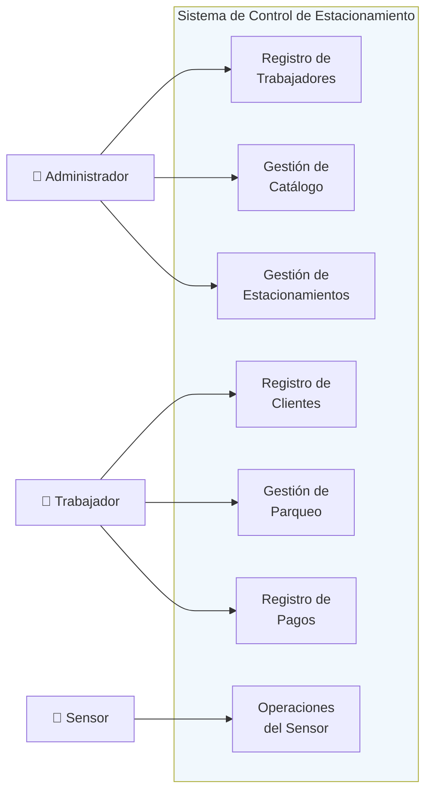
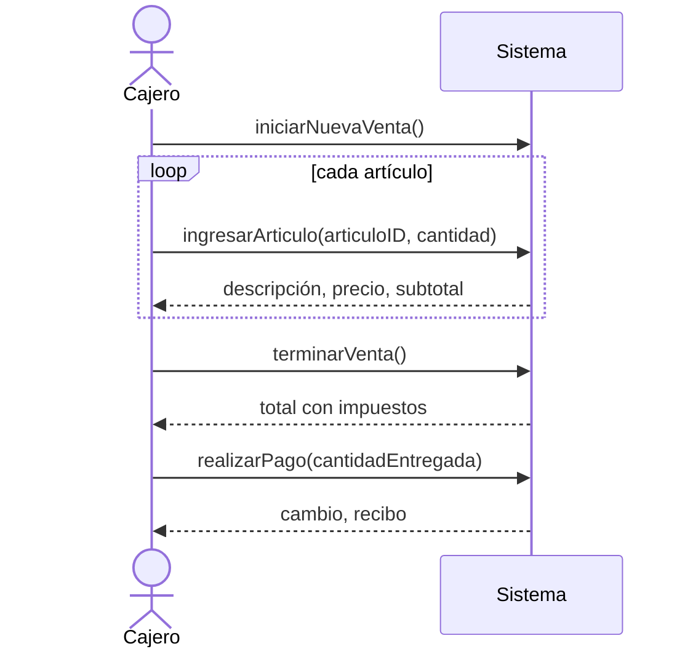
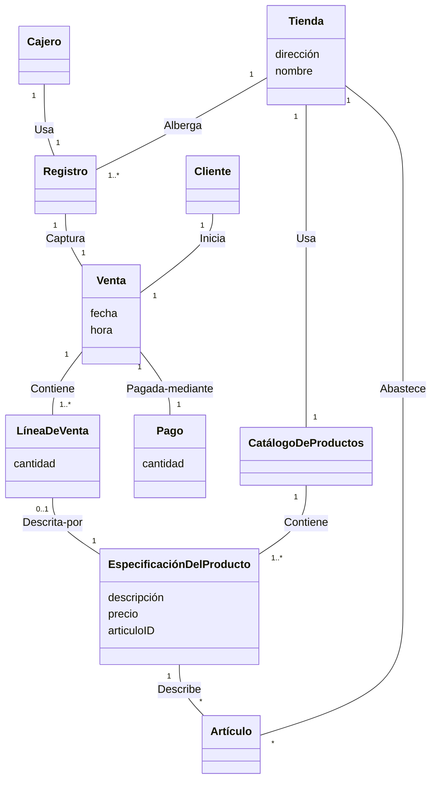
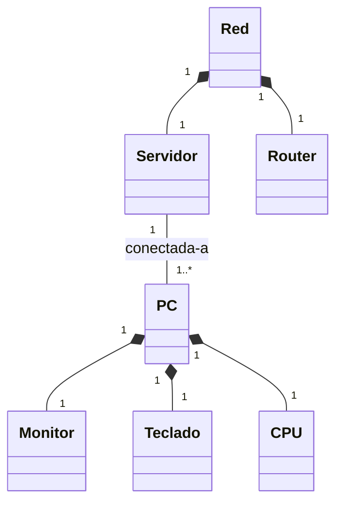
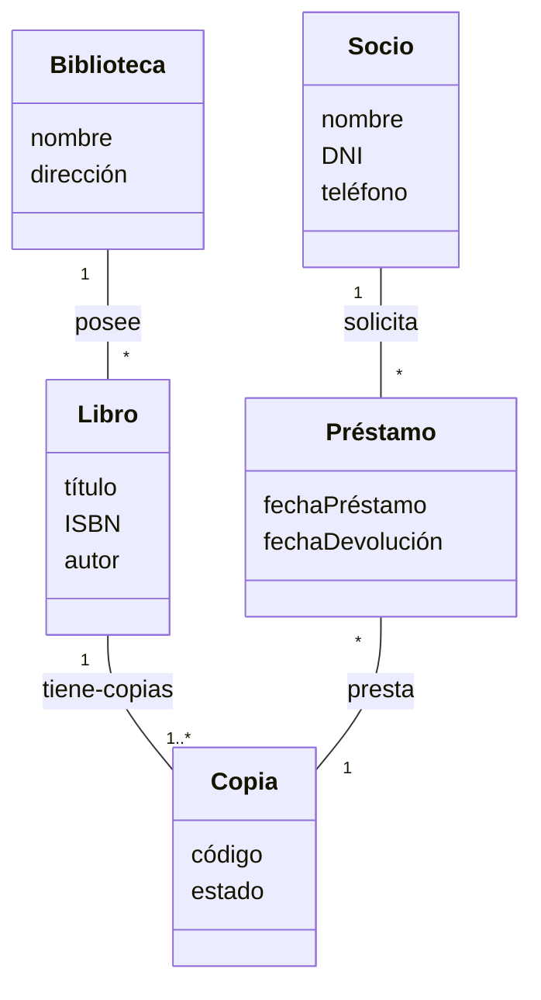
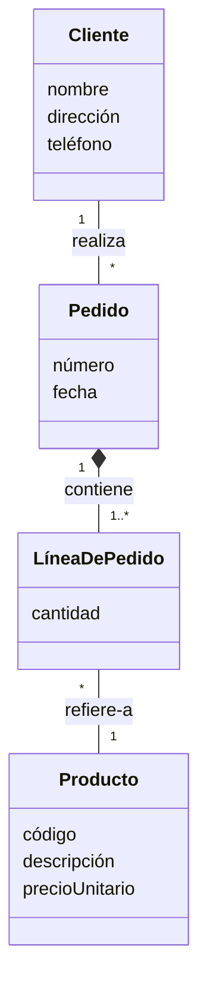
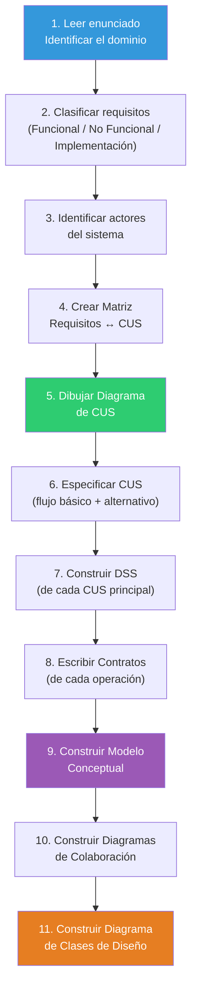

# 13 — Laboratorios Resueltos: Aplicación Práctica

> **Pregunta central**: ¿Cómo se aplican todos estos conceptos en ejercicios reales?

---

## Caso 1: Sistema de Control de Estacionamiento Vehicular

> **Fuente**: Lab 11 / Lab 6 (Sem 05, 06, 11, 12)

### 1.1 Enunciado

Una empresa dispone de estacionamientos (parqueos) para vehículos y desea automatizar:
- Registro de clientes y trabajadores
- Gestión de tarifas (incluidas tarifas especiales para domingos/feriados)
- Registro de ingreso/salida de vehículos
- Cálculo de importes (fracciones de hora = hora adicional)
- Detección de ubicación por sensores ultrasónicos
- Generación de tickets y reportes

### 1.2 Clasificación de Requisitos

| # | Requisito | Tipo | Justificación |
|---|----------|------|--------------|
| 01 | Usar Oracle 11g | **Implementación** | Tecnología específica |
| 02 | Disponibilidad 24/7 | **No Funcional** | Calidad: disponibilidad |
| 03 | Administrador gestiona establecimientos | **Funcional** | Capacidad del sistema |
| 04 | Registrar trabajadores | **Funcional** | Capacidad del sistema |
| 05 | Acceso desde cualquier punto | **No Funcional** | Calidad: accesibilidad |
| 06 | Respuesta < 5 segundos | **No Funcional** | Calidad: rendimiento |
| 07 | Mantener catálogo de tarifas | **Funcional** | Capacidad del sistema |
| 08 | Tarifas especiales por día | **Funcional** | Regla de negocio |
| 09 | Operar solo en soles | **No Funcional** | Restricción operativa |
| 10 | Registro de solicitud de parqueo | **Funcional** | Capacidad del sistema |
| 11 | Registrar datos del cliente | **Funcional** | Capacidad del sistema |
| 12 | Sensor detecta ubicación/sector/piso | **Funcional** | Capacidad del sistema |
| 13 | Registrar ingreso/salida de vehículos | **Funcional** | Capacidad del sistema |
| 14 | Calcular importe por horas | **Funcional** | Capacidad del sistema |
| 15 | Fracciones de hora = hora adicional | **Funcional** | Regla de negocio |
| 16 | Generar Nº correlativo de parqueo/ticket | **Funcional** | Capacidad del sistema |
| 17 | Almacenar datos sin pérdida | **No Funcional** | Calidad: confiabilidad |
| 18 | Seguridad con usuario/contraseña | **No Funcional** | Calidad: seguridad |
| 19 | Control acceso con lista de permisos | **Implementación** | Mecanismo específico |
| 20 | Consultar disponibilidad y generar reportes | **Funcional** | Capacidad del sistema |
| 21 | Interfaz amigable e intuitiva | **No Funcional** | Calidad: usabilidad |
| 22 | Plataforma Web, compatible IE 8.0 | **Implementación** | Tecnología específica |

### 1.3 Actores del Sistema

| Actor | Tipo | Descripción |
|-------|------|-------------|
| **Administrador** | Persona | Gestiona establecimientos, registra trabajadores, actualiza tarifas |
| **Trabajador** | Persona | Registra clientes, solicitudes, ingresos/salidas, pagos |
| **Sensor** | Dispositivo | Detecta ubicación del vehículo |

### 1.4 Matriz Requisitos ↔ CUS

| Requisitos | CUS | Descripción |
|-----------|-----|-------------|
| R04 | **Registro de Trabajadores** | CRUD de trabajadores |
| R07, R08 | **Gestión de Catálogo** | CRUD de tarifas + tarifas especiales |
| R10, R13 | **Gestión de Parqueo** | Solicitudes, ingresos/salidas de vehículos |
| R11 | **Registro de Clientes** | CRUD de clientes |
| R12 | **Operaciones del Sensor** | Recibir datos de ubicación del sensor |
| R14, R15, R16 | **Registro de Pagos** | Calcular importe, generar ticket |
| R03, R20 | **Gestión de Estacionamientos** | Gestionar establecimientos, reportes |

### 1.5 Diagrama de CUS



### 1.6 Especificación de CUS: "Registro de Clientes"

```
Nombre CUS:     Registro de Clientes
Descripción:    Permite al trabajador registrar, modificar y eliminar clientes.
Precondición:   El trabajador ingresó correctamente al sistema.

FLUJO BÁSICO — Registrar cliente:
1. El sistema muestra formulario de registro.
2. El trabajador llena los datos (nombre, apellidos, DNI, teléfono, distrito).
3. El sistema valida los datos.
4. El trabajador selecciona "guardar".
5. El sistema muestra confirmación.
6. El trabajador confirma.
7. El sistema registra al cliente.
8. El sistema muestra confirmación exitosa.
9. El CUS finaliza.

FLUJO BÁSICO — Modificar cliente:
1. El sistema muestra formulario de búsqueda.
2. El trabajador busca al cliente.
3. El sistema muestra los datos del cliente.
4. El trabajador modifica los datos.
5. El sistema valida los cambios.
6. El trabajador confirma.
7. El sistema actualiza el registro.
8. Confirmación exitosa. El CUS finaliza.

FLUJO BÁSICO — Eliminar cliente:
1-5. Similar a modificar (búsqueda y visualización).
6. El trabajador selecciona "eliminar".
7. Confirmación → Sistema elimina → Confirmación exitosa.

FLUJOS ALTERNATIVOS:
- Si el trabajador no guarda → Selecciona "cancelar" → CUS finaliza.
- Si el trabajador no confirma → Selecciona "cancelar" → CUS finaliza.

Postcondición: El sistema registró, modificó o eliminó correctamente el registro.
```

---

## Caso 2: Sistema de Punto de Venta (PDV) — Craig Larman

> **Fuente**: Sem 08, 09, 11, 12 (Larman: *Applying UML and Patterns*)

### 2.1 Requisitos Principales

| Ref | Función | Categoría |
|-----|---------|-----------|
| R1.1 | Registrar venta actual (productos comprados) | Evidente |
| R1.2 | Calcular total con impuesto | Evidente |
| R1.3 | Capturar info por código de barras o manual | Evidente |
| R1.4 | Reducir inventario al vender | Oculta |
| R1.5 | Registrar ventas efectuadas | Oculta |
| R1.6 | Autenticación con ID/contraseña | Evidente |
| R1.7 | Almacenamiento persistente | Oculta |
| R1.9 | Mostrar descripción y precio | Evidente |

### 2.2 CUS: Comprar Productos (Expandido)

```
CUS: Comprar Productos (Procesar Venta)
Actores: Cliente, Cajero
Tipo: Primario

Flujo Básico:
1. El Cliente llega con mercancías.
2. El Cajero inicia una nueva venta.
3. El Cajero introduce el identificador del artículo.
4. El Sistema registra la línea de venta, muestra descripción, precio, subtotal.
   → Repite 3-4 hasta terminar.
5. El Sistema muestra total con impuestos.
6. El Cajero indica total al Cliente y solicita pago.
7. El Cliente paga, el Sistema gestiona el pago.
8. El Sistema registra la venta completa, envía a Contabilidad e Inventario.
9. El Sistema presenta el recibo.
10. El Cliente se va.

Extensiones:
7a. Pago en efectivo:
    1. Cajero ingresa cantidad entregada.
    2. Sistema muestra cambio y abre cajón.
    3. Cajero entrega cambio.
    4. Sistema registra pago en efectivo.
```

### 2.3 DSS



### 2.4 Modelo Conceptual (Clases principales)



### 2.5 Contratos Clave

| Operación | Postcondiciones clave |
|-----------|----------------------|
| `iniciarNuevaVenta()` | Crear Venta, asociar a Registro, inicializar fecha/hora |
| `ingresarArticulo(id, cant)` | Crear LíneaDeVenta, asociar a Venta y a EspecificaciónDelProducto |
| `terminarVenta()` | Marcar venta como completa |
| `realizarPago(monto)` | Crear Pago, asociar a Venta, asociar Venta a Tienda |

---

## Caso 3: Ejercicios de Modelo Conceptual

> **Fuente**: Sem 09 — Ejercicio Modelo Conceptual

### 3.1 Red de Computadoras

Enunciado: "Un servidor tiene N PC's conectadas, cada PC tiene un monitor, teclado y CPU. La red tiene un router."



### 3.2 Biblioteca

Enunciado: Gestión de préstamos de libros a socios.



### 3.3 Sistema de Pedidos

Enunciado: Empresa que gestiona pedidos de productos con clientes.



---

## Caso 4: Sistema de Marcado de Personal

> **Fuente**: Sem 08 (Final del material de Larman)

### 4.1 Enunciado

Sistema que registra ingreso de docentes y alumnos usando lector de código de barras (DNI para docentes, carnet para alumnos).

### 4.2 Artefactos a elaborar

| Artefacto | Descripción |
|-----------|-------------|
| Requerimientos | Panorama, metas, funciones, atributos |
| Modelo de Procesos | Modelo de negocio |
| Modelo de Requisitos | Diagrama CUS + especificaciones + actividades + prototipo |
| Modelo Conceptual | Clases conceptuales del dominio |
| Modelo de Análisis | Realizaciones (DSS / Colaboración por cada RCUS) |

---

## Guía de Práctica: ¿Cómo Resolver un Ejercicio Completo?



### Checklist de revisión

- [ ] ¿Cada requisito funcional está cubierto por al menos un CUS?
- [ ] ¿Cada CUS tiene al menos un actor?
- [ ] ¿El DSS tiene un mensaje por cada interacción actor→sistema?
- [ ] ¿Cada operación del DSS tiene un contrato?
- [ ] ¿Las postcondiciones mencionan creación, asociación o modificación?
- [ ] ¿El modelo conceptual NO tiene métodos ni artefactos software?
- [ ] ¿Las asociaciones tienen nombre, dirección de lectura y multiplicidad?
